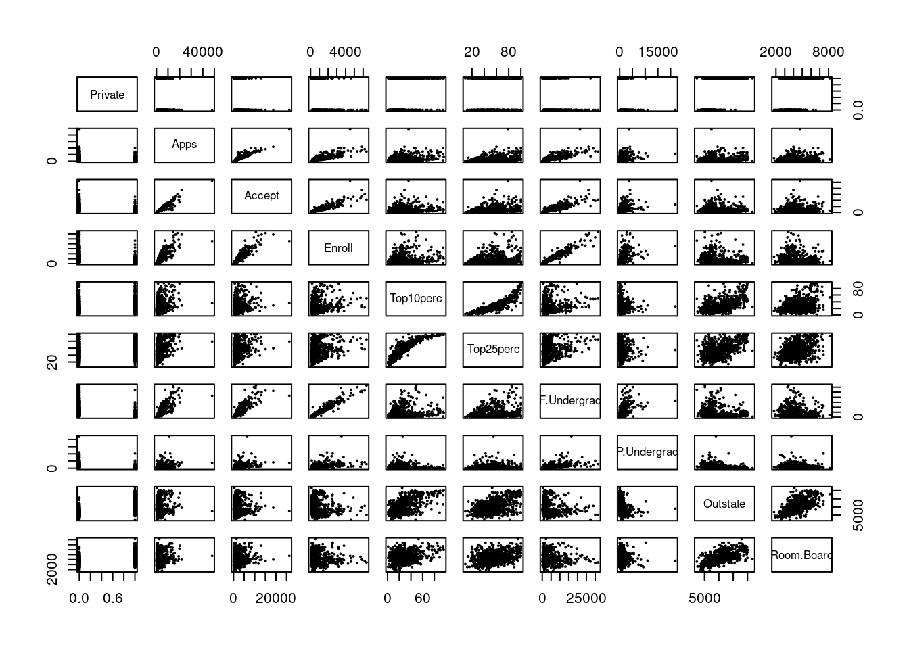
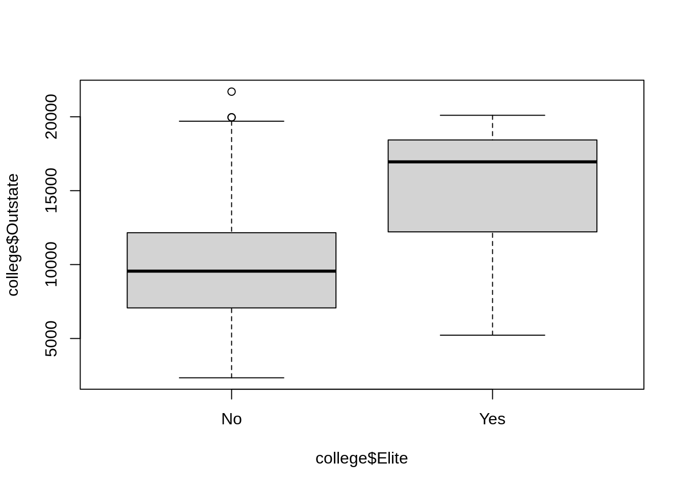
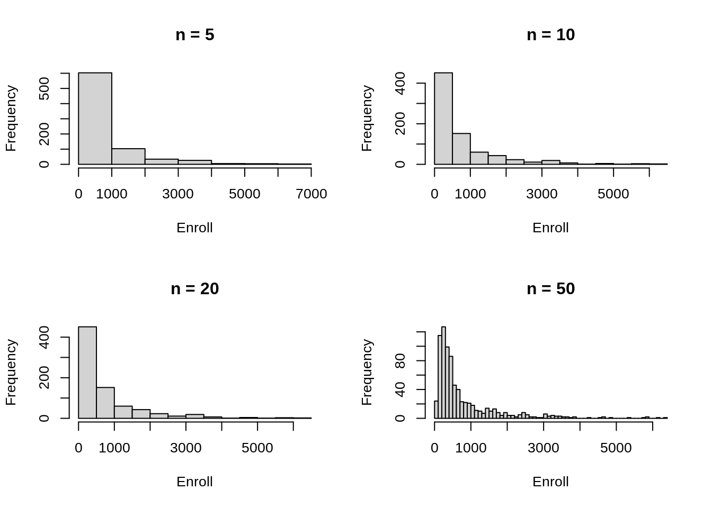
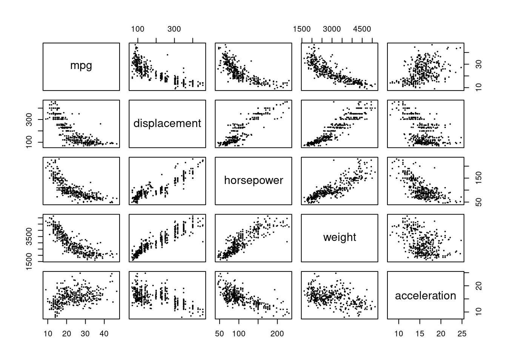
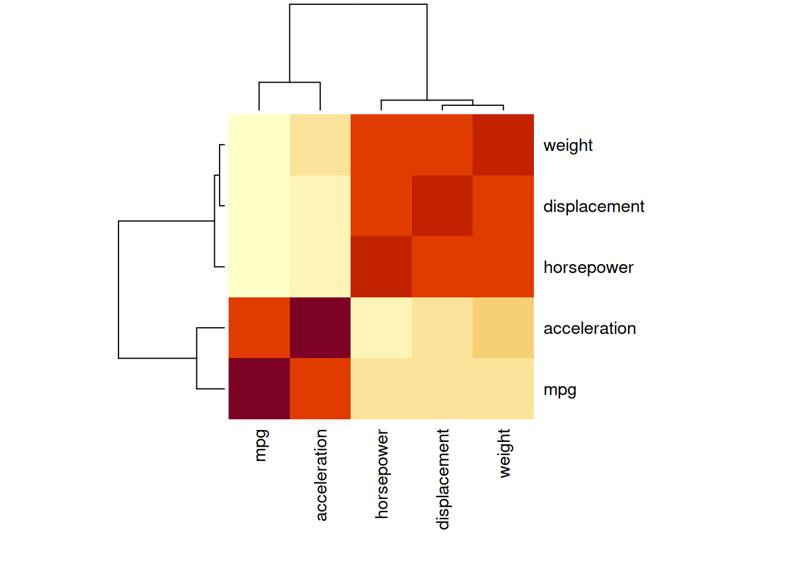
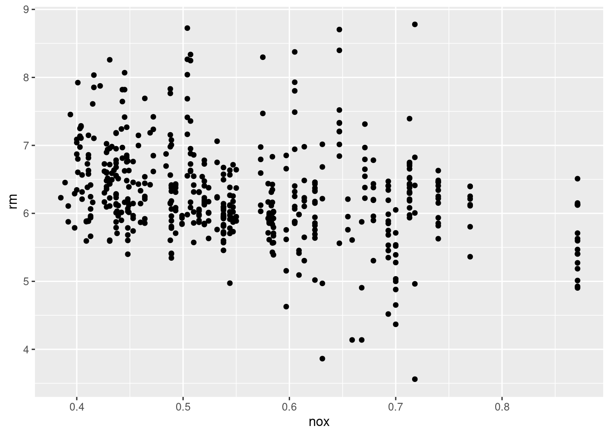
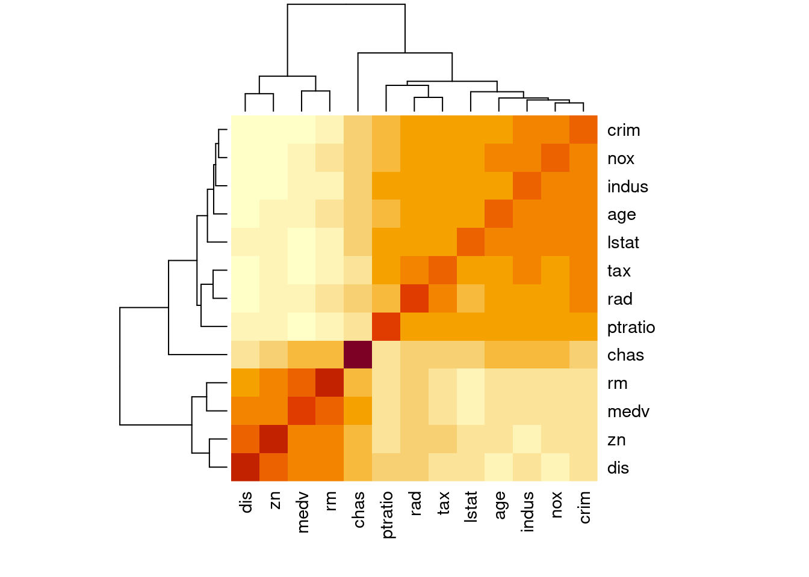
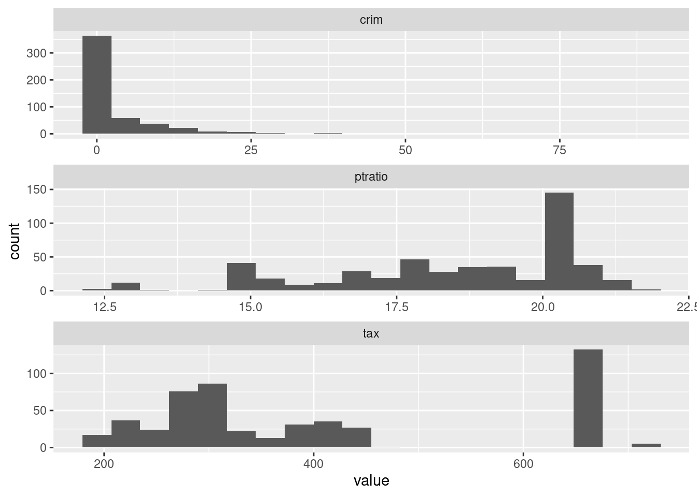
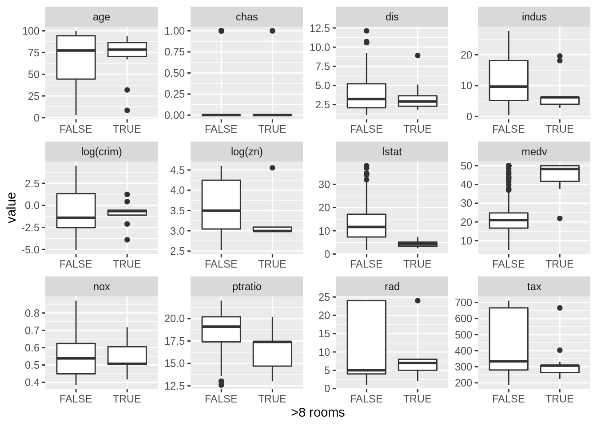

# Statistical Learning

## Conceptual

### Question 1

> For each of parts (a) through (d), indicate whether we would generally expect
> the performance of a flexible statistical learning method to be better or
> worse than an inflexible method. Justify your answer.
>
> a. The sample size $n$ is extremely large, and the number of predictors $p$ is
>    small.

Flexible best - opposite of b.

> b. The number of predictors $p$ is extremely large, and the number of
>    observations $n$ is small.

Inflexible best - high chance of some predictors being randomly associated.

> c. The relationship between the predictors and response is highly
>    non-linear.

Flexible best - inflexible leads to high bias.

> d. The variance of the error terms, i.e. $\sigma^2 = Var(\epsilon)$, is
>    extremely high.

Inflexible best - opposite of c.

### Question 2

> Explain whether each scenario is a classification or regression problem, and
> indicate whether we are most interested in inference or prediction. Finally,
> provide $n$ and $p$.
>
> a. We collect a set of data on the top 500 firms in the US. For each firm
>    we record profit, number of employees, industry and the CEO salary. We are
>    interested in understanding which factors affect CEO salary.

$n=500$, $p=3$, regression, inference.

> b. We are considering launching a new product and wish to know whether
>    it will be a success or a failure. We collect data on 20 similar products
>    that were previously launched. For each product we have recorded whether it
>    was a success or failure, price charged for the product, marketing budget,
>    competition price, and ten other variables.

$n=20$, $p=13$, classification, prediction.

> c. We are interested in predicting the % change in the USD/Euro exchange
>    rate in relation to the weekly changes in the world stock markets. Hence we
>    collect weekly data for all of 2012. For each week we record the % change
>    in the USD/Euro, the % change in the US market, the % change in the British
>    market, and the % change in the German market.

$n=52$, $p=3$, regression, prediction.

### Question 3

> We now revisit the bias-variance decomposition.
>
> a. Provide a sketch of typical (squared) bias, variance, training error,
>    test error, and Bayes (or irreducible) error curves, on a single plot, as
>    we go from less flexible statistical learning methods towards more flexible
>    approaches. The x-axis should represent the amount of flexibility in the
>    method, and the y-axis should represent the values for each curve. There
>    should be five curves. Make sure to label each one.
>
> b. Explain why each of the five curves has the shape displayed in
>    part (a).

* (squared) bias: Decreases with increasing flexibility (Generally, more
  flexible methods result in less bias).
* variance: Increases with increasing flexibility (In general, more flexible
  statistical methods have higher variance).
* training error: Decreases with model flexibility (More complex models will
  better fit the training data).
* test error: Decreases initially, then increases due to overfitting (less
  bias but more training error).
* Bayes (irreducible) error: fixed (does not change with model).

### Question 4

> You will now think of some real-life applications for statistical learning.
>
> a. Describe three real-life applications in which classification might
>    be useful. Describe the response, as well as the predictors. Is the goal of
>    each application inference or prediction? Explain your answer.

* Coffee machine cleaned? (day of week, person assigned), inference.
* Is a flight delayed? (airline, airport etc), inference.
* Beer type (IPA, pilsner etc.), prediction.

> b. Describe three real-life applications in which regression might be
>    useful. Describe the response, as well as the predictors. Is the goal of
>    each application inference or prediction? Explain your answer.

* Amount of bonus paid (profitability, client feedback), prediction.
* Person's height, prediction.
* House price, inference.

> c. Describe three real-life applications in which cluster analysis might be
>    useful.

* RNAseq tumour gene expression data.
* SNPs in human populations.
* Frequencies of mutations (with base pair context) in somatic mutation data.

### Question 5

> What are the advantages and disadvantages of a very flexible (versus a less
> flexible) approach for regression or classification? Under what circumstances
> might a more flexible approach be preferred to a less flexible approach? When
> might a less flexible approach be preferred?

Inflexible is more interpretable, fewer observations required, can be biased.
Flexible can overfit (high error variance). In cases where we have high $n$ or
non-linear patterns flexible will be preferred.

### Question 6

> Describe the differences between a parametric and a non-parametric statistical
> learning approach. What are the advantages of a parametric approach to
> regression or classification (as opposed to a non-parametric approach)? What
> are its disadvantages?

Parametric uses (model) parameters. Parametric models can be more interpretable
as there is a model behind how data is generated. However, the disadvantage is
that the model might not reflect reality. If the model is too far from the
truth, estimates will be poor and more flexible models can fit many different
forms and require more parameters (leading to overfitting). Non-parametric
approaches do not estimate a small number of parameters, so a large number
of observations may be needed to obtain accurate estimates.

### Question 7

> The table below provides a training data set containing six observations,
> three predictors, and one qualitative response variable.
> 
> | Obs. | $X_1$ | $X_2$ | $X_3$ | $Y$   |
> |------|-------|-------|-------|-------|
> | 1    | 0     | 3     | 0     | Red   |
> | 2    | 2     | 0     | 0     | Red   |
> | 3    | 0     | 1     | 3     | Red   |
> | 4    | 0     | 1     | 2     | Green |
> | 5    | -1    | 0     | 1     | Green |
> | 6    | 1     | 1     | 1     | Red   |
> 
> Suppose we wish to use this data set to make a prediction for $Y$ when 
> $X_1 = X_2 = X_3 = 0$ using $K$-nearest neighbors.
>
> a. Compute the Euclidean distance between each observation and the test
>    point, $X_1 = X_2 = X_3 = 0$.


``` r
dat <- data.frame(
  "x1" = c(0, 2, 0, 0, -1, 1),
  "x2" = c(3, 0, 1, 1, 0, 1),
  "x3" = c(0, 0, 3, 2, 1, 1),
  "y" = c("Red", "Red", "Red", "Green", "Green", "Red")
)

# Euclidean distance between points and c(0, 0, 0)
dist <- sqrt(dat[["x1"]]^2 + dat[["x2"]]^2 + dat[["x3"]]^2)
signif(dist, 3)
```

```
## [1] 3.00 2.00 3.16 2.24 1.41 1.73
```

> b. What is our prediction with $K = 1$? Why?


``` r
knn <- function(k) {
  names(which.max(table(dat[["y"]][order(dist)[1:k]])))
}
knn(1)
```

```
## [1] "Green"
```

Green (based on data point 5 only)

> c. What is our prediction with $K = 3$? Why?


``` r
knn(3)
```

```
## [1] "Red"
```

Red (based on data points 2, 5, 6)

> d. If the Bayes decision boundary in this problem is highly non-linear, then
>    would we expect the best value for $K$ to be large or small? Why?

Small (high $k$ leads to linear boundaries due to averaging)

## Applied

### Question 8

> This exercise relates to the `College` data set, which can be found in
> the file `College.csv`. It contains a number of variables for 777 different
> universities and colleges in the US. The variables are
>
> * `Private` : Public/private indicator
> * `Apps` : Number of applications received
> * `Accept` : Number of applicants accepted
> * `Enroll` : Number of new students enrolled
> * `Top10perc` : New students from top 10% of high school class
> * `Top25perc` : New students from top 25% of high school class
> * `F.Undergrad` : Number of full-time undergraduates
> * `P.Undergrad` : Number of part-time undergraduates
> * `Outstate` : Out-of-state tuition
> * `Room.Board` : Room and board costs
> * `Books` : Estimated book costs
> * `Personal` : Estimated personal spending
> * `PhD` : Percent of faculty with Ph.D.'s
> * `Terminal` : Percent of faculty with terminal degree
> * `S.F.Ratio` : Student/faculty ratio
> * `perc.alumni` : Percent of alumni who donate
> * `Expend` : Instructional expenditure per student
> * `Grad.Rate` : Graduation rate
>
> Before reading the data into `R`, it can be viewed in Excel or a text
> editor.
>
> a. Use the `read.csv()` function to read the data into `R`. Call the loaded
>    data `college`. Make sure that you have the directory set to the correct
>    location for the data.


``` r
college <- read.csv("data/College.csv")
```

> b. Look at the data using the `View()` function. You should notice that the
>    first column is just the name of each university. We don't really want `R`
>    to treat this as data. However, it may be handy to have these names for 
>    later. Try the following commands:
>    
>    ```r
>    rownames(college) <- college[, 1]
>    View(college)
>    ```
>    
>    You should see that there is now a `row.names` column with the name of 
>    each university recorded. This means that R has given each row a name 
>    corresponding to the appropriate university. `R` will not try to perform 
>    calculations on the row names. However, we still need to eliminate the 
>    first column in the data where the names are stored. Try
>    
>    ```r
>    college <- college [, -1]
>    View(college)
>    ```
>    
>    Now you should see that the first data column is `Private`. Note that 
>    another column labeled `row.names` now appears before the `Private` column.
>    However, this is not a data column but rather the name that R is giving to
>    each row.


``` r
rownames(college) <- college[, 1]
college <- college[, -1]
```

> c.
>     i.   Use the `summary()` function to produce a numerical summary of the
>          variables in the data set.
>     ii.  Use the `pairs()` function to produce a scatterplot matrix of the
>          first ten columns or variables of the data. Recall that you can 
>          reference the first ten columns of a matrix A using `A[,1:10]`.
>     iii. Use the `plot()` function to produce side-by-side boxplots of 
>          `Outstate` versus `Private`.
>     iv. Create a new qualitative variable, called `Elite`, by _binning_ the
>         `Top10perc` variable. We are going to divide universities into two
>         groups based on whether or not the proportion of students coming from
>         the top 10% of their high school classes exceeds 50%.
>         
>         ```r
>         > Elite <- rep("No", nrow(college))
>         > Elite[college$Top10perc > 50] <- "Yes"
>         > Elite <- as.factor(Elite)
>         > college <- data.frame(college, Elite)
>         ```
>         
>         Use the `summary()` function to see how many elite universities there
>         are. Now use the `plot()` function to produce side-by-side boxplots of
>         `Outstate` versus `Elite`.
>     v.   Use the `hist()` function to produce some histograms with differing
>          numbers of bins for a few of the quantitative variables. You may find
>          the command `par(mfrow=c(2,2))` useful: it will divide the print 
>          window into four regions so that four plots can be made 
>          simultaneously. Modifying the arguments to this function will divide
>          the screen in other ways.
>     vi.  Continue exploring the data, and provide a brief summary of what you
>          discover.


``` r
summary(college)
```

```
##    Private               Apps           Accept          Enroll    
##  Length:777         Min.   :   81   Min.   :   72   Min.   :  35  
##  Class :character   1st Qu.:  776   1st Qu.:  604   1st Qu.: 242  
##  Mode  :character   Median : 1558   Median : 1110   Median : 434  
##                     Mean   : 3002   Mean   : 2019   Mean   : 780  
##                     3rd Qu.: 3624   3rd Qu.: 2424   3rd Qu.: 902  
##                     Max.   :48094   Max.   :26330   Max.   :6392  
##    Top10perc       Top25perc      F.Undergrad     P.Undergrad     
##  Min.   : 1.00   Min.   :  9.0   Min.   :  139   Min.   :    1.0  
##  1st Qu.:15.00   1st Qu.: 41.0   1st Qu.:  992   1st Qu.:   95.0  
##  Median :23.00   Median : 54.0   Median : 1707   Median :  353.0  
##  Mean   :27.56   Mean   : 55.8   Mean   : 3700   Mean   :  855.3  
##  3rd Qu.:35.00   3rd Qu.: 69.0   3rd Qu.: 4005   3rd Qu.:  967.0  
##  Max.   :96.00   Max.   :100.0   Max.   :31643   Max.   :21836.0  
##     Outstate       Room.Board       Books           Personal   
##  Min.   : 2340   Min.   :1780   Min.   :  96.0   Min.   : 250  
##  1st Qu.: 7320   1st Qu.:3597   1st Qu.: 470.0   1st Qu.: 850  
##  Median : 9990   Median :4200   Median : 500.0   Median :1200  
##  Mean   :10441   Mean   :4358   Mean   : 549.4   Mean   :1341  
##  3rd Qu.:12925   3rd Qu.:5050   3rd Qu.: 600.0   3rd Qu.:1700  
##  Max.   :21700   Max.   :8124   Max.   :2340.0   Max.   :6800  
##       PhD            Terminal       S.F.Ratio      perc.alumni   
##  Min.   :  8.00   Min.   : 24.0   Min.   : 2.50   Min.   : 0.00  
##  1st Qu.: 62.00   1st Qu.: 71.0   1st Qu.:11.50   1st Qu.:13.00  
##  Median : 75.00   Median : 82.0   Median :13.60   Median :21.00  
##  Mean   : 72.66   Mean   : 79.7   Mean   :14.09   Mean   :22.74  
##  3rd Qu.: 85.00   3rd Qu.: 92.0   3rd Qu.:16.50   3rd Qu.:31.00  
##  Max.   :103.00   Max.   :100.0   Max.   :39.80   Max.   :64.00  
##      Expend        Grad.Rate     
##  Min.   : 3186   Min.   : 10.00  
##  1st Qu.: 6751   1st Qu.: 53.00  
##  Median : 8377   Median : 65.00  
##  Mean   : 9660   Mean   : 65.46  
##  3rd Qu.:10830   3rd Qu.: 78.00  
##  Max.   :56233   Max.   :118.00
```

``` r
college$Private <- college$Private == "Yes"
pairs(college[, 1:10], cex = 0.2)
```



``` r
plot(college$Outstate ~ factor(college$Private), xlab = "Private", ylab = "Outstate")
```


``` r
college$Elite <- factor(ifelse(college$Top10perc > 50, "Yes", "No"))
summary(college$Elite)
```

```
##  No Yes 
## 699  78
```

``` r
plot(college$Outstate ~ college$Elite, xlab = "Elite", ylab = "Outstate")
```



``` r
par(mfrow = c(2, 2))
for (n in c(5, 10, 20, 50)) {
  hist(college$Enroll, breaks = n, main = paste("n =", n), xlab = "Enroll")
}
```



``` r
chisq.test(college$Private, college$Elite)
```

```
## 
## 	Pearson's Chi-squared test with Yates' continuity correction
## 
## data:  college$Private and college$Elite
## X-squared = 4.3498, df = 1, p-value = 0.03701
```

Whether a college is Private and Elite is not random!

### Question 9

> This exercise involves the Auto data set studied in the lab. Make sure
> that the missing values have been removed from the data.


``` r
x <- read.table("data/Auto.data", header = TRUE, na.strings = "?")
x <- na.omit(x)
```

> a. Which of the predictors are quantitative, and which are qualitative?


``` r
sapply(x, class)
```

```
##          mpg    cylinders displacement   horsepower       weight acceleration 
##    "numeric"    "integer"    "numeric"    "numeric"    "numeric"    "numeric" 
##         year       origin         name 
##    "integer"    "integer"  "character"
```

``` r
numeric <- which(sapply(x, class) == "numeric")
names(numeric)
```

```
## [1] "mpg"          "displacement" "horsepower"   "weight"       "acceleration"
```

> b. What is the range of each quantitative predictor? You can answer this using
>    the `range()` function.


``` r
sapply(x[, numeric], function(x) diff(range(x)))
```

```
##          mpg displacement   horsepower       weight acceleration 
##         37.6        387.0        184.0       3527.0         16.8
```

> c. What is the mean and standard deviation of each quantitative predictor?


``` r
library(tidyverse)
```

```
## ── Attaching core tidyverse packages ──────────────────────── tidyverse 2.0.0 ──
## ✔ dplyr     1.1.4     ✔ readr     2.1.5
## ✔ forcats   1.0.0     ✔ stringr   1.5.1
## ✔ ggplot2   3.5.1     ✔ tibble    3.2.1
## ✔ lubridate 1.9.4     ✔ tidyr     1.3.1
## ✔ purrr     1.0.2     
## ── Conflicts ────────────────────────────────────────── tidyverse_conflicts() ──
## ✖ dplyr::filter() masks stats::filter()
## ✖ dplyr::lag()    masks stats::lag()
## ℹ Use the conflicted package (<http://conflicted.r-lib.org/>) to force all conflicts to become errors
```

``` r
library(knitr)

x[, numeric] |>
  pivot_longer(everything()) |>
  group_by(name) |>
  summarise(
    Mean = mean(value),
    SD = sd(value)
  ) |>
  kable()
```


|name         |       Mean|         SD|
|:------------|----------:|----------:|
|acceleration |   15.54133|   2.758864|
|displacement |  194.41199| 104.644004|
|horsepower   |  104.46939|  38.491160|
|mpg          |   23.44592|   7.805008|
|weight       | 2977.58418| 849.402560|

> d. Now remove the 10th through 85th observations. What is the range, mean, and
>    standard deviation of each predictor in the subset of the data that 
>    remains?


``` r
x[-(10:85), numeric] |>
  pivot_longer(everything()) |>
  group_by(name) |>
  summarise(
    Range = diff(range(value)),
    Mean = mean(value),
    SD = sd(value)
  ) |>
  kable()
```


|name         |  Range|       Mean|         SD|
|:------------|------:|----------:|----------:|
|acceleration |   16.3|   15.72690|   2.693721|
|displacement |  387.0|  187.24051|  99.678367|
|horsepower   |  184.0|  100.72152|  35.708853|
|mpg          |   35.6|   24.40443|   7.867283|
|weight       | 3348.0| 2935.97152| 811.300208|

> e. Using the full data set, investigate the predictors graphically, using
>    scatterplots or other tools of your choice. Create some plots highlighting
>    the relationships among the predictors. Comment on your findings.


``` r
pairs(x[, numeric], cex = 0.2)
```



``` r
cor(x[, numeric]) |>
  kable()
```


|             |        mpg| displacement| horsepower|     weight| acceleration|
|:------------|----------:|------------:|----------:|----------:|------------:|
|mpg          |  1.0000000|   -0.8051269| -0.7784268| -0.8322442|    0.4233285|
|displacement | -0.8051269|    1.0000000|  0.8972570|  0.9329944|   -0.5438005|
|horsepower   | -0.7784268|    0.8972570|  1.0000000|  0.8645377|   -0.6891955|
|weight       | -0.8322442|    0.9329944|  0.8645377|  1.0000000|   -0.4168392|
|acceleration |  0.4233285|   -0.5438005| -0.6891955| -0.4168392|    1.0000000|

``` r
heatmap(cor(x[, numeric]), cexRow = 1.1, cexCol = 1.1, margins = c(8, 8))
```



Many of the variables appear to be highly (positively or negatively) correlated
with some relationships being non-linear.

> f. Suppose that we wish to predict gas mileage (`mpg`) on the basis of the
>    other variables. Do your plots suggest that any of the other variables
>    might be useful in predicting `mpg`? Justify your answer.

Yes, since other variables are correlated. However, horsepower, weight and 
displacement are highly related.

### Question 10

> This exercise involves the `Boston` housing data set.
>
> a. To begin, load in the `Boston` data set. The `Boston` data set is part of 
>    the `ISLR2` library in R.
>    ```r
>    > library(ISLR2)
>    ```
>    Now the data set is contained in the object `Boston`.
>    ```r
>    > Boston
>    ```
>    Read about the data set:
>    ```r
>    > ?Boston
>    ```
>    How many rows are in this data set? How many columns? What do the rows and
>    columns represent?


``` r
library(ISLR2)
dim(Boston)
```

```
## [1] 506  13
```

> b. Make some pairwise scatterplots of the predictors (columns) in this data
>    set. Describe your findings.


``` r
library(ggplot2)
library(tidyverse)
```


``` r
ggplot(Boston, aes(nox, rm)) +
  geom_point()
```



``` r
ggplot(Boston, aes(ptratio, rm)) +
  geom_point()
```


``` r
heatmap(cor(Boston, method = "spearman"), cexRow = 1.1, cexCol = 1.1)
```



> c. Are any of the predictors associated with per capita crime rate? If so,
>    explain the relationship.

Yes

> d. Do any of the census tracts of Boston appear to have particularly high 
>    crime rates? Tax rates? Pupil-teacher ratios? Comment on the range of each
>    predictor.


``` r
Boston |>
  pivot_longer(cols = 1:13) |>
  filter(name %in% c("crim", "tax", "ptratio")) |>
  ggplot(aes(value)) +
  geom_histogram(bins = 20) +
  facet_wrap(~name, scales = "free", ncol = 1)
```



Yes, particularly crime and tax rates.

> e. How many of the census tracts in this data set bound the Charles river?


``` r
sum(Boston$chas)
```

```
## [1] 35
```

> f. What is the median pupil-teacher ratio among the towns in this data set?


``` r
median(Boston$ptratio)
```

```
## [1] 19.05
```

> g. Which census tract of Boston has lowest median value of owner-occupied
>    homes? What are the values of the other predictors for that census tract,
>    and how do those values compare to the overall ranges for those predictors?
>    Comment on your findings.


``` r
Boston[Boston$medv == min(Boston$medv), ] |>
  kable()
```


|    |    crim| zn| indus| chas|   nox|    rm| age|    dis| rad| tax| ptratio| lstat| medv|
|:---|-------:|--:|-----:|----:|-----:|-----:|---:|------:|---:|---:|-------:|-----:|----:|
|399 | 38.3518|  0|  18.1|    0| 0.693| 5.453| 100| 1.4896|  24| 666|    20.2| 30.59|    5|
|406 | 67.9208|  0|  18.1|    0| 0.693| 5.683| 100| 1.4254|  24| 666|    20.2| 22.98|    5|

``` r
sapply(Boston, quantile) |>
  kable()
```


|     |      crim|    zn| indus| chas|   nox|     rm|     age|       dis| rad| tax| ptratio|  lstat|   medv|
|:----|---------:|-----:|-----:|----:|-----:|------:|-------:|---------:|---:|---:|-------:|------:|------:|
|0%   |  0.006320|   0.0|  0.46|    0| 0.385| 3.5610|   2.900|  1.129600|   1| 187|   12.60|  1.730|  5.000|
|25%  |  0.082045|   0.0|  5.19|    0| 0.449| 5.8855|  45.025|  2.100175|   4| 279|   17.40|  6.950| 17.025|
|50%  |  0.256510|   0.0|  9.69|    0| 0.538| 6.2085|  77.500|  3.207450|   5| 330|   19.05| 11.360| 21.200|
|75%  |  3.677083|  12.5| 18.10|    0| 0.624| 6.6235|  94.075|  5.188425|  24| 666|   20.20| 16.955| 25.000|
|100% | 88.976200| 100.0| 27.74|    1| 0.871| 8.7800| 100.000| 12.126500|  24| 711|   22.00| 37.970| 50.000|

> h. In this data set, how many of the census tract average more than seven
>    rooms per dwelling? More than eight rooms per dwelling? Comment on the
>    census tracts that average more than eight rooms per dwelling.


``` r
sum(Boston$rm > 7)
```

```
## [1] 64
```

``` r
sum(Boston$rm > 8)
```

```
## [1] 13
```

Let's compare median statistics for those census tracts with more than eight
rooms per dwelling on average, with the statistics for those with fewer.


``` r
Boston |>
  mutate(
    `log(crim)` = log(crim),
    `log(zn)` = log(zn)
  ) |>
  select(-c(crim, zn)) |>
  pivot_longer(!rm) |>
  mutate(">8 rooms" = rm > 8) |>
  ggplot(aes(`>8 rooms`, value)) +
  geom_boxplot() +
  facet_wrap(~name, scales = "free")
```

```
## Warning: Removed 372 rows containing non-finite outside the scale range
## (`stat_boxplot()`).
```



Census tracts with big average properties (more than eight rooms per dwelling)
have higher median value (`medv`), a lower proportion of non-retail
business acres (`indus`), a lower pupil-teacher ratio (`ptratio`), a lower
status of the population (`lstat`) among other differences.
