# Linear Regression

## Conceptual

### Question 1

> Describe the null hypotheses to which the p-values given in Table 3.4
> correspond. Explain what conclusions you can draw based on these p-values.
> Your explanation should be phrased in terms of `sales`, `TV`, `radio`, and
> `newspaper`, rather than in terms of the coefficients of the linear model.

For intercept, that $\beta_0 = 0$
For the others, that $\beta_n = 0$ (for $n = 1, 2, 3$)

We can conclude that that without any spending, there are still some sales (the
intercept is not 0). Furthermore, we can conclude that money spent on TV and
radio are significantly associated with increased sales, but the same cannot be
said of newspaper spending.

### Question 2

> Carefully explain the differences between the KNN classifier and KNN
> regression methods.

The KNN classifier is categorical and assigns a value based on the most
frequent observed category among $K$ nearest neighbors, whereas KNN regression
assigns a continuous variable, the average of the response variables for
the $K$ nearest neighbors.

### Question 3

> Suppose we have a data set with five predictors, $X_1$ = GPA, $X_2$ = IQ,
> $X_3$ = Level (1 for College and 0 for High School), $X_4$ = Interaction
> between GPA and IQ, and $X_5$ = Interaction between GPA and Level. The
> response is starting salary after graduation (in thousands of dollars).
> Suppose we use least squares to fit the model, and get $\hat\beta_0 = 50$,
> $\hat\beta_1 = 20$, $\hat\beta_2 = 0.07$, $\hat\beta_3 = 35$, $\hat\beta_4 =
> 0.01$, $\hat\beta_5 = -10$.
>
> a. Which answer is correct, and why?
>     i. For a fixed value of IQ and GPA, high school graduates earn more on
>        average than college graduates.
>     ii. For a fixed value of IQ and GPA, college graduates earn more on
>         average than high school graduates.
>     iii. For a fixed value of IQ and GPA, high school graduates earn more on
>          average than college graduates provided that the GPA is high enough.
>     iv. For a fixed value of IQ and GPA, college graduates earn more on 
>         average than high school graduates provided that the GPA is high 
>         enough.

The model is:

$y = \beta_0 + \beta_1 \cdot \text{GPA} + \beta_2 \cdot \text{IQ} + \beta_3 \cdot \text{Level} + \beta_4 \cdot \text{GPA} \cdot \text{IQ} + \beta_5 \cdot \text{GPA} \cdot \text{Level}$

Fixing IQ and GPA, changing Level from 0 to 1 will change the outcome by:

$\Delta y = \beta_3 + \beta_5 \cdot \text{GPA}$

$\Delta y > 0 \Rightarrow \beta_3 + \beta_5 \cdot \text{GPA} > 0 \Rightarrow \text{GPA} < \dfrac{-\beta_3}{\beta_5} = \dfrac{-35}{-10} = 3.5$

From a graphical standpoint:


``` r
library(plotly)
```


``` r
model <- function(gpa, iq, level) {
  50 +
  gpa * 20 +
  iq * 0.07 +
  level * 35 +
  gpa * iq * 0.01 +
  gpa * level * -10
}
x <- seq(1, 5, length = 10)
y <- seq(1, 200, length = 20)
college <- t(outer(x, y, model, level = 1))
high_school <- t(outer(x, y, model, level = 0))

plot_ly(x = x, y = y) |>
  add_surface(
    z = ~college,
    colorscale = list(c(0, 1), c("rgb(107,184,214)", "rgb(0,90,124)")),
    colorbar = list(title = "College")) |>
  add_surface(
    z = ~high_school,
    colorscale = list(c(0, 1), c("rgb(255,112,184)", "rgb(128,0,64)")),
    colorbar = list(title = "High school")) |>
  layout(scene = list(
    xaxis = list(title = "GPA"),
    yaxis = list(title = "IQ"),
    zaxis = list(title = "Salary")))
```

```{=html}
<div class="plotly html-widget html-fill-item" id="htmlwidget-fbf8ec8bf9036f703327" style="width:672px;height:480px;"></div>
<script type="application/json" data-for="htmlwidget-fbf8ec8bf9036f703327">{"x":{"visdat":{"1b3a51bac973":["function () ","plotlyVisDat"]},"cur_data":"1b3a51bac973","attrs":{"1b3a51bac973":{"x":[1,1.4444444444444444,1.8888888888888888,2.333333333333333,2.7777777777777777,3.2222222222222223,3.6666666666666665,4.1111111111111107,4.5555555555555554,5],"y":[1,11.473684210526315,21.94736842105263,32.421052631578945,42.89473684210526,53.368421052631575,63.84210526315789,74.315789473684205,84.78947368421052,95.263157894736835,105.73684210526315,116.21052631578947,126.68421052631578,137.15789473684208,147.63157894736841,158.10526315789474,168.57894736842104,179.05263157894734,189.52631578947367,200],"alpha_stroke":1,"sizes":[10,100],"spans":[1,20],"z":{},"type":"surface","colorscale":[[0,1],["rgb(107,184,214)","rgb(0,90,124)"]],"colorbar":{"title":"College"},"inherit":true},"1b3a51bac973.1":{"x":[1,1.4444444444444444,1.8888888888888888,2.333333333333333,2.7777777777777777,3.2222222222222223,3.6666666666666665,4.1111111111111107,4.5555555555555554,5],"y":[1,11.473684210526315,21.94736842105263,32.421052631578945,42.89473684210526,53.368421052631575,63.84210526315789,74.315789473684205,84.78947368421052,95.263157894736835,105.73684210526315,116.21052631578947,126.68421052631578,137.15789473684208,147.63157894736841,158.10526315789474,168.57894736842104,179.05263157894734,189.52631578947367,200],"alpha_stroke":1,"sizes":[10,100],"spans":[1,20],"z":{},"type":"surface","colorscale":[[0,1],["rgb(255,112,184)","rgb(128,0,64)"]],"colorbar":{"title":"High school"},"inherit":true}},"layout":{"margin":{"b":40,"l":60,"t":25,"r":10},"scene":{"xaxis":{"title":"GPA"},"yaxis":{"title":"IQ"},"zaxis":{"title":"Salary"}},"hovermode":"closest","showlegend":false,"legend":{"yanchor":"top","y":0.33333333333333337}},"source":"A","config":{"modeBarButtonsToAdd":["hoverclosest","hovercompare"],"showSendToCloud":false},"data":[{"colorbar":{"title":"College","ticklen":2,"len":0.33333333333333331,"lenmode":"fraction","y":1,"yanchor":"top"},"colorscale":[[0,"rgb(107,184,214)"],[1,"rgb(0,90,124)"]],"showscale":true,"x":[1,1.4444444444444444,1.8888888888888888,2.333333333333333,2.7777777777777777,3.2222222222222223,3.6666666666666665,4.1111111111111107,4.5555555555555554,5],"y":[1,11.473684210526315,21.94736842105263,32.421052631578945,42.89473684210526,53.368421052631575,63.84210526315789,74.315789473684205,84.78947368421052,95.263157894736835,105.73684210526315,116.21052631578947,126.68421052631578,137.15789473684208,147.63157894736841,158.10526315789474,168.57894736842104,179.05263157894734,189.52631578947367,200],"z":[[95.079999999999998,99.528888888888886,103.97777777777777,108.42666666666666,112.87555555555554,117.32444444444445,121.77333333333331,126.22222222222223,130.67111111111109,135.12],[95.917894736842101,100.41333333333333,104.90877192982455,109.40421052631579,113.89964912280701,118.39508771929826,122.89052631578946,127.38596491228071,131.88140350877194,136.37684210526317],[96.755789473684217,101.29777777777778,105.83976608187135,110.38175438596492,114.92374269005848,119.46573099415207,124.0077192982456,128.5497076023392,133.09169590643273,137.63368421052633],[97.59368421052632,102.18222222222222,106.77076023391812,111.35929824561403,115.94783625730994,120.53637426900585,125.12491228070175,129.71345029239768,134.30198830409358,138.89052631578949],[98.431578947368422,103.06666666666666,107.70175438596492,112.33684210526313,116.97192982456141,121.60701754385966,126.2421052631579,130.87719298245614,135.51228070175438,140.14736842105262],[99.269473684210524,103.9511111111111,108.63274853801168,113.31438596491226,117.99602339181288,122.67766081871343,127.35929824561404,132.04093567251462,136.72257309941523,141.40421052631578],[100.10736842105264,104.83555555555556,109.56374269005849,114.29192982456139,119.02011695906435,123.74830409356724,128.47649122807019,133.20467836257311,137.93286549707602,142.66105263157894],[100.94526315789473,105.72,110.49473684210525,115.26947368421052,120.04421052631579,124.81894736842105,129.59368421052631,134.36842105263159,139.14315789473687,143.9178947368421],[101.78315789473685,106.60444444444444,111.42573099415202,116.24701754385966,121.06830409356726,125.88959064327486,130.71087719298245,135.53216374269005,140.35345029239767,145.17473684210526],[102.62105263157893,107.48888888888888,112.35672514619881,117.22456140350876,122.09239766081873,126.96023391812867,131.8280701754386,136.69590643274853,141.56374269005846,146.43157894736842],[103.45894736842105,108.37333333333333,113.28771929824561,118.20210526315789,123.11649122807017,128.03087719298247,132.94526315789471,137.85964912280701,142.77403508771931,147.68842105263158],[104.29684210526317,109.25777777777778,114.2187134502924,119.17964912280702,124.14058479532164,129.10152046783628,134.06245614035086,139.0233918128655,143.98432748538011,148.94526315789474],[105.13473684210526,110.14222222222222,115.14970760233919,120.15719298245612,125.16467836257311,130.17216374269006,135.17964912280701,140.18713450292398,145.19461988304096,150.2021052631579],[105.97263157894737,111.02666666666667,116.08070175438598,121.13473684210526,126.18877192982458,131.24280701754387,136.29684210526315,141.35087719298244,146.40491228070175,151.45894736842104],[106.81052631578947,111.91111111111111,117.01169590643275,122.11228070175439,127.21286549707605,132.31345029239765,137.41403508771933,142.51461988304092,147.61520467836255,152.7157894736842],[107.64842105263158,112.79555555555555,117.94269005847954,123.08982456140352,128.23695906432752,133.38409356725145,138.53122807017544,143.67836257309943,148.8254970760234,153.97263157894739],[108.48631578947368,113.67999999999999,118.87368421052631,124.06736842105265,129.26105263157896,134.45473684210526,139.64842105263159,144.84210526315792,150.03578947368425,155.22947368421055],[109.3242105263158,114.56444444444445,119.80467836257307,125.04491228070175,130.28514619883043,135.52538011695907,140.76561403508774,146.00584795321637,151.24608187134504,156.48631578947368],[110.16210526315788,115.44888888888887,120.73567251461986,126.02245614035085,131.30923976608187,136.59602339181288,141.88280701754388,147.16959064327486,152.45637426900583,157.74315789473684],[111,116.33333333333333,121.66666666666666,126.99999999999999,132.33333333333331,137.66666666666669,143.00000000000003,148.33333333333334,153.66666666666669,159]],"type":"surface","frame":null},{"colorbar":{"title":"High school","ticklen":2,"len":0.33333333333333331,"lenmode":"fraction","y":0.66666666666666674,"yanchor":"top"},"colorscale":[[0,"rgb(255,112,184)"],[1,"rgb(128,0,64)"]],"showscale":true,"x":[1,1.4444444444444444,1.8888888888888888,2.333333333333333,2.7777777777777777,3.2222222222222223,3.6666666666666665,4.1111111111111107,4.5555555555555554,5],"y":[1,11.473684210526315,21.94736842105263,32.421052631578945,42.89473684210526,53.368421052631575,63.84210526315789,74.315789473684205,84.78947368421052,95.263157894736835,105.73684210526315,116.21052631578947,126.68421052631578,137.15789473684208,147.63157894736841,158.10526315789474,168.57894736842104,179.05263157894734,189.52631578947367,200],"z":[[70.079999999999998,78.973333333333329,87.86666666666666,96.759999999999977,105.65333333333332,114.54666666666665,123.43999999999998,132.33333333333334,141.22666666666666,150.12],[70.917894736842101,79.85777777777777,88.797660818713439,97.737543859649108,106.67742690058479,115.61730994152046,124.55719298245613,133.49707602339183,142.43695906432748,151.37684210526317],[71.755789473684217,80.742222222222225,89.728654970760232,98.715087719298239,107.70152046783626,116.68795321637427,125.67438596491228,134.66081871345031,143.6472514619883,152.63368421052633],[72.59368421052632,81.626666666666665,90.659649122807011,99.692631578947356,108.72561403508772,117.75859649122806,126.79157894736841,135.8245614035088,144.85754385964913,153.89052631578949],[73.431578947368422,82.511111111111106,91.590643274853804,100.67017543859649,109.74970760233919,118.82923976608187,127.90877192982457,136.98830409356725,146.06783625730992,155.14736842105262],[74.269473684210524,83.395555555555546,92.521637426900568,101.6477192982456,110.77380116959064,119.89988304093566,129.0259649122807,138.15204678362574,147.27812865497077,156.40421052631578],[75.107368421052641,84.280000000000001,93.452631578947361,102.62526315789474,111.79789473684211,120.97052631578947,130.14315789473685,139.31578947368422,148.48842105263159,157.66105263157894],[75.945263157894729,85.164444444444442,94.38362573099414,103.60280701754384,112.82198830409357,122.04116959064326,131.26035087719296,140.4795321637427,149.69871345029242,158.9178947368421],[76.783157894736846,86.048888888888882,95.314619883040933,104.58035087719297,113.84608187134504,123.11181286549707,132.37754385964911,141.64327485380116,150.90900584795321,160.17473684210526],[77.621052631578934,86.933333333333323,96.245614035087712,105.55789473684209,114.8701754385965,124.18245614035088,133.49473684210525,142.80701754385964,152.11929824561403,161.43157894736842],[78.45894736842105,87.817777777777778,97.176608187134491,106.53543859649122,115.89426900584796,125.25309941520467,134.61192982456137,143.97076023391813,153.32959064327486,162.68842105263158],[79.296842105263167,88.702222222222218,98.107602339181284,107.51298245614035,116.91836257309943,126.32374269005848,135.72912280701752,145.13450292397661,154.53988304093568,163.94526315789474],[80.134736842105255,89.586666666666659,99.038596491228063,108.49052631578947,117.94245614035087,127.39438596491227,136.84631578947366,146.2982456140351,155.7501754385965,165.2021052631579],[80.972631578947372,90.471111111111114,99.969590643274856,109.46807017543858,118.96654970760234,128.4650292397661,137.96350877192981,147.46198830409355,156.96046783625729,166.45894736842104],[81.810526315789474,91.355555555555554,100.90058479532163,110.4456140350877,119.9906432748538,129.53567251461988,139.08070175438598,148.62573099415204,158.17076023391812,167.7157894736842],[82.648421052631576,92.239999999999995,101.83157894736841,111.42315789473683,121.01473684210526,130.60631578947368,140.1978947368421,149.78947368421055,159.38105263157897,168.97263157894739],[83.486315789473679,93.124444444444435,102.76257309941519,112.40070175438595,122.03883040935672,131.67695906432749,141.31508771929825,150.95321637426903,160.59134502923979,170.22947368421055],[84.324210526315795,94.00888888888889,103.69356725146199,113.37824561403508,123.06292397660819,132.7476023391813,142.43228070175439,152.11695906432749,161.80163742690058,171.48631578947368],[85.162105263157883,94.893333333333317,104.62456140350876,114.3557894736842,124.08701754385966,133.81824561403511,143.54947368421054,153.28070175438597,163.01192982456141,172.74315789473684],[86,95.777777777777771,105.55555555555554,115.33333333333333,125.11111111111111,134.88888888888891,144.66666666666669,154.44444444444446,164.22222222222223,174]],"type":"surface","frame":null}],"highlight":{"on":"plotly_click","persistent":false,"dynamic":false,"selectize":false,"opacityDim":0.20000000000000001,"selected":{"opacity":1},"debounce":0},"shinyEvents":["plotly_hover","plotly_click","plotly_selected","plotly_relayout","plotly_brushed","plotly_brushing","plotly_clickannotation","plotly_doubleclick","plotly_deselect","plotly_afterplot","plotly_sunburstclick"],"base_url":"https://plot.ly"},"evals":[],"jsHooks":[]}</script>
```

Option iii correct.

> b. Predict the salary of a college graduate with IQ of 110 and a GPA of 4.0.


``` r
model(gpa = 4, iq = 110, level = 1)
```

```
## [1] 137.1
```

> c. True or false: Since the coefficient for the GPA/IQ interaction term is
>    very small, there is very little evidence of an interaction effect. Justify
>    your answer.

This is false. It is important to remember that GPA and IQ vary over different
scales. It is better to explicitly test the significance of the interaction 
effect, and/or visualize or quantify the effect on sales under realistic ranges
of GPA/IQ values.

### Question 4

> I collect a set of data ($n = 100$ observations) containing a single predictor
> and a quantitative response. I then fit a linear regression model to the data,
> as well as a separate cubic regression, i.e. $Y = \beta_0 + \beta_1X +
> \beta_2X^2 + \beta_3X^3 + \epsilon$.
>
> a. Suppose that the true relationship between $X$ and $Y$ is linear,
>    i.e. $Y = \beta_0 + \beta_1X + \epsilon$. Consider the training residual
>    sum of squares (RSS) for the linear regression, and also the training RSS
>    for the cubic regression. Would we expect one to be lower than the other,
>    would we expect them to be the same, or is there not enough information to
>    tell? Justify your answer.

You would expect the cubic regression to have lower RSS since it is at least
as flexible as the linear regression.

> b. Answer (a) using test rather than training RSS.

Though we could not be certain, the test RSS would likely be higher due to
overfitting.

> c. Suppose that the true relationship between $X$ and $Y$ is not linear, but
>    we don't know how far it is from linear. Consider the training RSS for the
>    linear regression, and also the training RSS for the cubic regression.
>    Would we expect one to be lower than the other, would we expect them to be
>    the same, or is there not enough information to tell? Justify your answer.

You would expect the cubic regression to have lower RSS since it is at least
as flexible as the linear regression.

> d. Answer (c) using test rather than training RSS.

There is not enough information to tell, it depends on how non-linear the 
true relationship is.

### Question 5

> Consider the fitted values that result from performing linear regression
> without an intercept. In this setting, the ith fitted value takes the form
> $$\hat{y}_i = x_i\hat\beta,$$
> where
> $$\hat{\beta} = \left(\sum_{i=1}^nx_iy_i\right) / \left(\sum_{i' = 1}^n x^2_{i'}\right).$$
> show that we can write
> $$\hat{y}_i = \sum_{i' = 1}^na_{i'}y_{i'}$$
> What is $a_{i'}$?
>
> _Note: We interpret this result by saying that the fitted
> values from linear regression are linear combinations of the response values._

\begin{align}
\hat{y}_i 
  & = x_i \frac{\sum_{i=1}^nx_iy_i}{\sum_{i' = 1}^n x^2_{i'}} \\
  & = x_i \frac{\sum_{i'=1}^nx_{i'}y_{i'}}{\sum_{i'' = 1}^n x^2_{i''}} \\
  & = \frac{\sum_{i'=1}^n x_i x_{i'}y_{i'}}{\sum_{i'' = 1}^n x^2_{i''}} \\
  & = \sum_{i'=1}^n  \frac{ x_i x_{i'}y_{i'}}{\sum_{i'' = 1}^n x^2_{i''}} \\
  & = \sum_{i'=1}^n  \frac{ x_i x_{i'}}{\sum_{i'' = 1}^n x^2_{i''}} y_{i'}
\end{align}

therefore,

$$a_{i'} = \frac{ x_i x_{i'}}{\sum x^2}$$

### Question 6

> Using (3.4), argue that in the case of simple linear regression, the
> least squares line always passes through the point $(\bar{x}, \bar{y})$.

when $x = \bar{x}$ what is $y$?

\begin{align}
y &= \hat\beta_0 + \hat\beta_1\bar{x} \\
  &= \bar{y} - \hat\beta_1\bar{x} + \hat\beta_1\bar{x} \\
  &= \bar{y}
\end{align}

### Question 7

> It is claimed in the text that in the case of simple linear regression
> of $Y$ onto $X$, the $R^2$ statistic (3.17) is equal to the square of the
> correlation between $X$ and $Y$ (3.18). Prove that this is the case. For
> simplicity, you may assume that $\bar{x} = \bar{y} = 0$.

We have the following equations:

$$ R^2 = \frac{\textit{TSS} - \textit{RSS}}{\textit{TSS}} $$
$$ Cor(x,y) = \frac{\sum_i (x_i-\bar{x})(y_i - \bar{y})}{\sqrt{\sum_i(x_i - \bar{x})^2}\sqrt{\sum_i(y_i - \bar{y})^2}} $$

As above, its important to remember $\sum_i x_i = \sum_j x_j$

when $\bar{x} = \bar{y} = 0$
$$ Cor(x,y)^2 = \frac{(\sum_ix_iy_i)^2}{\sum_ix_i^2 \sum_iy_i^2} $$

Also note that:

$$\hat{y}_i = \hat\beta_o + \hat\beta_1x_i = x_i\frac{\sum_j{x_jy_j}}{\sum_jx_j^2}$$

Therefore, given that $RSS = \sum_i(y_i - \hat{y}_i)^2$ and
$\textit{TSS} = \sum_i(y_i - \bar{y})^2 = \sum_iy_i^2$

\begin{align}
R^2 &= \frac{\sum_iy_i^2 - \sum_i(y_i - x_i\frac{\sum_j{x_jy_j}}{\sum_jx_j^2})^2}
            {\sum_iy_i^2} \\

    &= \frac{\sum_iy_i^2 - \sum_i(
          y_i^2 -
          2y_ix_i\frac{\sum_j{x_jy_j}}{\sum_jx_j^2} +
          x_i^2 (\frac{\sum_j{x_jy_j}}{\sum_jx_j^2})^2
        )}{\sum_iy_i^2} \\

    &= \frac{
          2\sum_i(y_ix_i\frac{\sum_j{x_jy_j}}{\sum_jx_j^2}) -
          \sum_i(x_i^2 (\frac{\sum_j{x_jy_j}}{\sum_jx_j^2})^2)
        }{\sum_iy_i^2} \\

    &= \frac{
          2\sum_i(y_ix_i) \frac{\sum_j{x_jy_j}}{\sum_jx_j^2} -
          \sum_i(x_i^2) \frac{(\sum_j{x_jy_j})^2}{(\sum_jx_j^2)^2}
        }{\sum_iy_i^2} \\

    &= \frac{
          2\frac{(\sum_i{x_iy_i})^2}{\sum_jx_j^2} -
          \frac{(\sum_i{x_iy_i})^2}{\sum_jx_j^2}
        }{\sum_iy_i^2} \\

    &= \frac{(\sum_i{x_iy_i})^2}{\sum_ix_i^2 \sum_iy_i^2}
\end{align}

## Applied

### Question 8

> This question involves the use of simple linear regression on the Auto
> data set.
>
> a. Use the `lm()` function to perform a simple linear regression with `mpg` as
>   the response and `horsepower` as the predictor. Use the `summary()` function
>   to print the results. Comment on the output. For example:
>   i. Is there a relationship between the predictor and the response?
>   ii. How strong is the relationship between the predictor and the response?
>   iii. Is the relationship between the predictor and the response positive or
>        negative?
>   iv. What is the predicted mpg associated with a horsepower of 98?
>   v. What are the associated 95% confidence and prediction intervals?


``` r
library(ISLR2)
fit <- lm(mpg ~ horsepower, data = Auto)
summary(fit)
```

```
## 
## Call:
## lm(formula = mpg ~ horsepower, data = Auto)
## 
## Residuals:
##      Min       1Q   Median       3Q      Max 
## -13.5710  -3.2592  -0.3435   2.7630  16.9240 
## 
## Coefficients:
##              Estimate Std. Error t value Pr(>|t|)    
## (Intercept) 39.935861   0.717499   55.66   <2e-16 ***
## horsepower  -0.157845   0.006446  -24.49   <2e-16 ***
## ---
## Signif. codes:  0 '***' 0.001 '**' 0.01 '*' 0.05 '.' 0.1 ' ' 1
## 
## Residual standard error: 4.906 on 390 degrees of freedom
## Multiple R-squared:  0.6059,	Adjusted R-squared:  0.6049 
## F-statistic: 599.7 on 1 and 390 DF,  p-value: < 2.2e-16
```

Yes, there is a significant relationship between predictor and response. For
every unit increase in horsepower, mpg reduces by 0.16 (a negative
relationship).


``` r
predict(fit, data.frame(horsepower = 98), interval = "confidence")
```

```
##        fit      lwr      upr
## 1 24.46708 23.97308 24.96108
```

``` r
predict(fit, data.frame(horsepower = 98), interval = "prediction")
```

```
##        fit     lwr      upr
## 1 24.46708 14.8094 34.12476
```

> b. Plot the response and the predictor. Use the `abline()` function to display
>   the least squares regression line.


``` r
plot(Auto$horsepower, Auto$mpg, xlab = "horsepower", ylab = "mpg")
abline(fit)
```

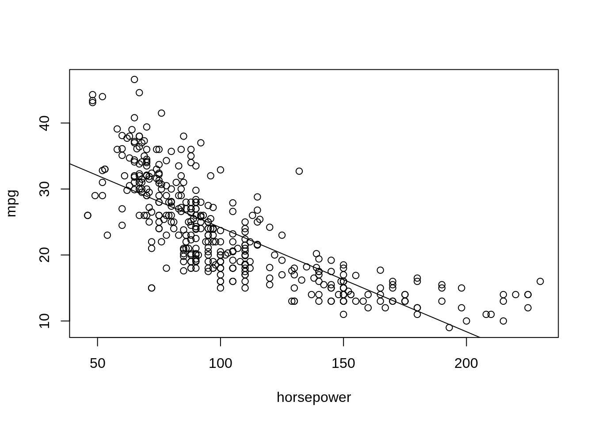

> c. Use the `plot()` function to produce diagnostic plots of the least squares
>   regression fit. Comment on any problems you see with the fit.


``` r
par(mfrow = c(2, 2))
plot(fit, cex = 0.2)
```

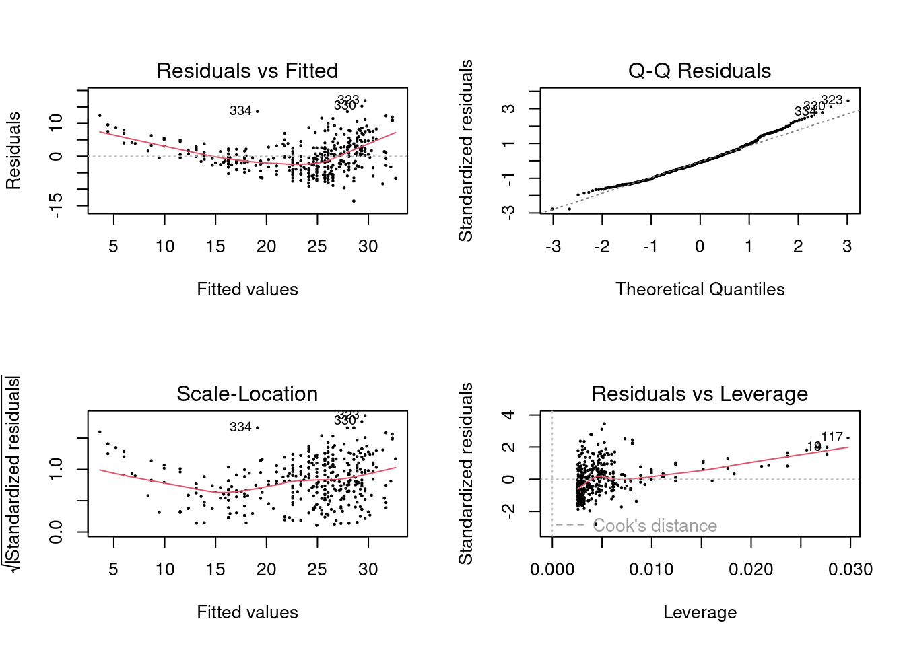

The residuals show a trend with respect to the fitted values suggesting a
non-linear relationship.

### Question 9

> This question involves the use of multiple linear regression on the `Auto`
> data set.
>
> a. Produce a scatterplot matrix which includes all of the variables in the
>    data set.


``` r
pairs(Auto, cex = 0.2)
```

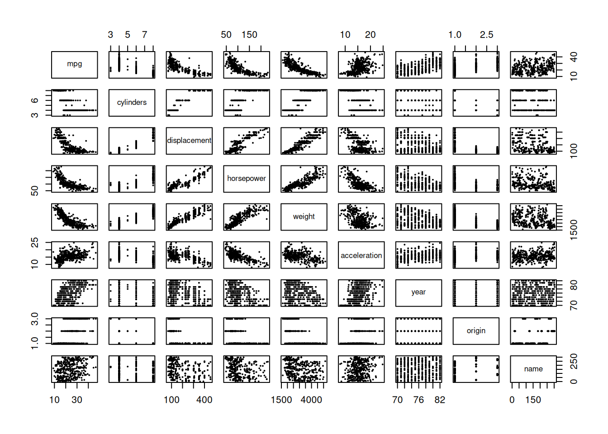

> b. Compute the matrix of correlations between the variables using the function
>    `cor()`. You will need to exclude the name variable, `name` which is
>    qualitative.


``` r
x <- subset(Auto, select = -name)
cor(x)
```

```
##                     mpg  cylinders displacement horsepower     weight
## mpg           1.0000000 -0.7776175   -0.8051269 -0.7784268 -0.8322442
## cylinders    -0.7776175  1.0000000    0.9508233  0.8429834  0.8975273
## displacement -0.8051269  0.9508233    1.0000000  0.8972570  0.9329944
## horsepower   -0.7784268  0.8429834    0.8972570  1.0000000  0.8645377
## weight       -0.8322442  0.8975273    0.9329944  0.8645377  1.0000000
## acceleration  0.4233285 -0.5046834   -0.5438005 -0.6891955 -0.4168392
## year          0.5805410 -0.3456474   -0.3698552 -0.4163615 -0.3091199
## origin        0.5652088 -0.5689316   -0.6145351 -0.4551715 -0.5850054
##              acceleration       year     origin
## mpg             0.4233285  0.5805410  0.5652088
## cylinders      -0.5046834 -0.3456474 -0.5689316
## displacement   -0.5438005 -0.3698552 -0.6145351
## horsepower     -0.6891955 -0.4163615 -0.4551715
## weight         -0.4168392 -0.3091199 -0.5850054
## acceleration    1.0000000  0.2903161  0.2127458
## year            0.2903161  1.0000000  0.1815277
## origin          0.2127458  0.1815277  1.0000000
```

> c. Use the `lm()` function to perform a multiple linear regression with `mpg`
>    as the response and all other variables except name as the predictors. Use 
>    the `summary()` function to print the results. Comment on the output. For
>    instance:
>    i. Is there a relationship between the predictors and the response?
>    ii. Which predictors appear to have a statistically significant relationship
>       to the response?
>    iii. What does the coefficient for the `year` variable suggest?


``` r
fit <- lm(mpg ~ ., data = x)
summary(fit)
```

```
## 
## Call:
## lm(formula = mpg ~ ., data = x)
## 
## Residuals:
##     Min      1Q  Median      3Q     Max 
## -9.5903 -2.1565 -0.1169  1.8690 13.0604 
## 
## Coefficients:
##                Estimate Std. Error t value Pr(>|t|)    
## (Intercept)  -17.218435   4.644294  -3.707  0.00024 ***
## cylinders     -0.493376   0.323282  -1.526  0.12780    
## displacement   0.019896   0.007515   2.647  0.00844 ** 
## horsepower    -0.016951   0.013787  -1.230  0.21963    
## weight        -0.006474   0.000652  -9.929  < 2e-16 ***
## acceleration   0.080576   0.098845   0.815  0.41548    
## year           0.750773   0.050973  14.729  < 2e-16 ***
## origin         1.426141   0.278136   5.127 4.67e-07 ***
## ---
## Signif. codes:  0 '***' 0.001 '**' 0.01 '*' 0.05 '.' 0.1 ' ' 1
## 
## Residual standard error: 3.328 on 384 degrees of freedom
## Multiple R-squared:  0.8215,	Adjusted R-squared:  0.8182 
## F-statistic: 252.4 on 7 and 384 DF,  p-value: < 2.2e-16
```

Yes, there is a relationship between some predictors and response, notably
"displacement" (positive), "weight" (negative), "year" (positive) and
"origin" (positive).

The coefficient for year (which is positive $~0.75$) suggests that mpg
increases by about this amount every year on average.

> d. Use the `plot()` function to produce diagnostic plots of the linear
>    regression fit. Comment on any problems you see with the fit. Do the
>    residual plots suggest any unusually large outliers? Does the leverage plot
>    identify any observations with unusually high leverage?


``` r
par(mfrow = c(2, 2))
plot(fit, cex = 0.2)
```

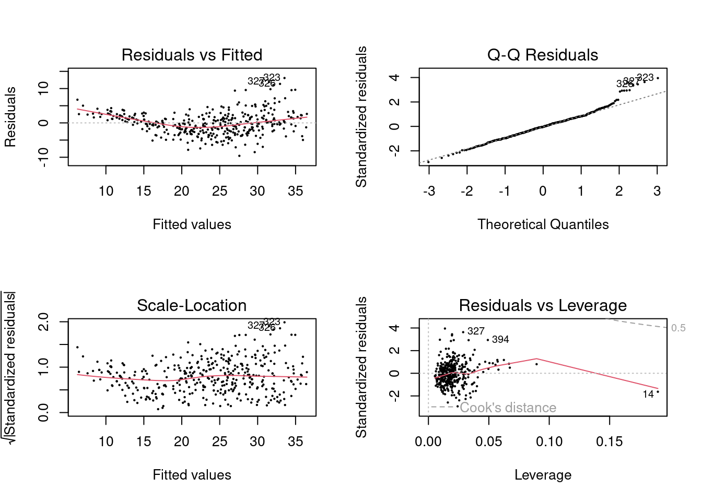

One point has high leverage, the residuals also show a trend with fitted values.

> e. Use the `*` and `:` symbols to fit linear regression models with
>    interaction effects. Do any interactions appear to be statistically
>    significant?


``` r
summary(lm(mpg ~ . + weight:horsepower, data = x))
```

```
## 
## Call:
## lm(formula = mpg ~ . + weight:horsepower, data = x)
## 
## Residuals:
##    Min     1Q Median     3Q    Max 
## -8.589 -1.617 -0.184  1.541 12.001 
## 
## Coefficients:
##                     Estimate Std. Error t value Pr(>|t|)    
## (Intercept)        2.876e+00  4.511e+00   0.638 0.524147    
## cylinders         -2.955e-02  2.881e-01  -0.103 0.918363    
## displacement       5.950e-03  6.750e-03   0.881 0.378610    
## horsepower        -2.313e-01  2.363e-02  -9.791  < 2e-16 ***
## weight            -1.121e-02  7.285e-04 -15.393  < 2e-16 ***
## acceleration      -9.019e-02  8.855e-02  -1.019 0.309081    
## year               7.695e-01  4.494e-02  17.124  < 2e-16 ***
## origin             8.344e-01  2.513e-01   3.320 0.000986 ***
## horsepower:weight  5.529e-05  5.227e-06  10.577  < 2e-16 ***
## ---
## Signif. codes:  0 '***' 0.001 '**' 0.01 '*' 0.05 '.' 0.1 ' ' 1
## 
## Residual standard error: 2.931 on 383 degrees of freedom
## Multiple R-squared:  0.8618,	Adjusted R-squared:  0.859 
## F-statistic: 298.6 on 8 and 383 DF,  p-value: < 2.2e-16
```

``` r
summary(lm(mpg ~ . + acceleration:horsepower, data = x))
```

```
## 
## Call:
## lm(formula = mpg ~ . + acceleration:horsepower, data = x)
## 
## Residuals:
##     Min      1Q  Median      3Q     Max 
## -9.0329 -1.8177 -0.1183  1.7247 12.4870 
## 
## Coefficients:
##                           Estimate Std. Error t value Pr(>|t|)    
## (Intercept)             -32.499820   4.923380  -6.601 1.36e-10 ***
## cylinders                 0.083489   0.316913   0.263 0.792350    
## displacement             -0.007649   0.008161  -0.937 0.349244    
## horsepower                0.127188   0.024746   5.140 4.40e-07 ***
## weight                   -0.003976   0.000716  -5.552 5.27e-08 ***
## acceleration              0.983282   0.161513   6.088 2.78e-09 ***
## year                      0.755919   0.048179  15.690  < 2e-16 ***
## origin                    1.035733   0.268962   3.851 0.000138 ***
## horsepower:acceleration  -0.012139   0.001772  -6.851 2.93e-11 ***
## ---
## Signif. codes:  0 '***' 0.001 '**' 0.01 '*' 0.05 '.' 0.1 ' ' 1
## 
## Residual standard error: 3.145 on 383 degrees of freedom
## Multiple R-squared:  0.841,	Adjusted R-squared:  0.8376 
## F-statistic: 253.2 on 8 and 383 DF,  p-value: < 2.2e-16
```

``` r
summary(lm(mpg ~ . + cylinders:weight, data = x))
```

```
## 
## Call:
## lm(formula = mpg ~ . + cylinders:weight, data = x)
## 
## Residuals:
##      Min       1Q   Median       3Q      Max 
## -10.9484  -1.7133  -0.1809   1.4530  12.4137 
## 
## Coefficients:
##                    Estimate Std. Error t value Pr(>|t|)    
## (Intercept)       7.3143478  5.0076737   1.461  0.14494    
## cylinders        -5.0347425  0.5795767  -8.687  < 2e-16 ***
## displacement      0.0156444  0.0068409   2.287  0.02275 *  
## horsepower       -0.0314213  0.0126216  -2.489  0.01322 *  
## weight           -0.0150329  0.0011125 -13.513  < 2e-16 ***
## acceleration      0.1006438  0.0897944   1.121  0.26306    
## year              0.7813453  0.0464139  16.834  < 2e-16 ***
## origin            0.8030154  0.2617333   3.068  0.00231 ** 
## cylinders:weight  0.0015058  0.0001657   9.088  < 2e-16 ***
## ---
## Signif. codes:  0 '***' 0.001 '**' 0.01 '*' 0.05 '.' 0.1 ' ' 1
## 
## Residual standard error: 3.022 on 383 degrees of freedom
## Multiple R-squared:  0.8531,	Adjusted R-squared:  0.8501 
## F-statistic: 278.1 on 8 and 383 DF,  p-value: < 2.2e-16
```

There are at least three cases where the interactions appear to be highly
significant.

> f. Try a few different transformations of the variables, such as $log(X)$,
>    $\sqrt{X}$, $X^2$. Comment on your findings.

Here I'll just consider transformations for `horsepower`.


``` r
par(mfrow = c(2, 2))
plot(Auto$horsepower, Auto$mpg, cex = 0.2)
plot(log(Auto$horsepower), Auto$mpg, cex = 0.2)
plot(sqrt(Auto$horsepower), Auto$mpg, cex = 0.2)
plot(Auto$horsepower ^ 2, Auto$mpg, cex = 0.2)
```

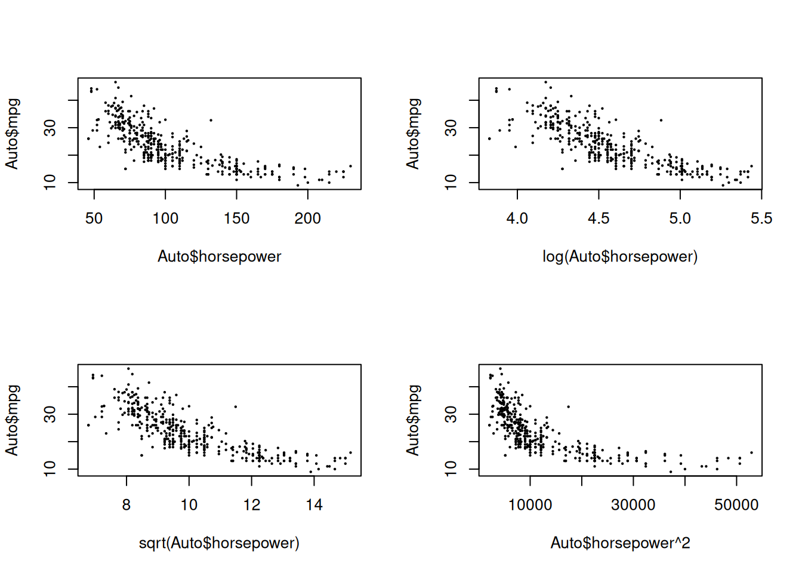

``` r
x <- subset(Auto, select = -name)
x$horsepower <- log(x$horsepower)
fit <- lm(mpg ~ ., data = x)
summary(fit)
```

```
## 
## Call:
## lm(formula = mpg ~ ., data = x)
## 
## Residuals:
##     Min      1Q  Median      3Q     Max 
## -9.3115 -2.0041 -0.1726  1.8393 12.6579 
## 
## Coefficients:
##               Estimate Std. Error t value Pr(>|t|)    
## (Intercept)  27.254005   8.589614   3.173  0.00163 ** 
## cylinders    -0.486206   0.306692  -1.585  0.11372    
## displacement  0.019456   0.006876   2.830  0.00491 ** 
## horsepower   -9.506436   1.539619  -6.175 1.69e-09 ***
## weight       -0.004266   0.000694  -6.148 1.97e-09 ***
## acceleration -0.292088   0.103804  -2.814  0.00515 ** 
## year          0.705329   0.048456  14.556  < 2e-16 ***
## origin        1.482435   0.259347   5.716 2.19e-08 ***
## ---
## Signif. codes:  0 '***' 0.001 '**' 0.01 '*' 0.05 '.' 0.1 ' ' 1
## 
## Residual standard error: 3.18 on 384 degrees of freedom
## Multiple R-squared:  0.837,	Adjusted R-squared:  0.834 
## F-statistic: 281.6 on 7 and 384 DF,  p-value: < 2.2e-16
```

``` r
par(mfrow = c(2, 2))
plot(fit, cex = 0.2)
```

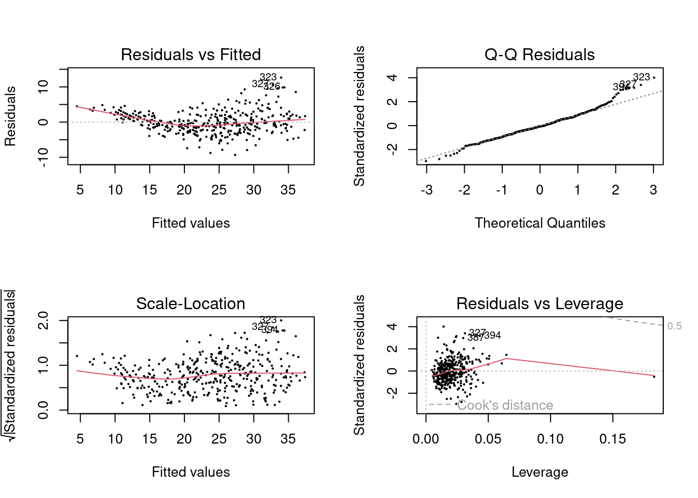

A log transformation of `horsepower` appears to give a more linear relationship
with mpg.

### Question 10

> This question should be answered using the `Carseats` data set.
>
> a. Fit a multiple regression model to predict `Sales` using `Price`, `Urban`,
>    and `US`.


``` r
fit <- lm(Sales ~ Price + Urban + US, data = Carseats)
```

> b. Provide an interpretation of each coefficient in the model. Be
>    careful---some of the variables in the model are qualitative!


``` r
summary(fit)
```

```
## 
## Call:
## lm(formula = Sales ~ Price + Urban + US, data = Carseats)
## 
## Residuals:
##     Min      1Q  Median      3Q     Max 
## -6.9206 -1.6220 -0.0564  1.5786  7.0581 
## 
## Coefficients:
##              Estimate Std. Error t value Pr(>|t|)    
## (Intercept) 13.043469   0.651012  20.036  < 2e-16 ***
## Price       -0.054459   0.005242 -10.389  < 2e-16 ***
## UrbanYes    -0.021916   0.271650  -0.081    0.936    
## USYes        1.200573   0.259042   4.635 4.86e-06 ***
## ---
## Signif. codes:  0 '***' 0.001 '**' 0.01 '*' 0.05 '.' 0.1 ' ' 1
## 
## Residual standard error: 2.472 on 396 degrees of freedom
## Multiple R-squared:  0.2393,	Adjusted R-squared:  0.2335 
## F-statistic: 41.52 on 3 and 396 DF,  p-value: < 2.2e-16
```

> c. Write out the model in equation form, being careful to handle the
>    qualitative variables properly.

$$
\textit{Sales} = 13 + -0.054 \times \textit{Price} + \begin{cases}
   -0.022,   & \text{if $\textit{Urban}$ is Yes, $\textit{US}$ is No} \\
    1.20,    & \text{if $\textit{Urban}$ is No, $\textit{US}$ is Yes} \\
    1.18,    & \text{if $\textit{Urban}$ and $\textit{US}$ is Yes} \\
    0,       & \text{Otherwise}
\end{cases}
$$

> d. For which of the predictors can you reject the null hypothesis
>    $H_0 : \beta_j = 0$?

Price and US (Urban shows no significant difference between "No" and "Yes")

> e. On the basis of your response to the previous question, fit a smaller model
>    that only uses the predictors for which there is evidence of association
>    with the outcome.


``` r
fit2 <- lm(Sales ~ Price + US, data = Carseats)
```

> f. How well do the models in (a) and (e) fit the data?


``` r
summary(fit)
```

```
## 
## Call:
## lm(formula = Sales ~ Price + Urban + US, data = Carseats)
## 
## Residuals:
##     Min      1Q  Median      3Q     Max 
## -6.9206 -1.6220 -0.0564  1.5786  7.0581 
## 
## Coefficients:
##              Estimate Std. Error t value Pr(>|t|)    
## (Intercept) 13.043469   0.651012  20.036  < 2e-16 ***
## Price       -0.054459   0.005242 -10.389  < 2e-16 ***
## UrbanYes    -0.021916   0.271650  -0.081    0.936    
## USYes        1.200573   0.259042   4.635 4.86e-06 ***
## ---
## Signif. codes:  0 '***' 0.001 '**' 0.01 '*' 0.05 '.' 0.1 ' ' 1
## 
## Residual standard error: 2.472 on 396 degrees of freedom
## Multiple R-squared:  0.2393,	Adjusted R-squared:  0.2335 
## F-statistic: 41.52 on 3 and 396 DF,  p-value: < 2.2e-16
```

``` r
summary(fit2)
```

```
## 
## Call:
## lm(formula = Sales ~ Price + US, data = Carseats)
## 
## Residuals:
##     Min      1Q  Median      3Q     Max 
## -6.9269 -1.6286 -0.0574  1.5766  7.0515 
## 
## Coefficients:
##             Estimate Std. Error t value Pr(>|t|)    
## (Intercept) 13.03079    0.63098  20.652  < 2e-16 ***
## Price       -0.05448    0.00523 -10.416  < 2e-16 ***
## USYes        1.19964    0.25846   4.641 4.71e-06 ***
## ---
## Signif. codes:  0 '***' 0.001 '**' 0.01 '*' 0.05 '.' 0.1 ' ' 1
## 
## Residual standard error: 2.469 on 397 degrees of freedom
## Multiple R-squared:  0.2393,	Adjusted R-squared:  0.2354 
## F-statistic: 62.43 on 2 and 397 DF,  p-value: < 2.2e-16
```

``` r
anova(fit, fit2)
```

```
## Analysis of Variance Table
## 
## Model 1: Sales ~ Price + Urban + US
## Model 2: Sales ~ Price + US
##   Res.Df    RSS Df Sum of Sq      F Pr(>F)
## 1    396 2420.8                           
## 2    397 2420.9 -1  -0.03979 0.0065 0.9357
```

They have similar $R^2$ and the model containing the extra variable "Urban" is
non-significantly better.

> g. Using the model from (e), obtain 95% confidence intervals for the
>    coefficient(s).


``` r
confint(fit2)
```

```
##                   2.5 %      97.5 %
## (Intercept) 11.79032020 14.27126531
## Price       -0.06475984 -0.04419543
## USYes        0.69151957  1.70776632
```

> h. Is there evidence of outliers or high leverage observations in the model
>    from (e)?


``` r
par(mfrow = c(2, 2))
plot(fit2, cex = 0.2)
```

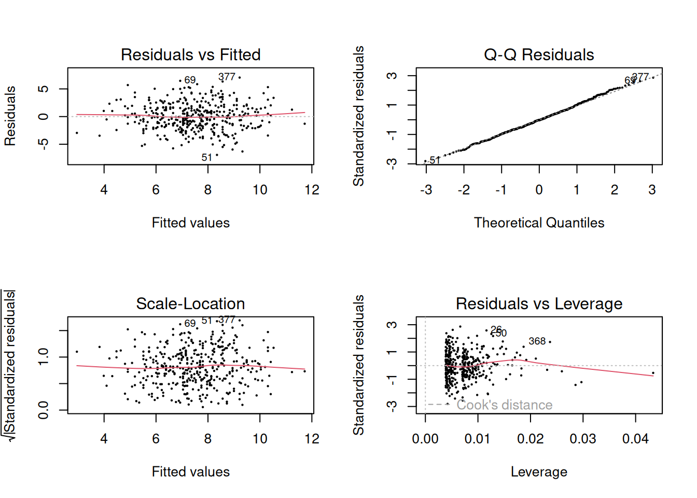

Yes, somewhat.

### Question 11

> In this problem we will investigate the _t_-statistic for the null hypothesis
> $H_0 : \beta = 0$ in simple linear regression without an intercept. To
> begin, we generate a predictor `x` and a response `y` as follows.
>
> ```r
> set.seed(1)
> x <- rnorm(100)
> y <- 2 * x + rnorm(100)
> ```


``` r
set.seed(1)
x <- rnorm(100)
y <- 2 * x + rnorm(100)
```

> a. Perform a simple linear regression of `y` onto `x`, _without_ an intercept.
>    Report the coefficient estimate $\hat{\beta}$, the standard error of this
>    coefficient estimate, and the _t_-statistic and _p_-value associated with the
>    null hypothesis $H_0 : \beta = 0$. Comment on these results. (You can
>    perform regression without an intercept using the command `lm(y~x+0)`.)


``` r
fit <- lm(y ~ x + 0)
coef(summary(fit))
```

```
##   Estimate Std. Error  t value     Pr(>|t|)
## x 1.993876  0.1064767 18.72593 2.642197e-34
```

There's a significant positive relationship between $y$ and $x$. $y$ values are
predicted to be (a little below) twice the $x$ values.

> b. Now perform a simple linear regression of `x` onto `y` without an intercept,
>    and report the coefficient estimate, its standard error, and the
>    corresponding _t_-statistic and _p_-values associated with the null hypothesis
>    $H_0 : \beta = 0$. Comment on these results.


``` r
fit <- lm(x ~ y + 0)
coef(summary(fit))
```

```
##    Estimate Std. Error  t value     Pr(>|t|)
## y 0.3911145 0.02088625 18.72593 2.642197e-34
```

There's a significant positive relationship between $x$ and $y$. $x$ values are
predicted to be (a little below) half the $y$ values.

> c. What is the relationship between the results obtained in (a) and (b)?

Without error, the coefficients would be the inverse of each other (2 and 1/2).
The t-statistic and p-values are the same.

> d. For the regression of $Y$ onto $X$ without an intercept, the
>    _t_-statistic for $H_0 : \beta = 0$ takes the form 
>    $\hat{\beta}/SE(\hat{\beta})$, where $\hat{\beta}$ is given by (3.38), and
>    where
>    $$
>    SE(\hat\beta) = \sqrt{\frac{\sum_{i=1}^n(y_i - x_i\hat\beta)^2}{(n-1)\sum_{i'=1}^nx_{i'}^2}}.
>    $$
>    (These formulas are slightly different from those given in Sections 3.1.1 and
>    3.1.2, since here we are performing regression without an intercept.) Show
>    algebraically, and confirm numerically in R, that the t-statistic can be
>    written as
>    $$
>    \frac{(\sqrt{n-1}) \sum_{i-1}^nx_iy_i)}
>         {\sqrt{(\sum_{i=1}^nx_i^2)(\sum_{i'=1}^ny_{i'}^2)-(\sum_{i'=1}^nx_{i'}y_{i'})^2}}
>    $$

$$ \beta = \sum_i x_i y_i / \sum_{i'} x_{i'}^2 ,$$

therefore

\begin{align}
t &= \frac{\sum_i x_i y_i \sqrt{n-1} \sqrt{\sum_ix_i^2}}
          {\sum_i x_i^2 \sqrt{\sum_i(y_i - x_i \beta)^2}} \\

  &= \frac{\sum_i x_i y_i \sqrt{n-1}}
          {\sqrt{\sum_ix_i^2 \sum_i(y_i - x_i \beta)^2}} \\

  &= \frac{\sum_i x_i y_i \sqrt{n-1}}
          {\sqrt{
            \sum_ix_i^2
            \sum_i(y_i^2 - 2 y_i x_i \beta + x_i^2 \beta^2)
           }} \\

  &= \frac{\sum_i x_i y_i \sqrt{n-1}}
          {\sqrt{
            \sum_ix_i^2 \sum_iy_i^2 -
            \beta \sum_ix_i^2 (2 \sum_i y_i x_i -\beta \sum_i x_i^2)
           }} \\

  &= \frac{\sum_i x_i y_i \sqrt{n-1}}
          {\sqrt{
            \sum_ix_i^2 \sum_iy_i^2 -
            \sum_i x_i y_i (2 \sum_i y_i x_i - \sum_i x_i y_i)
           }} \\

  &= \frac{\sum_i x_i y_i \sqrt{n-1}}
          {\sqrt{\sum_ix_i^2 \sum_iy_i^2 - (\sum_i x_i y_i)^2}} \\
\end{align}

We can show this numerically in R by computing $t$ using the above equation.


``` r
n <- length(x)
sqrt(n - 1) * sum(x * y) / sqrt(sum(x ^ 2) * sum(y ^ 2) - sum(x * y) ^ 2)
```

```
## [1] 18.72593
```

> e. Using the results from (d), argue that the _t_-statistic for the
>    regression of y onto x is the same as the _t_-statistic for the regression
>    of `x` onto `y`.

Swapping $x_i$ for $y_i$ in the formula for $t$ will give the same result.

> f. In `R`, show that when regression is performed _with_ an intercept, the
>    _t_-statistic for $H_0 : \beta_1 = 0$ is the same for the regression of `y`
>    onto `x` as it is for the regression of `x` onto `y`.


``` r
coef(summary(lm(y ~ x)))
```

```
##                Estimate Std. Error    t value     Pr(>|t|)
## (Intercept) -0.03769261 0.09698729 -0.3886346 6.983896e-01
## x            1.99893961 0.10772703 18.5555993 7.723851e-34
```

``` r
coef(summary(lm(x ~ y)))
```

```
##               Estimate Std. Error    t value     Pr(>|t|)
## (Intercept) 0.03880394 0.04266144  0.9095787 3.652764e-01
## y           0.38942451 0.02098690 18.5555993 7.723851e-34
```

### Question 12

> This problem involves simple linear regression without an intercept.
>
> a. Recall that the coefficient estimate $\hat{\beta}$ for the linear
>    regression of $Y$ onto $X$ without an intercept is given by (3.38). Under
>    what circumstance is the coefficient estimate for the regression of $X$
>    onto $Y$ the same as the coefficient estimate for the regression of $Y$
>    onto $X$?

$$ \hat\beta = \sum_i x_iy_i / \sum_{i'} x_{i'}^2 $$

The coefficient for the regression of X onto Y swaps the $x$ and $y$ variables:

$$ \hat\beta = \sum_i x_iy_i / \sum_{i'} y_{i'}^2 $$

So they are the same when $\sum_{i} x_{i}^2 = \sum_{i} y_{i}^2$

> b. Generate an example in `R` with $n = 100$ observations in which the
>    coefficient estimate for the regression of $X$ onto $Y$ is different from
>    the coefficient estimate for the regression of $Y$ onto $X$.


``` r
x <- rnorm(100)
y <- 2 * x + rnorm(100, 0, 0.1)
c(sum(x^2), sum(y^2))
```

```
## [1] 105.9889 429.4924
```

``` r
c(coef(lm(y ~ x))[2], coef(lm(x ~ y))[2])
```

```
##         x         y 
## 2.0106218 0.4962439
```

> c. Generate an example in `R` with $n = 100$ observations in which the
>    coefficient estimate for the regression of $X$ onto $Y$ is the same as the
>    coefficient estimate for the regression of $Y$ onto $X$.


``` r
x <- rnorm(100)
y <- x + rnorm(100, 0, 0.1)
c(sum(x^2), sum(y^2))
```

```
## [1] 135.5844 134.5153
```

``` r
c(coef(lm(y ~ x))[2], coef(lm(x ~ y))[2])
```

```
##         x         y 
## 0.9925051 1.0006765
```

### Question 13

> In this exercise you will create some simulated data and will fit simple
> linear regression models to it. Make sure to use `set.seed(1)` prior to
> starting part (a) to ensure consistent results.


``` r
set.seed(1)
```

> a. Using the `rnorm()` function, create a vector, `x`, containing 100
>    observations drawn from a $N(0, 1)$ distribution. This represents a
>    feature, $X$.


``` r
x <- rnorm(100, 0, 1)
```

> b. Using the `rnorm()` function, create a vector, `eps`, containing 100
>    observations drawn from a $N(0, 0.25)$ distribution---a normal
>    distribution with mean zero and variance 0.25.


``` r
eps <- rnorm(100, 0, sqrt(0.25))
```

> c. Using x and `eps`, generate a vector y according to the model
>    $$Y = -1 + 0.5X + \epsilon$$
>    What is the length of the vector `y`? What are the values of
>    $\beta_0$ and $\beta_1$ in this linear model?


``` r
y <- -1 + 0.5 * x + eps
length(y)
```

```
## [1] 100
```

$\beta_0 = -1$ and $\beta_1 = 0.5$

> d. Create a scatterplot displaying the relationship between `x` and `y`.
>    Comment on what you observe.


``` r
plot(x, y)
```

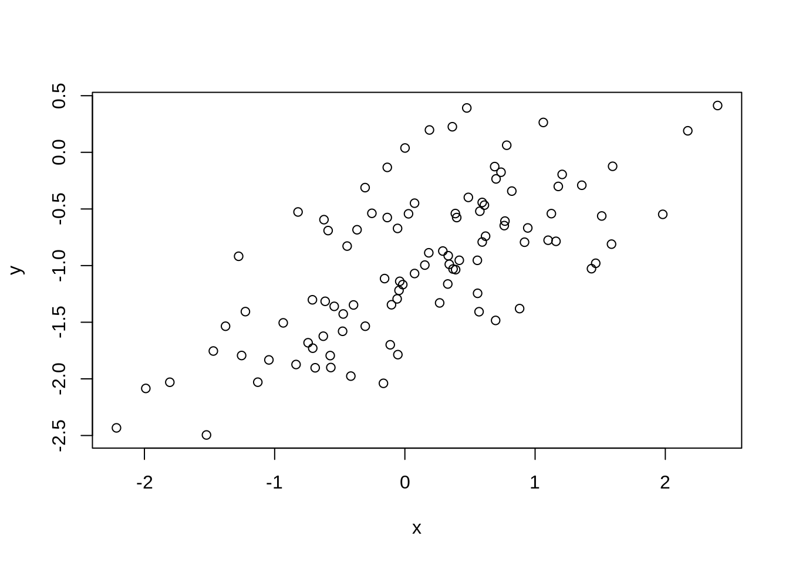

There is a linear relationship between $x$ and $y$ (with some error).

> e. Fit a least squares linear model to predict `y` using `x`. Comment on the
>    model obtained. How do $\hat\beta_0$ and $\hat\beta_1$ compare to $\beta_0$
>    and $\beta_1$?


``` r
fit <- lm(y ~ x)
summary(fit)
```

```
## 
## Call:
## lm(formula = y ~ x)
## 
## Residuals:
##      Min       1Q   Median       3Q      Max 
## -0.93842 -0.30688 -0.06975  0.26970  1.17309 
## 
## Coefficients:
##             Estimate Std. Error t value Pr(>|t|)    
## (Intercept) -1.01885    0.04849 -21.010  < 2e-16 ***
## x            0.49947    0.05386   9.273 4.58e-15 ***
## ---
## Signif. codes:  0 '***' 0.001 '**' 0.01 '*' 0.05 '.' 0.1 ' ' 1
## 
## Residual standard error: 0.4814 on 98 degrees of freedom
## Multiple R-squared:  0.4674,	Adjusted R-squared:  0.4619 
## F-statistic: 85.99 on 1 and 98 DF,  p-value: 4.583e-15
```

$\beta_0$ and $\beta_1$ are close to their population values.

> f. Display the least squares line on the scatterplot obtained in (d). Draw the
>    population regression line on the plot, in a different color. Use the
>    `legend()` command to create an appropriate legend.


``` r
plot(x, y)
abline(fit)
abline(-1, 0.5, col = "red", lty = 2)
legend("topleft",
  c("model fit", "population regression"),
  col = c("black", "red"),
  lty = c(1, 2)
)
```

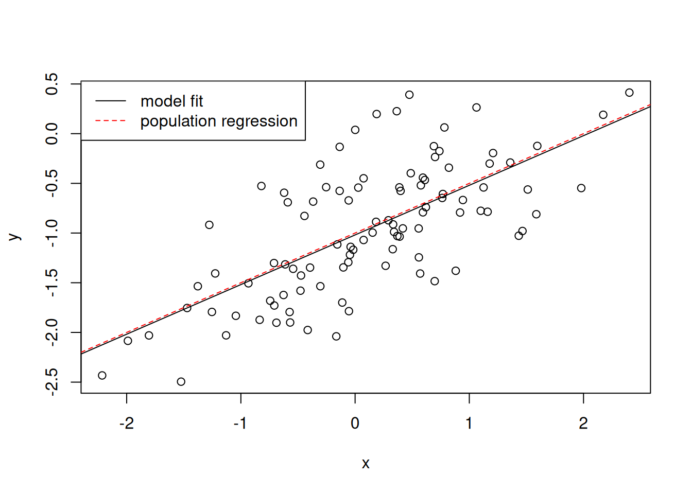

> g. Now fit a polynomial regression model that predicts `y` using `x` and `x^2`.
>    Is there evidence that the quadratic term improves the model fit? Explain
>    your answer.


``` r
fit2 <- lm(y ~ poly(x, 2))
anova(fit2, fit)
```

```
## Analysis of Variance Table
## 
## Model 1: y ~ poly(x, 2)
## Model 2: y ~ x
##   Res.Df    RSS Df Sum of Sq      F Pr(>F)
## 1     97 22.257                           
## 2     98 22.709 -1  -0.45163 1.9682 0.1638
```

There is no evidence for an improved fit, since the F-test is non-significant.

> h. Repeat (a)--(f) after modifying the data generation process in such a way
>    that there is *less* noise in the data. The model (3.39) should remain the
>    same. You can do this by decreasing the variance of the normal distribution
>    used to generate the error term $\epsilon$ in (b). Describe your results.


``` r
x <- rnorm(100, 0, 1)
y <- -1 + 0.5 * x + rnorm(100, 0, sqrt(0.05))
fit2 <- lm(y ~ x)
summary(fit2)
```

```
## 
## Call:
## lm(formula = y ~ x)
## 
## Residuals:
##      Min       1Q   Median       3Q      Max 
## -0.61308 -0.12553 -0.00391  0.15199  0.41332 
## 
## Coefficients:
##             Estimate Std. Error t value Pr(>|t|)    
## (Intercept) -0.98917    0.02216  -44.64   <2e-16 ***
## x            0.52375    0.02152   24.33   <2e-16 ***
## ---
## Signif. codes:  0 '***' 0.001 '**' 0.01 '*' 0.05 '.' 0.1 ' ' 1
## 
## Residual standard error: 0.2215 on 98 degrees of freedom
## Multiple R-squared:  0.858,	Adjusted R-squared:  0.8565 
## F-statistic: 592.1 on 1 and 98 DF,  p-value: < 2.2e-16
```

``` r
plot(x, y)
abline(fit2)
abline(-1, 0.5, col = "red", lty = 2)
legend("topleft",
  c("model fit", "population regression"),
  col = c("black", "red"),
  lty = c(1, 2)
)
```

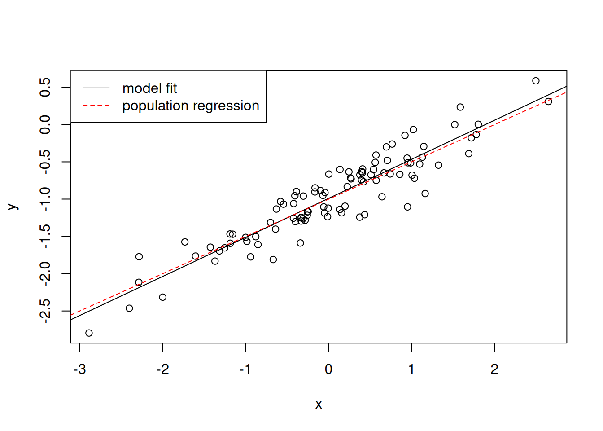

The data shows less variability and the $R^2$ is higher.

> i. Repeat (a)--(f) after modifying the data generation process in such a way
>    that there is *more* noise in the data. The model (3.39) should remain the
>    same. You can do this by increasing the variance of the normal distribution
>    used to generate the error term $\epsilon$ in (b). Describe your results.


``` r
x <- rnorm(100, 0, 1)
y <- -1 + 0.5 * x + rnorm(100, 0, 1)
fit3 <- lm(y ~ x)
summary(fit3)
```

```
## 
## Call:
## lm(formula = y ~ x)
## 
## Residuals:
##      Min       1Q   Median       3Q      Max 
## -2.51014 -0.60549  0.02065  0.70483  2.08980 
## 
## Coefficients:
##             Estimate Std. Error t value Pr(>|t|)    
## (Intercept) -1.04745    0.09676 -10.825  < 2e-16 ***
## x            0.42505    0.08310   5.115 1.56e-06 ***
## ---
## Signif. codes:  0 '***' 0.001 '**' 0.01 '*' 0.05 '.' 0.1 ' ' 1
## 
## Residual standard error: 0.9671 on 98 degrees of freedom
## Multiple R-squared:  0.2107,	Adjusted R-squared:  0.2027 
## F-statistic: 26.16 on 1 and 98 DF,  p-value: 1.56e-06
```

``` r
plot(x, y)
abline(fit3)
abline(-1, 0.5, col = "red", lty = 2)
legend("topleft",
  c("model fit", "population regression"),
  col = c("black", "red"),
  lty = c(1, 2)
)
```

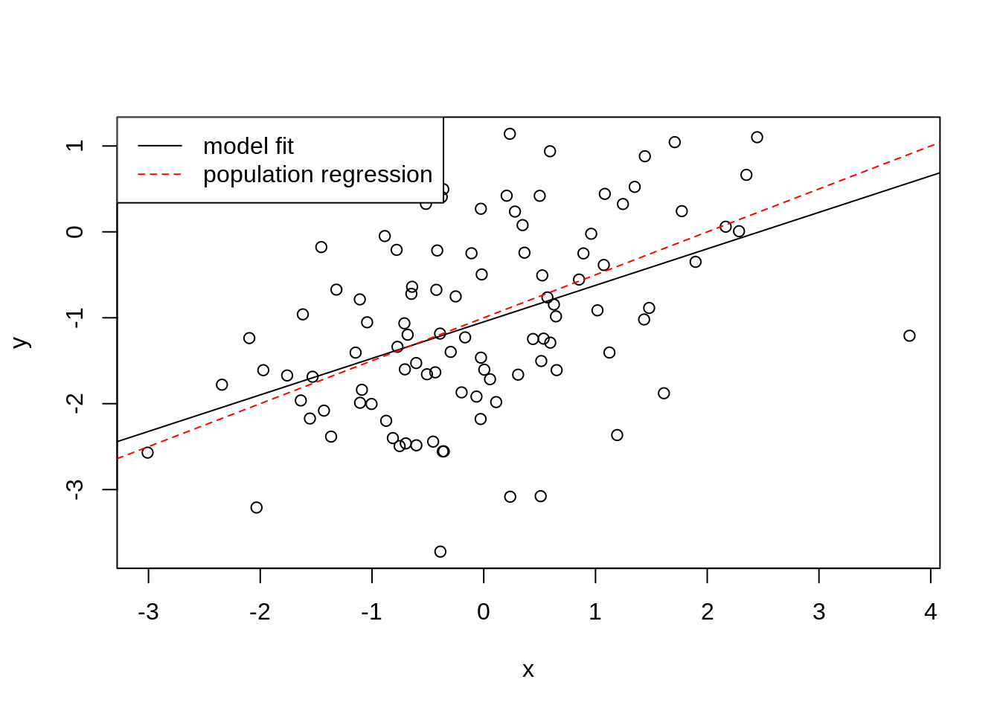

The data shows more variability. The $R^2$ is lower.

> j. What are the confidence intervals for $\beta_0$ and $\beta_1$ based on the
>    original data set, the noisier data set, and the less noisy data set?
>    Comment on your results.


``` r
confint(fit)
```

```
##                  2.5 %     97.5 %
## (Intercept) -1.1150804 -0.9226122
## x            0.3925794  0.6063602
```

``` r
confint(fit2)
```

```
##                 2.5 %     97.5 %
## (Intercept) -1.033141 -0.9451916
## x            0.481037  0.5664653
```

``` r
confint(fit3)
```

```
##                  2.5 %     97.5 %
## (Intercept) -1.2394772 -0.8554276
## x            0.2601391  0.5899632
```

The confidence intervals for the coefficients are smaller when there is less
error.

### Question 14

> This problem focuses on the collinearity problem.
>
> a. Perform the following commands in R :
>    
>    ```r
>    > set.seed(1)
>    > x1 <- runif(100)
>    > x2 <- 0.5 * x1 + rnorm(100) / 10
>    > y <- 2 + 2 * x1 + 0.3 * x2 + rnorm(100)
>    ```
>
>    The last line corresponds to creating a linear model in which `y` is a
>    function of `x1` and `x2`. Write out the form of the linear model. What are
>    the regression coefficients?


``` r
set.seed(1)
x1 <- runif(100)
x2 <- 0.5 * x1 + rnorm(100) / 10
y <- 2 + 2 * x1 + 0.3 * x2 + rnorm(100)
```

The model is of the form:

$$Y = \beta_0 + \beta_1X_1 + \beta_2X_2 + \epsilon$$

The coefficients are $\beta_0 = 2$, $\beta_1 = 2$, $\beta_3 = 0.3$.

> b. What is the correlation between `x1` and `x2`? Create a scatterplot
>    displaying the relationship between the variables.


``` r
cor(x1, x2)
```

```
## [1] 0.8351212
```

``` r
plot(x1, x2)
```

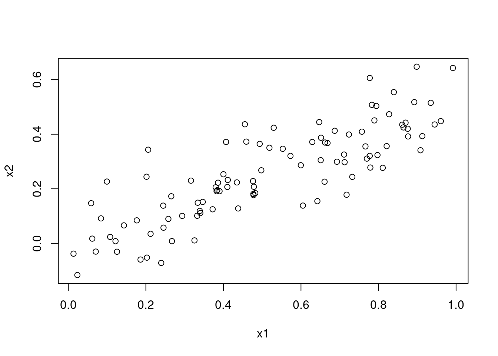

> c. Using this data, fit a least squares regression to predict `y` using `x1`
>    and `x2`. Describe the results obtained. What are $\hat\beta_0$,
>    $\hat\beta_1$, and $\hat\beta_2$? How do these relate to the true $\beta_0$,
>    $\beta_1$, and \beta_2$? Can you reject the null hypothesis $H_0 : \beta_1$
>    = 0$? How about the null hypothesis $H_0 : \beta_2 = 0$?


``` r
summary(lm(y ~ x1 + x2))
```

```
## 
## Call:
## lm(formula = y ~ x1 + x2)
## 
## Residuals:
##     Min      1Q  Median      3Q     Max 
## -2.8311 -0.7273 -0.0537  0.6338  2.3359 
## 
## Coefficients:
##             Estimate Std. Error t value Pr(>|t|)    
## (Intercept)   2.1305     0.2319   9.188 7.61e-15 ***
## x1            1.4396     0.7212   1.996   0.0487 *  
## x2            1.0097     1.1337   0.891   0.3754    
## ---
## Signif. codes:  0 '***' 0.001 '**' 0.01 '*' 0.05 '.' 0.1 ' ' 1
## 
## Residual standard error: 1.056 on 97 degrees of freedom
## Multiple R-squared:  0.2088,	Adjusted R-squared:  0.1925 
## F-statistic:  12.8 on 2 and 97 DF,  p-value: 1.164e-05
```

$\hat\beta_0 = 2.13$, $\hat\beta_1 = 1.43$, and $\hat\beta_2 = 1.01$. These are
relatively poor estimates of the true values. We can reject the hypothesis that
$H_0 : \beta_1$ at a p-value of 0.05 (just about). We cannot reject the 
hypothesis that $H_0 : \beta_2 = 0$.

> d. Now fit a least squares regression to predict `y` using only `x1`. Comment
>    on your results. Can you reject the null hypothesis $H 0 : \beta_1 = 0$?


``` r
summary(lm(y ~ x1))
```

```
## 
## Call:
## lm(formula = y ~ x1)
## 
## Residuals:
##      Min       1Q   Median       3Q      Max 
## -2.89495 -0.66874 -0.07785  0.59221  2.45560 
## 
## Coefficients:
##             Estimate Std. Error t value Pr(>|t|)    
## (Intercept)   2.1124     0.2307   9.155 8.27e-15 ***
## x1            1.9759     0.3963   4.986 2.66e-06 ***
## ---
## Signif. codes:  0 '***' 0.001 '**' 0.01 '*' 0.05 '.' 0.1 ' ' 1
## 
## Residual standard error: 1.055 on 98 degrees of freedom
## Multiple R-squared:  0.2024,	Adjusted R-squared:  0.1942 
## F-statistic: 24.86 on 1 and 98 DF,  p-value: 2.661e-06
```

We can reject $H_0 : \beta_1 = 0$. The p-value is much more significant for 
$\beta_1$ compared to when `x2` is included in the model.

> e. Now fit a least squares regression to predict `y` using only `x2`. Comment
>    on your results. Can you reject the null hypothesis $H_0 : \beta_1 = 0$?


``` r
summary(lm(y ~ x2))
```

```
## 
## Call:
## lm(formula = y ~ x2)
## 
## Residuals:
##      Min       1Q   Median       3Q      Max 
## -2.62687 -0.75156 -0.03598  0.72383  2.44890 
## 
## Coefficients:
##             Estimate Std. Error t value Pr(>|t|)    
## (Intercept)   2.3899     0.1949   12.26  < 2e-16 ***
## x2            2.8996     0.6330    4.58 1.37e-05 ***
## ---
## Signif. codes:  0 '***' 0.001 '**' 0.01 '*' 0.05 '.' 0.1 ' ' 1
## 
## Residual standard error: 1.072 on 98 degrees of freedom
## Multiple R-squared:  0.1763,	Adjusted R-squared:  0.1679 
## F-statistic: 20.98 on 1 and 98 DF,  p-value: 1.366e-05
```

Similarly, we can reject $H_0 : \beta_2 = 0$. The p-value is much more
significant for $\beta_2$ compared to when `x1` is included in the model.

> f. Do the results obtained in (c)--(e) contradict each other? Explain your
>    answer.

No they do not contradict each other. Both `x1` and `x2` individually are 
capable of explaining much of the variation observed in `y`, however since they
are correlated, it is very difficult to tease apart their separate 
contributions.

> g. Now suppose we obtain one additional observation, which was unfortunately
>    mismeasured.
>    ```r
>    > x1 <- c(x1, 0.1)
>    > x2 <- c(x2, 0.8)
>    > y <- c(y, 6)
>    ```
>    Re-fit the linear models from (c) to (e) using this new data. What effect
>    does this new observation have on the each of the models? In each model, is
>    this observation an outlier? A high-leverage point? Both? Explain your
>    answers.


``` r
x1 <- c(x1 , 0.1)
x2 <- c(x2 , 0.8)
y <- c(y ,6)
summary(lm(y ~ x1 + x2))
```

```
## 
## Call:
## lm(formula = y ~ x1 + x2)
## 
## Residuals:
##      Min       1Q   Median       3Q      Max 
## -2.73348 -0.69318 -0.05263  0.66385  2.30619 
## 
## Coefficients:
##             Estimate Std. Error t value Pr(>|t|)    
## (Intercept)   2.2267     0.2314   9.624 7.91e-16 ***
## x1            0.5394     0.5922   0.911  0.36458    
## x2            2.5146     0.8977   2.801  0.00614 ** 
## ---
## Signif. codes:  0 '***' 0.001 '**' 0.01 '*' 0.05 '.' 0.1 ' ' 1
## 
## Residual standard error: 1.075 on 98 degrees of freedom
## Multiple R-squared:  0.2188,	Adjusted R-squared:  0.2029 
## F-statistic: 13.72 on 2 and 98 DF,  p-value: 5.564e-06
```

``` r
summary(lm(y ~ x1))
```

```
## 
## Call:
## lm(formula = y ~ x1)
## 
## Residuals:
##     Min      1Q  Median      3Q     Max 
## -2.8897 -0.6556 -0.0909  0.5682  3.5665 
## 
## Coefficients:
##             Estimate Std. Error t value Pr(>|t|)    
## (Intercept)   2.2569     0.2390   9.445 1.78e-15 ***
## x1            1.7657     0.4124   4.282 4.29e-05 ***
## ---
## Signif. codes:  0 '***' 0.001 '**' 0.01 '*' 0.05 '.' 0.1 ' ' 1
## 
## Residual standard error: 1.111 on 99 degrees of freedom
## Multiple R-squared:  0.1562,	Adjusted R-squared:  0.1477 
## F-statistic: 18.33 on 1 and 99 DF,  p-value: 4.295e-05
```

``` r
summary(lm(y ~ x2))
```

```
## 
## Call:
## lm(formula = y ~ x2)
## 
## Residuals:
##      Min       1Q   Median       3Q      Max 
## -2.64729 -0.71021 -0.06899  0.72699  2.38074 
## 
## Coefficients:
##             Estimate Std. Error t value Pr(>|t|)    
## (Intercept)   2.3451     0.1912  12.264  < 2e-16 ***
## x2            3.1190     0.6040   5.164 1.25e-06 ***
## ---
## Signif. codes:  0 '***' 0.001 '**' 0.01 '*' 0.05 '.' 0.1 ' ' 1
## 
## Residual standard error: 1.074 on 99 degrees of freedom
## Multiple R-squared:  0.2122,	Adjusted R-squared:  0.2042 
## F-statistic: 26.66 on 1 and 99 DF,  p-value: 1.253e-06
```

``` r
par(mfrow = c(2, 2))
plot(lm(y ~ x1 + x2), cex = 0.2)
```

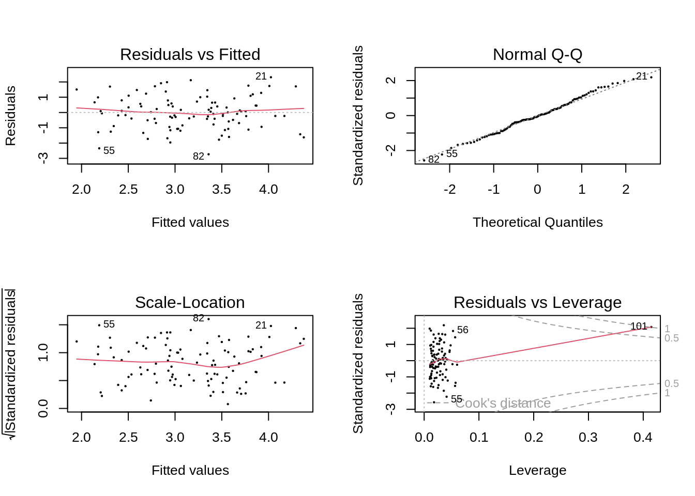

``` r
par(mfrow = c(2, 2))
plot(lm(y ~ x1), cex = 0.2)
```

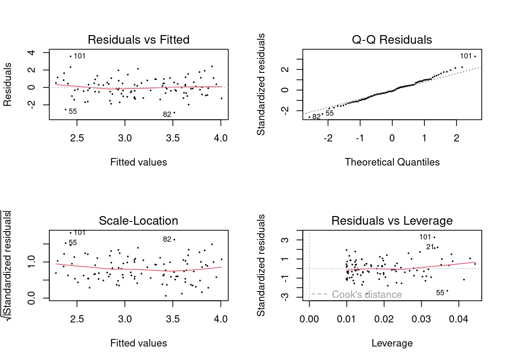

``` r
par(mfrow = c(2, 2))
plot(lm(y ~ x2), cex = 0.2)
```

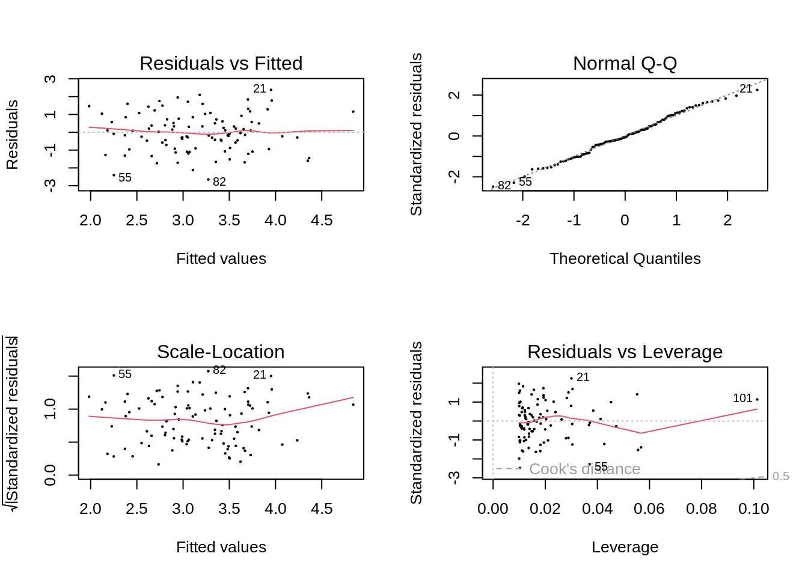

In the first model (with both predictors), the new point has very high leverage
(since it is an outlier in terms of the joint `x1` and `x2` distribution), 
however it is not an outlier. In the model that includes `x1`, it is an outlier
but does not have high leverage. In the model that includes `x2`, it has high
leverage but is not an outlier. It is useful to consider the scatterplot of 
`x1` and `x2`.


``` r
plot(x1, x2)
points(0.1, 0.8, col = "red", pch = 19)
```

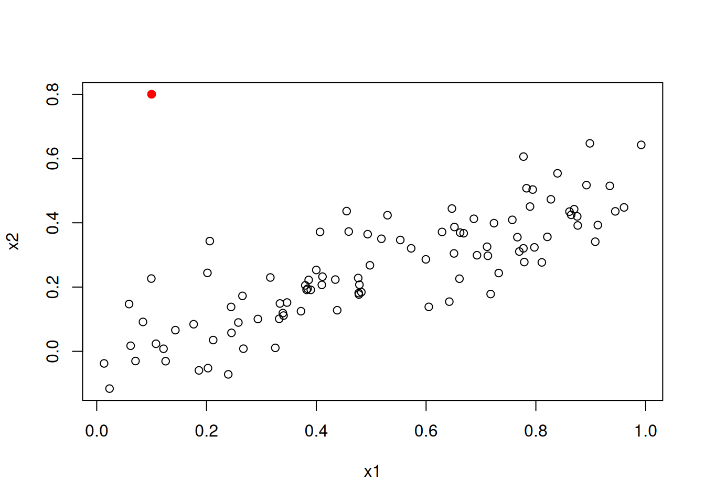

### Question 15

> This problem involves the `Boston` data set, which we saw in the lab for this
> chapter. We will now try to predict per capita crime rate using the other
> variables in this data set. In other words, per capita crime rate is the
> response, and the other variables are the predictors.

We are trying to predict `crim`.


``` r
pred <- subset(Boston, select = -crim)
```

> a. For each predictor, fit a simple linear regression model to predict the
>    response. Describe your results. In which of the models is there a
>    statistically significant association between the predictor and the
>    response? Create some plots to back up your assertions.


``` r
fits <- lapply(pred, function(x) lm(Boston$crim ~ x))
printCoefmat(do.call(rbind, lapply(fits, function(x) coef(summary(x))[2, ])))
```

```
##           Estimate Std. Error t value  Pr(>|t|)    
## zn      -0.0739350  0.0160946 -4.5938 5.506e-06 ***
## indus    0.5097763  0.0510243  9.9908 < 2.2e-16 ***
## chas    -1.8927766  1.5061155 -1.2567    0.2094    
## nox     31.2485312  2.9991904 10.4190 < 2.2e-16 ***
## rm      -2.6840512  0.5320411 -5.0448 6.347e-07 ***
## age      0.1077862  0.0127364  8.4628 2.855e-16 ***
## dis     -1.5509017  0.1683300 -9.2135 < 2.2e-16 ***
## rad      0.6179109  0.0343318 17.9982 < 2.2e-16 ***
## tax      0.0297423  0.0018474 16.0994 < 2.2e-16 ***
## ptratio  1.1519828  0.1693736  6.8014 2.943e-11 ***
## lstat    0.5488048  0.0477610 11.4907 < 2.2e-16 ***
## medv    -0.3631599  0.0383902 -9.4597 < 2.2e-16 ***
## ---
## Signif. codes:  0 '***' 0.001 '**' 0.01 '*' 0.05 '.' 0.1 ' ' 1
```

There are significant associations for all predictors with the exception of
`chas` when fitting separate linear models. For example, consider the following
plot representing the third model

```
plot(Boston$rm, Boston$crim)
abline(fits[[5]])
```

> b. Fit a multiple regression model to predict the response using all of the
>    predictors. Describe your results. For which predictors can we reject the
>    null hypothesis $H_0 : \beta_j = 0$?


``` r
mfit <- lm(crim ~ ., data = Boston)
summary(mfit)
```

```
## 
## Call:
## lm(formula = crim ~ ., data = Boston)
## 
## Residuals:
##    Min     1Q Median     3Q    Max 
## -8.534 -2.248 -0.348  1.087 73.923 
## 
## Coefficients:
##               Estimate Std. Error t value Pr(>|t|)    
## (Intercept) 13.7783938  7.0818258   1.946 0.052271 .  
## zn           0.0457100  0.0187903   2.433 0.015344 *  
## indus       -0.0583501  0.0836351  -0.698 0.485709    
## chas        -0.8253776  1.1833963  -0.697 0.485841    
## nox         -9.9575865  5.2898242  -1.882 0.060370 .  
## rm           0.6289107  0.6070924   1.036 0.300738    
## age         -0.0008483  0.0179482  -0.047 0.962323    
## dis         -1.0122467  0.2824676  -3.584 0.000373 ***
## rad          0.6124653  0.0875358   6.997 8.59e-12 ***
## tax         -0.0037756  0.0051723  -0.730 0.465757    
## ptratio     -0.3040728  0.1863598  -1.632 0.103393    
## lstat        0.1388006  0.0757213   1.833 0.067398 .  
## medv        -0.2200564  0.0598240  -3.678 0.000261 ***
## ---
## Signif. codes:  0 '***' 0.001 '**' 0.01 '*' 0.05 '.' 0.1 ' ' 1
## 
## Residual standard error: 6.46 on 493 degrees of freedom
## Multiple R-squared:  0.4493,	Adjusted R-squared:  0.4359 
## F-statistic: 33.52 on 12 and 493 DF,  p-value: < 2.2e-16
```

There are now only significant associations for `zn`, `dis`, `rad`, `black` and
`medv`.

> c. How do your results from (a) compare to your results from (b)? Create a
>    plot displaying the univariate regression coefficients from (a) on the
>    $x$-axis, and the multiple regression coefficients from (b) on the
>    $y$-axis. That is, each predictor is displayed as a single point in the
>    plot. Its coefficient in a simple linear regression model is shown on the
>    x-axis, and its coefficient estimate in the multiple linear regression
>    model is shown on the y-axis.

The results from (b) show reduced significance compared to the models fit in 
(a). 


``` r
plot(sapply(fits, function(x) coef(x)[2]), coef(mfit)[-1], 
  xlab = "Univariate regression", 
  ylab = "multiple regression")
```

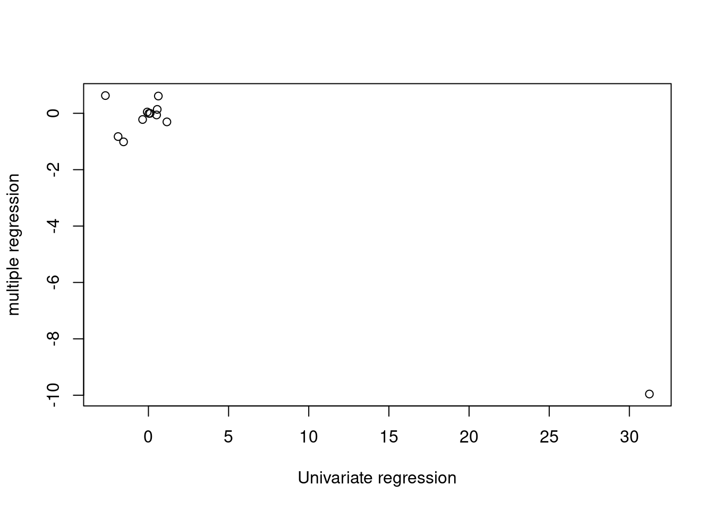

The estimated coefficients differ (in particular the estimated coefficient for
`nox` is dramatically different) between the two modelling strategies.

> d. Is there evidence of non-linear association between any of the predictors
>    and the response? To answer this question, for each predictor X, fit a
>    model of the form 
>    $$
>    Y = \beta_0 + \beta_1X + \beta_2X^2 + \beta_3X^3 + \epsilon
>    $$


``` r
pred <- subset(pred, select = -chas)
fits <- lapply(names(pred), function(p) {
  f <- paste0("crim ~ poly(", p, ", 3)")
  lm(as.formula(f), data = Boston)
})
for (fit in fits) printCoefmat(coef(summary(fit)))
```

```
##               Estimate Std. Error t value  Pr(>|t|)    
## (Intercept)    3.61352    0.37219  9.7088 < 2.2e-16 ***
## poly(zn, 3)1 -38.74984    8.37221 -4.6284 4.698e-06 ***
## poly(zn, 3)2  23.93983    8.37221  2.8594  0.004421 ** 
## poly(zn, 3)3 -10.07187    8.37221 -1.2030  0.229539    
## ---
## Signif. codes:  0 '***' 0.001 '**' 0.01 '*' 0.05 '.' 0.1 ' ' 1
##                 Estimate Std. Error t value  Pr(>|t|)    
## (Intercept)       3.6135     0.3300 10.9501 < 2.2e-16 ***
## poly(indus, 3)1  78.5908     7.4231 10.5873 < 2.2e-16 ***
## poly(indus, 3)2 -24.3948     7.4231 -3.2863  0.001086 ** 
## poly(indus, 3)3 -54.1298     7.4231 -7.2920 1.196e-12 ***
## ---
## Signif. codes:  0 '***' 0.001 '**' 0.01 '*' 0.05 '.' 0.1 ' ' 1
##                Estimate Std. Error t value  Pr(>|t|)    
## (Intercept)     3.61352    0.32157 11.2370 < 2.2e-16 ***
## poly(nox, 3)1  81.37202    7.23361 11.2492 < 2.2e-16 ***
## poly(nox, 3)2 -28.82859    7.23361 -3.9854 7.737e-05 ***
## poly(nox, 3)3 -60.36189    7.23361 -8.3446 6.961e-16 ***
## ---
## Signif. codes:  0 '***' 0.001 '**' 0.01 '*' 0.05 '.' 0.1 ' ' 1
##              Estimate Std. Error t value  Pr(>|t|)    
## (Intercept)    3.6135     0.3703  9.7584 < 2.2e-16 ***
## poly(rm, 3)1 -42.3794     8.3297 -5.0878 5.128e-07 ***
## poly(rm, 3)2  26.5768     8.3297  3.1906  0.001509 ** 
## poly(rm, 3)3  -5.5103     8.3297 -0.6615  0.508575    
## ---
## Signif. codes:  0 '***' 0.001 '**' 0.01 '*' 0.05 '.' 0.1 ' ' 1
##               Estimate Std. Error t value  Pr(>|t|)    
## (Intercept)    3.61352    0.34852 10.3683 < 2.2e-16 ***
## poly(age, 3)1 68.18201    7.83970  8.6970 < 2.2e-16 ***
## poly(age, 3)2 37.48447    7.83970  4.7814 2.291e-06 ***
## poly(age, 3)3 21.35321    7.83970  2.7237   0.00668 ** 
## ---
## Signif. codes:  0 '***' 0.001 '**' 0.01 '*' 0.05 '.' 0.1 ' ' 1
##                Estimate Std. Error  t value  Pr(>|t|)    
## (Intercept)     3.61352    0.32592  11.0870 < 2.2e-16 ***
## poly(dis, 3)1 -73.38859    7.33148 -10.0101 < 2.2e-16 ***
## poly(dis, 3)2  56.37304    7.33148   7.6892 7.870e-14 ***
## poly(dis, 3)3 -42.62188    7.33148  -5.8135 1.089e-08 ***
## ---
## Signif. codes:  0 '***' 0.001 '**' 0.01 '*' 0.05 '.' 0.1 ' ' 1
##                Estimate Std. Error t value  Pr(>|t|)    
## (Intercept)     3.61352    0.29707 12.1639 < 2.2e-16 ***
## poly(rad, 3)1 120.90745    6.68240 18.0934 < 2.2e-16 ***
## poly(rad, 3)2  17.49230    6.68240  2.6177  0.009121 ** 
## poly(rad, 3)3   4.69846    6.68240  0.7031  0.482314    
## ---
## Signif. codes:  0 '***' 0.001 '**' 0.01 '*' 0.05 '.' 0.1 ' ' 1
##                Estimate Std. Error t value  Pr(>|t|)    
## (Intercept)     3.61352    0.30468 11.8599 < 2.2e-16 ***
## poly(tax, 3)1 112.64583    6.85371 16.4358 < 2.2e-16 ***
## poly(tax, 3)2  32.08725    6.85371  4.6817 3.665e-06 ***
## poly(tax, 3)3  -7.99681    6.85371 -1.1668    0.2439    
## ---
## Signif. codes:  0 '***' 0.001 '**' 0.01 '*' 0.05 '.' 0.1 ' ' 1
##                    Estimate Std. Error t value  Pr(>|t|)    
## (Intercept)         3.61352    0.36105 10.0084 < 2.2e-16 ***
## poly(ptratio, 3)1  56.04523    8.12158  6.9008 1.565e-11 ***
## poly(ptratio, 3)2  24.77482    8.12158  3.0505  0.002405 ** 
## poly(ptratio, 3)3 -22.27974    8.12158 -2.7433  0.006301 ** 
## ---
## Signif. codes:  0 '***' 0.001 '**' 0.01 '*' 0.05 '.' 0.1 ' ' 1
##                  Estimate Std. Error t value Pr(>|t|)    
## (Intercept)       3.61352    0.33917 10.6540   <2e-16 ***
## poly(lstat, 3)1  88.06967    7.62944 11.5434   <2e-16 ***
## poly(lstat, 3)2  15.88816    7.62944  2.0825   0.0378 *  
## poly(lstat, 3)3 -11.57402    7.62944 -1.5170   0.1299    
## ---
## Signif. codes:  0 '***' 0.001 '**' 0.01 '*' 0.05 '.' 0.1 ' ' 1
##                 Estimate Std. Error t value  Pr(>|t|)    
## (Intercept)      3.61352    0.29203  12.374 < 2.2e-16 ***
## poly(medv, 3)1 -75.05761    6.56915 -11.426 < 2.2e-16 ***
## poly(medv, 3)2  88.08621    6.56915  13.409 < 2.2e-16 ***
## poly(medv, 3)3 -48.03343    6.56915  -7.312 1.047e-12 ***
## ---
## Signif. codes:  0 '***' 0.001 '**' 0.01 '*' 0.05 '.' 0.1 ' ' 1
```

Yes there is strong evidence for many variables having non-linear associations.
In many cases, the addition of a cubic term is significant (`indus`, `nox`, 
`age`, `dis`, `ptratio` and `medv`). In other cases although the cubic terms
is not significant, the squared term is (`zn`, `rm`, `rad`, `tax`, `lstat`). 
In only one case, `black` is there no evidence for a non-linear relationship.
