# Moving Beyond Linearity

## Conceptual

### Question 1

> It was mentioned in the chapter that a cubic regression spline with one knot
> at $\xi$ can be obtained using a basis of the form $x, x^2, x^3, (x-\xi)^3_+$,
> where $(x-\xi)^3_+ = (x-\xi)^3$ if $x>\xi$ and equals 0 otherwise. We will now
> show that a function of the form
> $$
> f(x)=\beta_0 +\beta_1x+\beta_2x^2 +\beta_3x^3 +\beta_4(x-\xi)^3_+
> $$
> is indeed a cubic regression spline, regardless of the values of
> $\beta_0, \beta_1, \beta_2, \beta_3,\beta_4$.
>
> a. Find a cubic polynomial
> $$
> f_1(x) = a_1 + b_1x + c_1x^2 + d_1x^3
> $$
> such that $f(x) = f_1(x)$ for all $x \le \xi$. Express $a_1,b_1,c_1,d_1$ in
> terms of $\beta_0, \beta_1, \beta_2, \beta_3, \beta_4$.

In this case, for $x \le \xi$, the cubic polynomial simply has terms
$a_1 = \beta_0$, $b_1 = \beta_1$, $c_1 = \beta_2$, $d_1 = \beta_3$

> b. Find a cubic polynomial
> $$
> f_2(x) = a_2 + b_2x + c_2x^2 + d_2x^3
> $$
> such that $f(x) = f_2(x)$ for all $x > \xi$. Express $a_2, b_2, c_2, d_2$ in
> terms of $\beta_0, \beta_1, \beta_2, \beta_3, \beta_4$. We have now established
> that $f(x)$ is a piecewise polynomial.

For $x \gt \xi$, the cubic polynomial would be (we include the $\beta_4$ term).
\begin{align}
f(x) = & \beta_0 + \beta_1x + \beta_2x^2 + \beta_3x^3 + \beta_4(x-\xi)^3 \\
     = & \beta_0 + \beta_1x + \beta_2x^2 +  + \beta_4(x^3 - 3x^2\xi + 3x\xi^2 -\xi^3) \\
     = & \beta_0 - \beta_4\xi^3 + (\beta_1 + 3\beta_4\xi^2)x +
         (\beta_2 - 3\beta_4\xi)x^2 + (\beta_3 + \beta_4)x^3
\end{align}

Therefore,
$a_1 = \beta_0 - \beta_4\xi^3$, $b_1 = \beta_1 + 3\beta_4\xi^2$,
$c_1 = \beta_2 - 3\beta_4\xi$, $d_1 = \beta_3 + \beta_4$

> c. Show that $f_1(\xi) = f_2(\xi)$. That is, $f(x)$ is continuous at $\xi$.

To do this, we replace $x$ with $\xi$ in the above equations and simplify.

\begin{align}
f_1(\xi) = \beta_0 + \beta_1\xi + \beta_2\xi^2 + \beta_3\xi^3
\end{align}

\begin{align}
f_2(\xi) = & \beta_0 - \beta_4\xi^3 + (\beta_1 + 3\beta_4\xi^2)\xi +
             (\beta_2 - 3\beta_4\xi)\xi^2 + (\beta_3 + \beta_4)\xi^3 \\
         = & \beta_0 - \beta_4\xi^3 + \beta_1\xi + 3\beta_4\xi^3 +
             \beta_2\xi^2 - 3\beta_4\xi^3 + \beta_3\xi^3 + \beta_4\xi^3 \\
         = & \beta_0 + \beta_1\xi + \beta_2\xi^2 + \beta_3\xi^3
\end{align}

> d. Show that $f_1'(\xi) = f_2'(\xi)$. That is, $f'(x)$ is continuous at $\xi$.

To do this we differentiate the above with respect to $x$.

$$
f_1'(x) = \beta_1 + 2\beta_2x + 3\beta_3x^2
f_1'(\xi) = \beta_1 + 2\beta_2\xi + 3\beta_3\xi^2
$$

\begin{align}
f_2'(x)   & = \beta_1 + 3\beta_4\xi^2 + 2(\beta_2 - 3\beta_4\xi)x + 3(\beta_3 + \beta_4)x^2 \\
f_2'(\xi) & = \beta_1 + 3\beta_4\xi^2 + 2(\beta_2 - 3\beta_4\xi)\xi + 3(\beta_3 + \beta_4)\xi^2 \\
          & = \beta_1 + 3\beta_4\xi^2 + 2\beta_2\xi - 6\beta_4\xi^2 + 3\beta_3\xi^2 + 3\beta_4\xi^2 \\
          & = \beta_1 + 2\beta_2\xi + 3\beta_3\xi^2
\end{align}

> e. Show that $f_1''(\xi) = f_2''(\xi)$. That is, $f''(x)$ is continuous at $\xi$.
>
> Therefore, $f(x)$ is indeed a cubic spline.

$$
f_1'(x) = 2\beta_2x + 6\beta_3x \\
f_1''(\xi) = 2\beta_2\xi + 6\beta_3\xi
$$

$$
f_2''(x) = 2\beta_2 - 6\beta_4\xi + 6(\beta_3 + \beta_4)x \\
$$
\begin{align}
f_2''(\xi) & = 2\beta_2 - 6\beta_4\xi + 6\beta_3\xi + 6\beta_4\xi \\
           & = 2\beta_2 + 6\beta_3\xi
\end{align}

> _Hint: Parts (d) and (e) of this problem require knowledge of single-variable
> calculus. As a reminder, given a cubic polynomial_
> $$f_1(x) = a_1 + b_1x + c_1x^2 + d_1x^3,$$
> _the first derivative takes the form_
> $$f_1'(x) = b_1 + 2c_1x + 3d_1x^2$$
> _and the second derivative takes the form_
> $$f_1''(x) = 2c_1 + 6d_1x.$$

### Question 2

> Suppose that a curve $\hat{g}$ is computed to smoothly fit a set of $n$ points
> using the following formula:
> $$
> \DeclareMathOperator*{\argmin}{arg\,min} % Jan Hlavacek
> \hat{g} = \argmin_g \left(\sum_{i=1}^n (y_i - g(x_i))^2 + \lambda \int \left[ g^{(m)}(x) \right]^2 dx \right),
> $$
> where $g^{(m)}$ represents the $m$th derivative of $g$ (and $g^{(0)} = g$).
> Provide example sketches of $\hat{g}$ in each of the following scenarios.
>
> a. $\lambda=\infty, m=0$.

Here we penalize the $g$ and a infinite $\lambda$ means that this penalty
dominates. This means that the $\hat{g}$ will be 0.

> b. $\lambda=\infty, m=1$.

Here we penalize the first derivative (the slope) of $g$ and a infinite
$\lambda$ means that this penalty dominates. Thus the slope will be 0
(and otherwise best fitting $x$, i.e. at the mean of $x$).

> c. $\lambda=\infty, m=2$.

Here we penalize the second derivative (the change of slope) of $g$ and a
infinite $\lambda$ means that this penalty dominates. Thus the line will be
straight (and otherwise best fitting $x$).

> d. $\lambda=\infty, m=3$.

Here we penalize the third derivative (the change of the change of slope) of $g$
and a infinite $\lambda$ means that this penalty dominates. In other words,
the curve will have a consistent rate of change (e.g. a quadratic
function or similar).

> e. $\lambda=0, m=3$.

Here we penalize the third derivative, but a value of $\lambda = 0$ means that
there is no penalty. As a result, the curve is able to interpolate all points.

### Question 3

> Suppose we fit a curve with basis functions
> $b_1(X) = X$,
> $b_2(X) = (X - 1)^2I(X \geq 1)$.
> (Note that $I(X \geq 1)$ equals 1 for $X \geq 1$ and 0 otherwise.) We fit the
> linear regression model
> $$Y = \beta_0 +\beta_1b_1(X) + \beta_2b_2(X) + \epsilon,$$
> and obtain coefficient estimates
> $\hat{\beta}_0 = 1, \hat{\beta}_1 = 1, \hat{\beta}_2 = -2$.
> Sketch the estimated curve between $X = -2$ and $X = 2$. Note the intercepts,
> slopes, and other relevant information.


```r
x <- seq(-2, 2, length.out = 1000)
f <- function(x) 1 + x + -2 * (x - 1)^2 * I(x >= 1)
plot(x, f(x), type = "l")
grid()
```

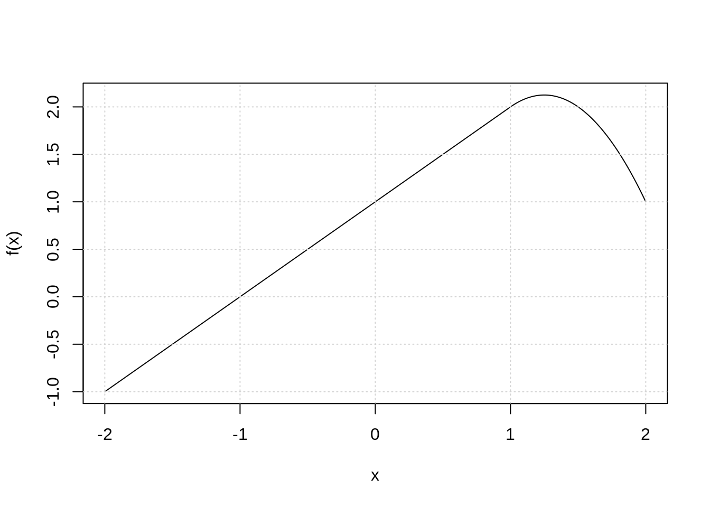

### Question 4

> Suppose we fit a curve with basis functions
> $b_1(X) = I(0 \leq X \leq 2) - (X -1)I(1 \leq X \leq 2),$
> $b_2(X) = (X -3)I(3 \leq X \leq 4) + I(4 \lt X \leq 5)$.
> We fit the linear regression model
> $$Y = \beta_0 +\beta_1b_1(X) + \beta_2b_2(X) + \epsilon,$$
> and obtain coefficient estimates
> $\hat{\beta}_0 = 1, \hat{\beta}_1 = 1, \hat{\beta}_2 = 3$.
> Sketch the estimated curve between $X = -2$ and $X = 6$. Note the intercepts,
> slopes, and other relevant information.


```r
x <- seq(-2, 6, length.out = 1000)
b1 <- function(x) I(0 <= x & x <= 2) - (x - 1) * I(1 <= x &  x <= 2)
b2 <- function(x) (x - 3) * I(3 <= x  & x <= 4) + I(4 < x & x <= 5)
f <- function(x) 1 + 1*b1(x) + 3*b2(x)
plot(x, f(x), type = "l")
grid()
```

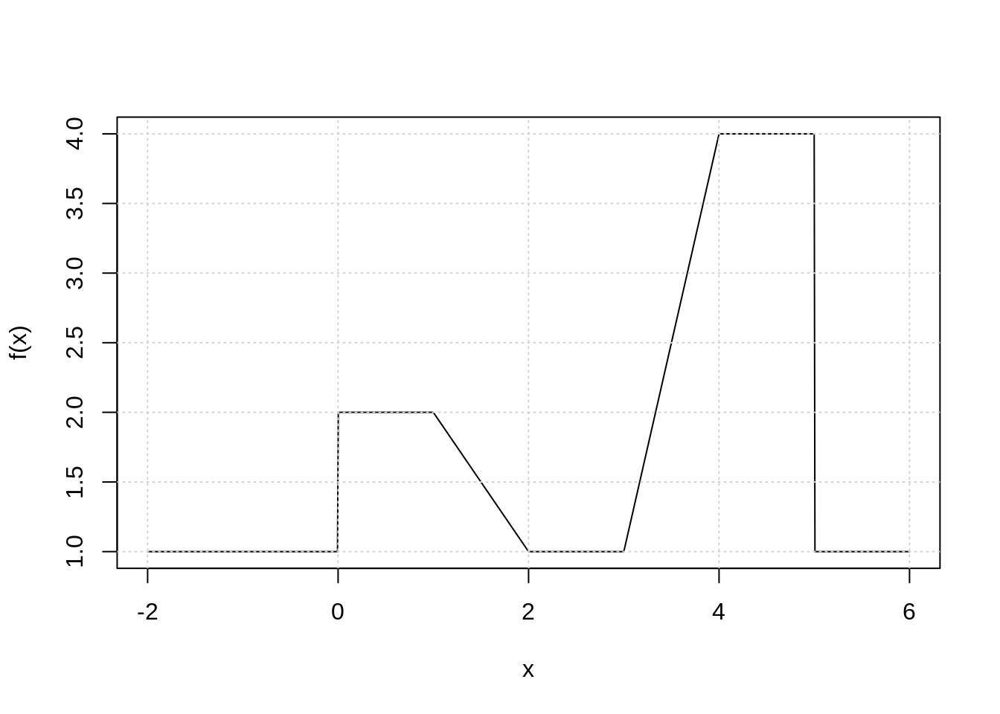

### Question 5

> Consider two curves, $\hat{g}$ and $\hat{g}_2$, defined by
>
> $$
> \hat{g}_1 = \argmin_g \left(\sum_{i=1}^n (y_i - g(x_i))^2 +
>   \lambda \int \left[ g^{(3)}(x) \right]^2 dx \right),
> $$
> $$
> \hat{g}_2 = \argmin_g \left(\sum_{i=1}^n (y_i - g(x_i))^2 +
>   \lambda \int \left[ g^{(4)}(x) \right]^2 dx \right),
> $$
>
> where $g^{(m)}$ represents the $m$th derivative of $g$.
>
> a. As $\lambda \to \infty$, will $\hat{g}_1$ or $\hat{g}_2$ have the smaller
>    training RSS?

$\hat{g}_2$ is more flexible (by penalizing a higher derivative of $g$) and
so will have a smaller training RSS.

> b. As $\lambda \to \infty$, will $\hat{g}_1$ or $\hat{g}_2$ have the smaller
>    test RSS?

We cannot tell which function will produce a smaller test RSS, but there is
chance that $\hat{g}_1$ will if $\hat{g}_2$ overfits the data.

> c. For $\lambda = 0$, will $\hat{g}_1$ or $\hat{g}_2$ have the smaller training
>    and test RSS?

When $\lambda = 0$ there is no penalty, so both functions will give the same
result: perfect interpolation of the training data. Thus training RSS will be
0 but test RSS could be high.

## Applied

### Question 6

> In this exercise, you will further analyze the `Wage` data set considered
> throughout this chapter.
>
> a. Perform polynomial regression to predict `wage` using `age`. Use
>    cross-validation to select the optimal degree $d$ for the polynomial. What
>    degree was chosen, and how does this compare to the results of hypothesis
>    testing using ANOVA? Make a plot of the resulting polynomial fit to the data.


```r
library(ISLR2)
library(boot)
library(ggplot2)
set.seed(42)
res <- sapply(1:6, function(i) {
  fit <- glm(wage ~ poly(age, i), data = Wage)
  cv.glm(Wage, fit, K = 5)$delta[1]
})
which.min(res)
```

```
## [1] 6
```

```r
plot(1:6, res, xlab = "Degree", ylab = "Test MSE", type = "l")
abline(v = which.min(res), col = "red", lty = 2)
```

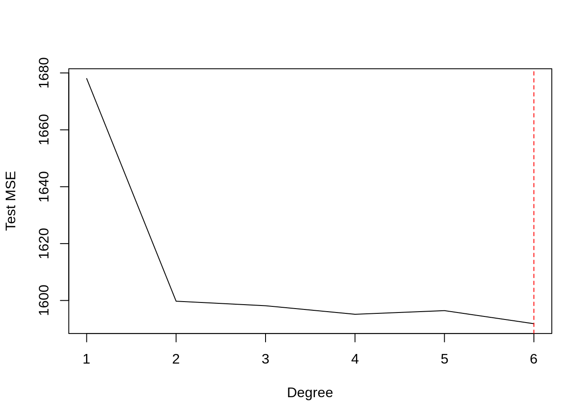

```r
fit <- glm(wage ~ poly(age, which.min(res)), data = Wage)
plot(Wage$age, Wage$wage, pch = 19, cex = 0.4, col = alpha("steelblue", 0.4))
points(1:100, predict(fit, data.frame(age = 1:100)), type = "l", col = "red")
```


```r
summary(glm(wage ~ poly(age, 6), data = Wage))
```

```
## 
## Call:
## glm(formula = wage ~ poly(age, 6), data = Wage)
## 
## Deviance Residuals: 
##     Min       1Q   Median       3Q      Max  
## -98.521  -24.536   -4.848   15.471  202.108  
## 
## Coefficients:
##                Estimate Std. Error t value Pr(>|t|)    
## (Intercept)    111.7036     0.7286 153.316  < 2e-16 ***
## poly(age, 6)1  447.0679    39.9063  11.203  < 2e-16 ***
## poly(age, 6)2 -478.3158    39.9063 -11.986  < 2e-16 ***
## poly(age, 6)3  125.5217    39.9063   3.145  0.00167 ** 
## poly(age, 6)4  -77.9112    39.9063  -1.952  0.05099 .  
## poly(age, 6)5  -35.8129    39.9063  -0.897  0.36956    
## poly(age, 6)6   62.7077    39.9063   1.571  0.11620    
## ---
## Signif. codes:  0 '***' 0.001 '**' 0.01 '*' 0.05 '.' 0.1 ' ' 1
## 
## (Dispersion parameter for gaussian family taken to be 1592.512)
## 
##     Null deviance: 5222086  on 2999  degrees of freedom
## Residual deviance: 4766389  on 2993  degrees of freedom
## AIC: 30642
## 
## Number of Fisher Scoring iterations: 2
```

```r
fit1 <- lm(wage ~ poly(age, 1), data = Wage)
fit2 <- lm(wage ~ poly(age, 2), data = Wage)
fit3 <- lm(wage ~ poly(age, 3), data = Wage)
fit4 <- lm(wage ~ poly(age, 4), data = Wage)
fit5 <- lm(wage ~ poly(age, 5), data = Wage)
anova(fit1, fit2, fit3, fit4, fit5)
```

```
## Analysis of Variance Table
## 
## Model 1: wage ~ poly(age, 1)
## Model 2: wage ~ poly(age, 2)
## Model 3: wage ~ poly(age, 3)
## Model 4: wage ~ poly(age, 4)
## Model 5: wage ~ poly(age, 5)
##   Res.Df     RSS Df Sum of Sq        F    Pr(>F)    
## 1   2998 5022216                                    
## 2   2997 4793430  1    228786 143.5931 < 2.2e-16 ***
## 3   2996 4777674  1     15756   9.8888  0.001679 ** 
## 4   2995 4771604  1      6070   3.8098  0.051046 .  
## 5   2994 4770322  1      1283   0.8050  0.369682    
## ---
## Signif. codes:  0 '***' 0.001 '**' 0.01 '*' 0.05 '.' 0.1 ' ' 1
```

The selected degree is 4. When testing with ANOVA, degrees 1, 2 and 3 are highly
significant and 4 is marginal.

> b. Fit a step function to predict `wage` using `age`, and perform
>    cross-validation to choose the optimal number of cuts. Make a plot of the fit
>    obtained.


```r
set.seed(42)
res <- sapply(2:10, function(i) {
  Wage$cats <- cut(Wage$age, i)
  fit <- glm(wage ~ cats, data = Wage)
  cv.glm(Wage, fit, K = 5)$delta[1]
})
names(res) <- 2:10
plot(2:10, res, xlab = "Cuts", ylab = "Test MSE", type = "l")
which.min(res)
```

```
## 8 
## 7
```

```r
abline(v = names(which.min(res)), col = "red", lty = 2)
```

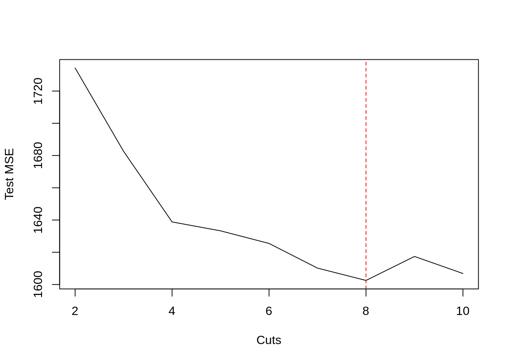

```r
fit <- glm(wage ~ cut(age, 8), data = Wage)
plot(Wage$age, Wage$wage, pch = 19, cex = 0.4, col = alpha("steelblue", 0.4))
points(18:80, predict(fit, data.frame(age = 18:80)), type = "l", col = "red")
```

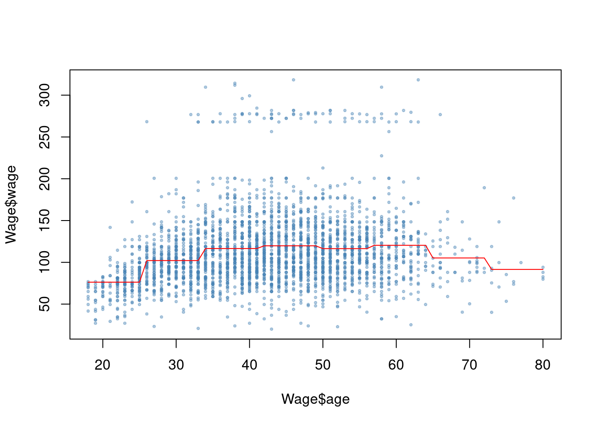

### Question 7

> The `Wage` data set contains a number of other features not explored in this
> chapter, such as marital status (`maritl`), job class (`jobclass`), and others.
> Explore the relationships between some of these other predictors and `wage`, and
> use non-linear fitting techniques in order to fit flexible models to the data.
> Create plots of the results obtained, and write a summary of your findings.


```r
plot(Wage$year, Wage$wage, pch = 19, cex = 0.4, col = alpha("steelblue", 0.4))
```

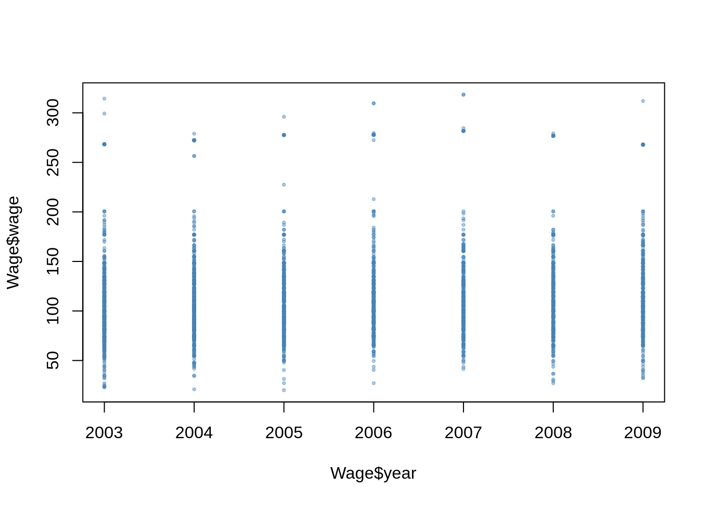

```r
plot(Wage$age, Wage$wage, pch = 19, cex = 0.4, col = alpha("steelblue", 0.4))
```

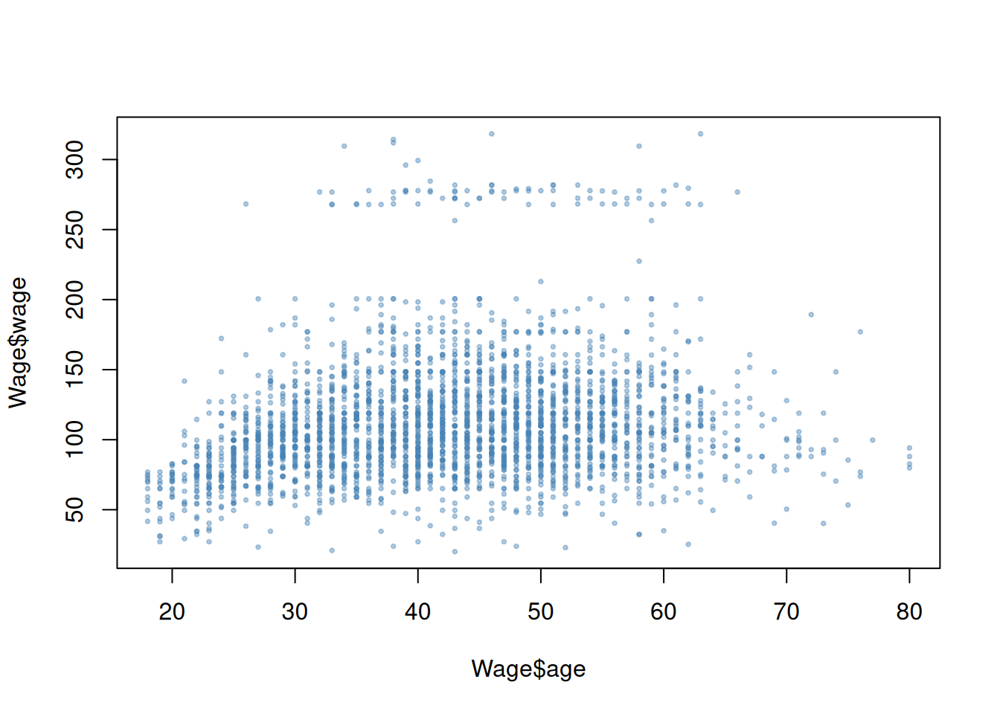

```r
plot(Wage$maritl, Wage$wage, pch = 19, cex = 0.4, col = alpha("steelblue", 0.4))
```

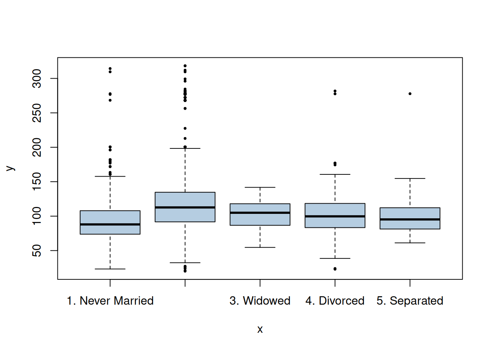

```r
plot(Wage$jobclass, Wage$wage, pch = 19, cex = 0.4, col = alpha("steelblue", 0.4))
```

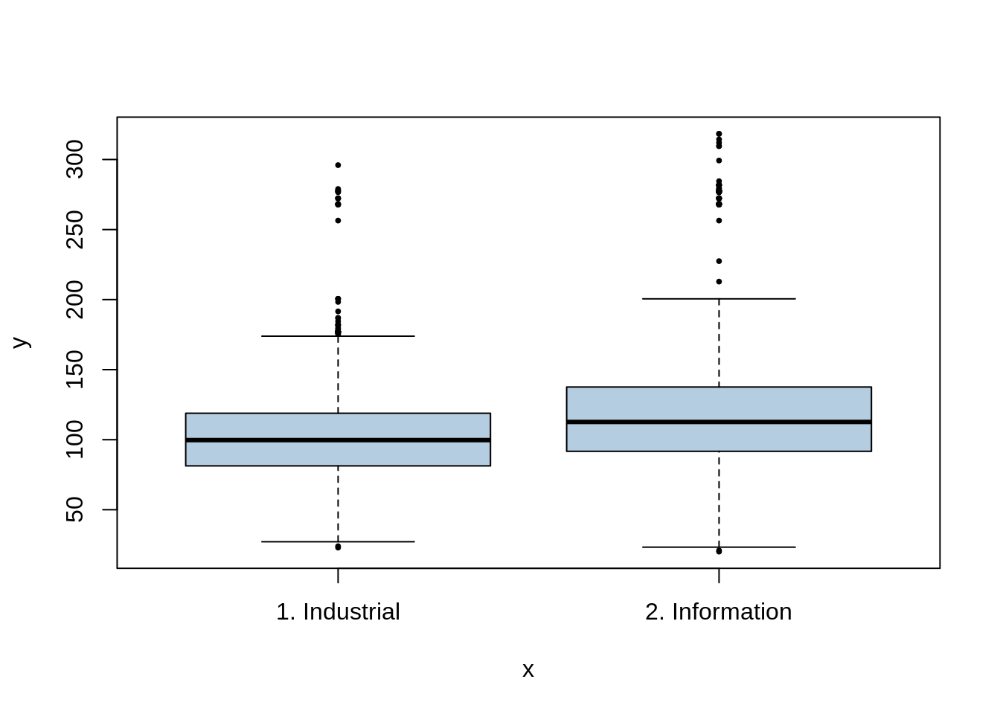

```r
plot(Wage$education, Wage$wage, pch = 19, cex = 0.4, col = alpha("steelblue", 0.4))
```

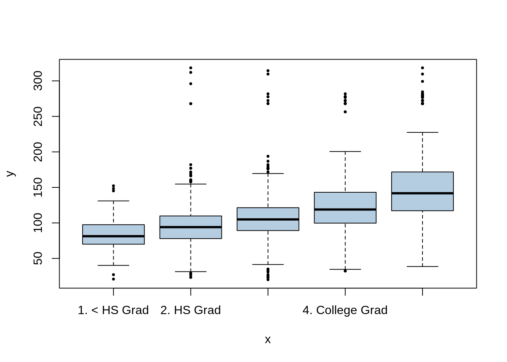

We have a mix of categorical and continuous variables and also want to
incorporate non-linear aspects of the continuous variables. A GAM is a good
choice to model this situation.


```r
library(gam)
```

```
## Loading required package: splines
```

```
## Loading required package: foreach
```

```
## Loaded gam 1.20.2
```

```r
fit0 <- gam(wage ~ s(year, 4) + s(age, 5) + education, data = Wage)
fit2 <- gam(wage ~ s(year, 4) + s(age, 5) + education + maritl, data = Wage)
fit1 <- gam(wage ~ s(year, 4) + s(age, 5) + education + jobclass, data = Wage)
fit3 <- gam(wage ~ s(year, 4) + s(age, 5) + education + jobclass + maritl, data = Wage)
anova(fit0, fit1, fit2, fit3)
```

```
## Analysis of Deviance Table
## 
## Model 1: wage ~ s(year, 4) + s(age, 5) + education
## Model 2: wage ~ s(year, 4) + s(age, 5) + education + jobclass
## Model 3: wage ~ s(year, 4) + s(age, 5) + education + maritl
## Model 4: wage ~ s(year, 4) + s(age, 5) + education + jobclass + maritl
##   Resid. Df Resid. Dev Df Deviance  Pr(>Chi)    
## 1      2986    3689770                          
## 2      2985    3677553  1    12218 0.0014286 ** 
## 3      2982    3595688  3    81865 1.071e-14 ***
## 4      2981    3581781  1    13907 0.0006687 ***
## ---
## Signif. codes:  0 '***' 0.001 '**' 0.01 '*' 0.05 '.' 0.1 ' ' 1
```

```r
par(mfrow = c(2, 3))
plot(fit3, se = TRUE, col = "blue")
```

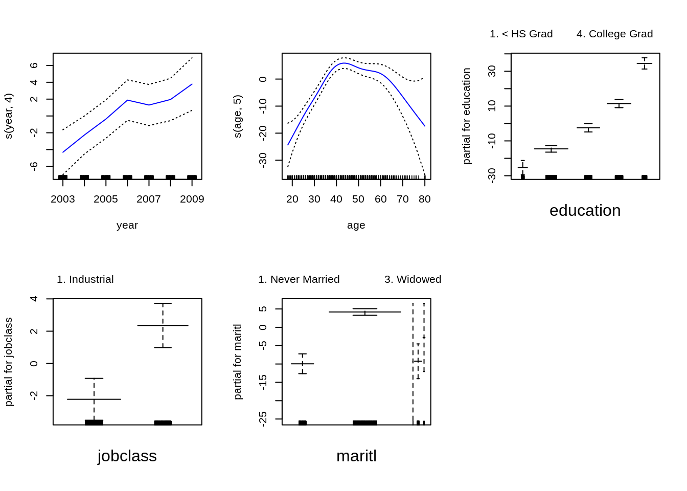

### Question 8

> Fit some of the non-linear models investigated in this chapter to the `Auto`
> data set. Is there evidence for non-linear relationships in this data set?
> Create some informative plots to justify your answer.

Here we want to explore a range of non-linear models. First let's look at the
relationships between the variables in the data.


```r
pairs(Auto, cex = 0.4, pch = 19)
```

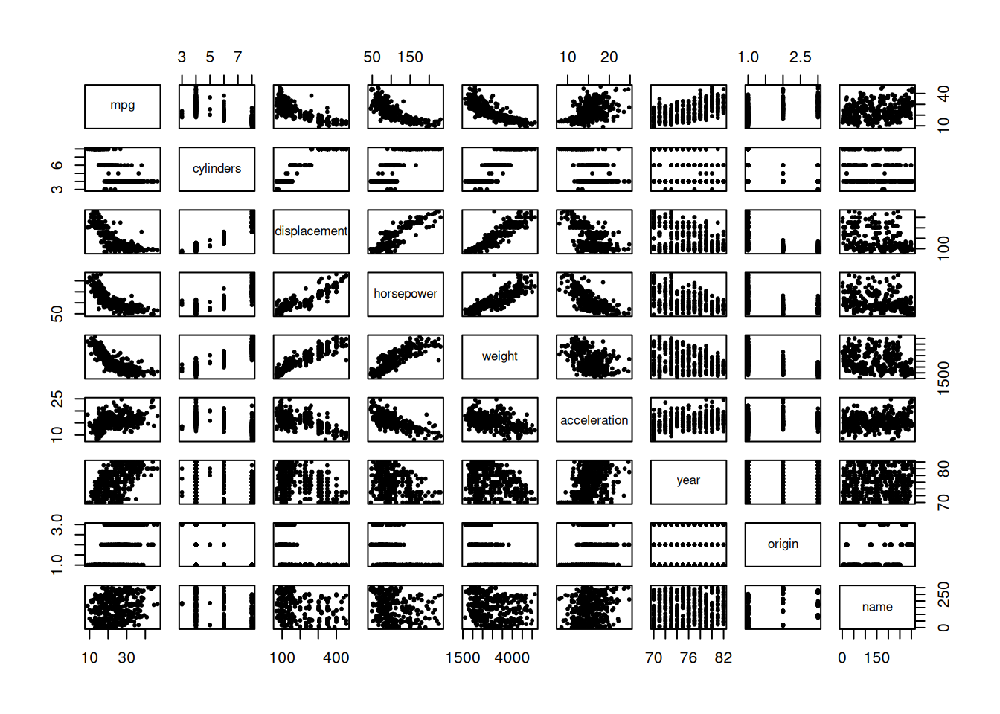

It does appear that there are some non-linear relationships (e.g.
horsepower / weight and mpg). We will pick one variable (horsepower) to predict
mpg and try the range of models discussed in this chapter. We will measure
test MSE through cross-validation to compare the models.


```r
library(tidyverse)
```

```
## ── Attaching packages ─────────────────────────────────────── tidyverse 1.3.2 ──
## ✔ tibble  3.1.8      ✔ dplyr   1.0.10
## ✔ tidyr   1.2.1      ✔ stringr 1.4.1 
## ✔ readr   2.1.3      ✔ forcats 0.5.2 
## ✔ purrr   0.3.5      
## ── Conflicts ────────────────────────────────────────── tidyverse_conflicts() ──
## ✖ purrr::accumulate() masks foreach::accumulate()
## ✖ dplyr::filter()     masks stats::filter()
## ✖ dplyr::lag()        masks stats::lag()
## ✖ purrr::when()       masks foreach::when()
```

```r
set.seed(42)
fit <- glm(mpg ~ horsepower, data = Auto)
err <- cv.glm(Auto, fit, K = 10)$delta[1]

fit1 <- glm(mpg ~ poly(horsepower, 4), data = Auto)
err1 <- cv.glm(Auto, fit1, K = 10)$delta[1]

q <- quantile(Auto$horsepower)
Auto$hp_cats <- cut(Auto$horsepower, breaks = q, include.lowest = TRUE)
fit2 <- glm(mpg ~ hp_cats, data = Auto)
err2 <- cv.glm(Auto, fit2, K = 10)$delta[1]

fit3 <- glm(mpg ~ bs(horsepower, df = 4), data = Auto)
err3 <- cv.glm(Auto, fit3, K = 10)$delta[1]
```

```
## Warning in bs(horsepower, degree = 3L, knots = c(`50%` = 92), Boundary.knots =
## c(46L, : some 'x' values beyond boundary knots may cause ill-conditioned bases

## Warning in bs(horsepower, degree = 3L, knots = c(`50%` = 92), Boundary.knots =
## c(46L, : some 'x' values beyond boundary knots may cause ill-conditioned bases
```

```r
fit4 <- glm(mpg ~ ns(horsepower, 4), data = Auto)
err4 <- cv.glm(Auto, fit4, K = 10)$delta[1]

fit5 <- gam(mpg ~ s(horsepower, df = 4), data = Auto)
# rough 10-fold cross-validation for gam.
err5 <- mean(replicate(10, {
  b <- cut(sample(seq_along(Auto$horsepower)), 10)
  pred <- numeric()
  for (i in 1:10) {
    train <- b %in% levels(b)[-i]
    f <- gam(mpg ~ s(horsepower, df = 4), data = Auto[train, ])
    pred[!train] <- predict(f, Auto[!train, ])
  }
  mean((Auto$mpg - pred)^2) # MSE
}))

c(err, err1, err2, err3, err4, err5)
```

```
## [1] 24.38418 19.94222 20.37940 18.92802 19.33556 19.02999
```

```r
anova(fit, fit1, fit2, fit3, fit4, fit5)
```

```
## Analysis of Deviance Table
## 
## Model 1: mpg ~ horsepower
## Model 2: mpg ~ poly(horsepower, 4)
## Model 3: mpg ~ hp_cats
## Model 4: mpg ~ bs(horsepower, df = 4)
## Model 5: mpg ~ ns(horsepower, 4)
## Model 6: mpg ~ s(horsepower, df = 4)
##   Resid. Df Resid. Dev          Df Deviance
## 1       390     9385.9                     
## 2       387     7399.5  3.00000000  1986.39
## 3       388     7805.4 -1.00000000  -405.92
## 4       387     7276.5  1.00000000   528.94
## 5       387     7248.6  0.00000000    27.91
## 6       387     7267.7  0.00013612   -19.10
```

```r
x <- seq(min(Auto$horsepower), max(Auto$horsepower), length.out=1000)
pred <- data.frame(
  x = x,
  "Linear" = predict(fit, data.frame(horsepower = x)),
  "Polynomial" = predict(fit1, data.frame(horsepower = x)),
  "Step" = predict(fit2, data.frame(hp_cats = cut(x, breaks = q, include.lowest = TRUE))),
  "Regression spline" = predict(fit3, data.frame(horsepower = x)),
  "Natural spline" = predict(fit4, data.frame(horsepower = x)),
  "Smoothing spline" = predict(fit5, data.frame(horsepower = x)),
  check.names = FALSE
)
pred <- pivot_longer(pred, -x)
ggplot(Auto, aes(horsepower, mpg)) +
  geom_point(color = alpha("steelblue", 0.4)) +
  geom_line(data = pred, aes(x, value, color = name)) +
  theme_bw()
```

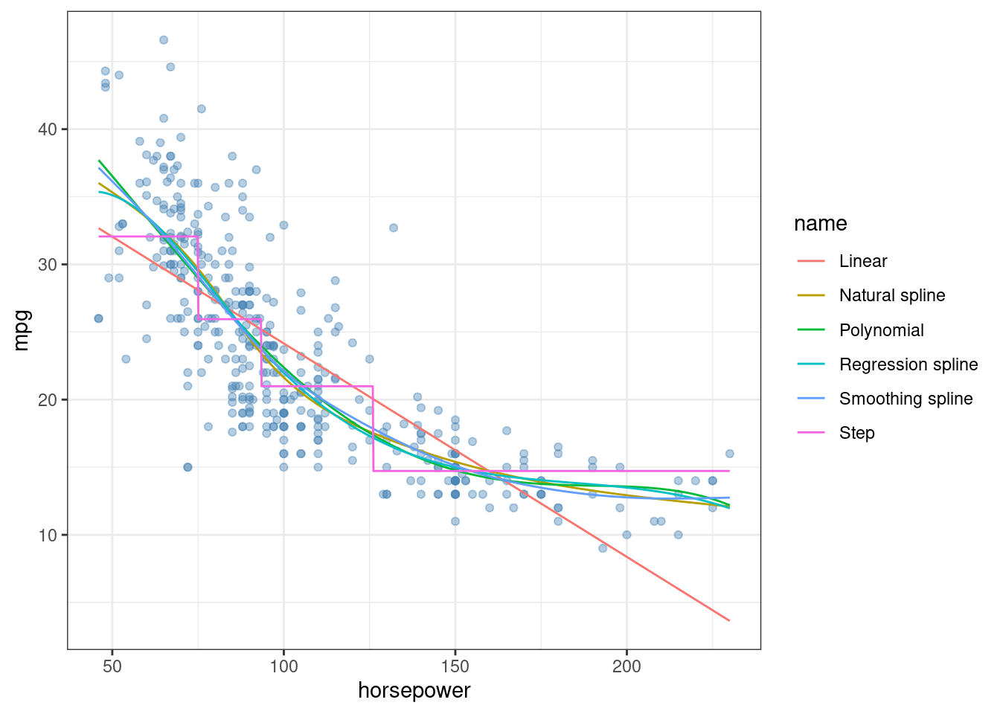

### Question 9

> This question uses the variables `dis` (the weighted mean of distances to five
> Boston employment centers) and `nox` (nitrogen oxides concentration in parts per
> 10 million) from the `Boston` data. We will treat `dis` as the predictor and
> `nox` as the response.
>
> a. Use the `poly()` function to fit a cubic polynomial regression to predict
>    `nox` using `dis`. Report the regression output, and plot the resulting data
>    and polynomial fits.


```r
fit <- glm(nox ~ poly(dis, 3), data = Boston)
summary(fit)
```

```
## 
## Call:
## glm(formula = nox ~ poly(dis, 3), data = Boston)
## 
## Deviance Residuals: 
##       Min         1Q     Median         3Q        Max  
## -0.121130  -0.040619  -0.009738   0.023385   0.194904  
## 
## Coefficients:
##                Estimate Std. Error t value Pr(>|t|)    
## (Intercept)    0.554695   0.002759 201.021  < 2e-16 ***
## poly(dis, 3)1 -2.003096   0.062071 -32.271  < 2e-16 ***
## poly(dis, 3)2  0.856330   0.062071  13.796  < 2e-16 ***
## poly(dis, 3)3 -0.318049   0.062071  -5.124 4.27e-07 ***
## ---
## Signif. codes:  0 '***' 0.001 '**' 0.01 '*' 0.05 '.' 0.1 ' ' 1
## 
## (Dispersion parameter for gaussian family taken to be 0.003852802)
## 
##     Null deviance: 6.7810  on 505  degrees of freedom
## Residual deviance: 1.9341  on 502  degrees of freedom
## AIC: -1370.9
## 
## Number of Fisher Scoring iterations: 2
```

```r
plot(nox ~ dis, data = Boston, col = alpha("steelblue", 0.4), pch = 19)
x <- seq(min(Boston$dis), max(Boston$dis), length.out = 1000)
lines(x, predict(fit, data.frame(dis = x)), col = "red", lty = 2)
```

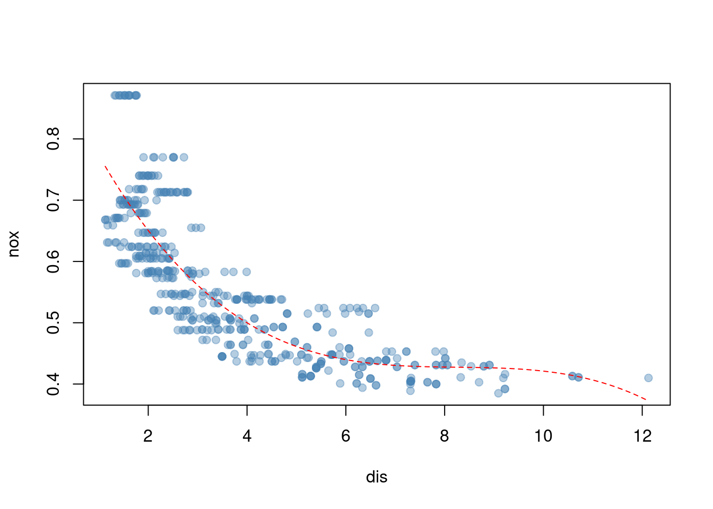

> b. Plot the polynomial fits for a range of different polynomial degrees (say,
>    from 1 to 10), and report the associated residual sum of squares.


```r
fits <- lapply(1:10, function(i) glm(nox ~ poly(dis, i), data = Boston))

x <- seq(min(Boston$dis), max(Boston$dis), length.out=1000)
pred <- data.frame(lapply(fits, function(fit) predict(fit, data.frame(dis = x))))
colnames(pred) <- 1:10
pred$x <- x
pred <- pivot_longer(pred, !x)
ggplot(Boston, aes(dis, nox)) +
  geom_point(color = alpha("steelblue", 0.4)) +
  geom_line(data = pred, aes(x, value, color = name)) +
  theme_bw()
```

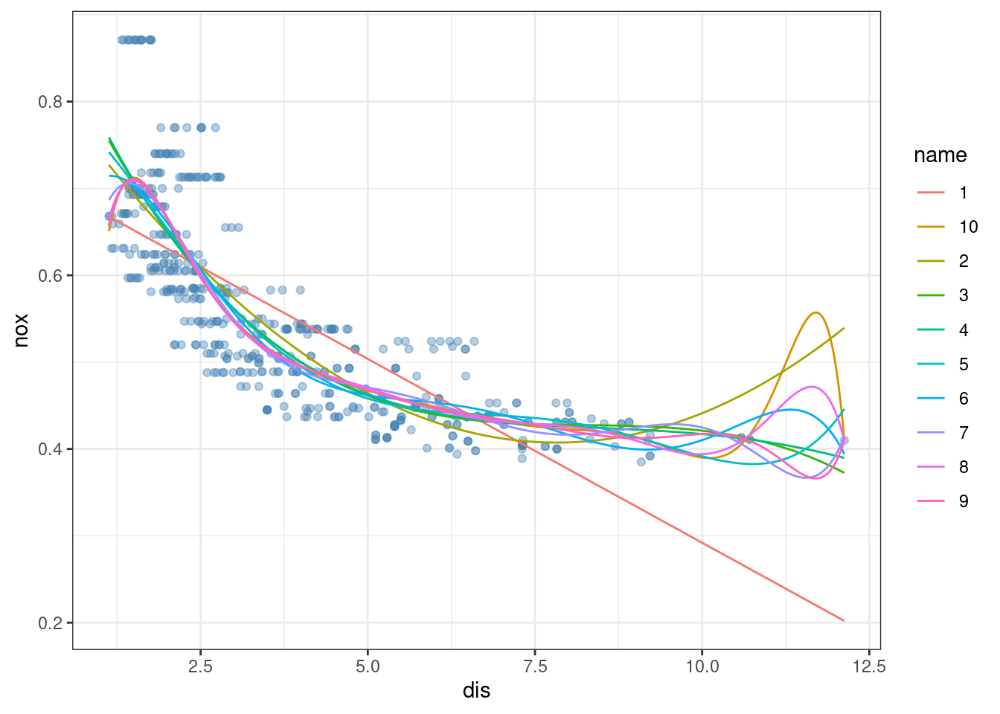

```r
# residual sum of squares
do.call(anova, fits)[, 2]
```

```
##  [1] 2.768563 2.035262 1.934107 1.932981 1.915290 1.878257 1.849484 1.835630
##  [9] 1.833331 1.832171
```

> c. Perform cross-validation or another approach to select the optimal degree
>    for the polynomial, and explain your results.


```r
res <- sapply(1:10, function(i) {
  fit <- glm(nox ~ poly(dis, i), data = Boston)
  cv.glm(Boston, fit, K = 10)$delta[1]
})
which.min(res)
```

```
## [1] 4
```

The optimal degree is 3 based on cross-validation. Higher values tend to
lead to overfitting.

> d. Use the `bs()` function to fit a regression spline to predict `nox` using
>    `dis`. Report the output for the fit using four degrees of freedom. How did
>    you choose the knots? Plot the resulting fit.


```r
fit <- glm(nox ~ bs(dis, df = 4), data = Boston)
summary(fit)
```

```
## 
## Call:
## glm(formula = nox ~ bs(dis, df = 4), data = Boston)
## 
## Deviance Residuals: 
##       Min         1Q     Median         3Q        Max  
## -0.124622  -0.039259  -0.008514   0.020850   0.193891  
## 
## Coefficients:
##                  Estimate Std. Error t value Pr(>|t|)    
## (Intercept)       0.73447    0.01460  50.306  < 2e-16 ***
## bs(dis, df = 4)1 -0.05810    0.02186  -2.658  0.00812 ** 
## bs(dis, df = 4)2 -0.46356    0.02366 -19.596  < 2e-16 ***
## bs(dis, df = 4)3 -0.19979    0.04311  -4.634 4.58e-06 ***
## bs(dis, df = 4)4 -0.38881    0.04551  -8.544  < 2e-16 ***
## ---
## Signif. codes:  0 '***' 0.001 '**' 0.01 '*' 0.05 '.' 0.1 ' ' 1
## 
## (Dispersion parameter for gaussian family taken to be 0.003837874)
## 
##     Null deviance: 6.7810  on 505  degrees of freedom
## Residual deviance: 1.9228  on 501  degrees of freedom
## AIC: -1371.9
## 
## Number of Fisher Scoring iterations: 2
```

```r
plot(nox ~ dis, data = Boston, col = alpha("steelblue", 0.4), pch = 19)
x <- seq(min(Boston$dis), max(Boston$dis), length.out = 1000)
lines(x, predict(fit, data.frame(dis = x)), col = "red", lty = 2)
```


Knots are chosen based on quantiles of the data.

> e. Now fit a regression spline for a range of degrees of freedom, and plot the
>    resulting fits and report the resulting RSS. Describe the results obtained.


```r
fits <- lapply(3:10, function(i) {
  glm(nox ~ bs(dis, df = i), data = Boston)
})

x <- seq(min(Boston$dis), max(Boston$dis), length.out = 1000)
pred <- data.frame(lapply(fits, function(fit) predict(fit, data.frame(dis = x))))
colnames(pred) <- 3:10
pred$x <- x
pred <- pivot_longer(pred, !x)
ggplot(Boston, aes(dis, nox)) +
  geom_point(color = alpha("steelblue", 0.4)) +
  geom_line(data = pred, aes(x, value, color = name)) +
  theme_bw()
```

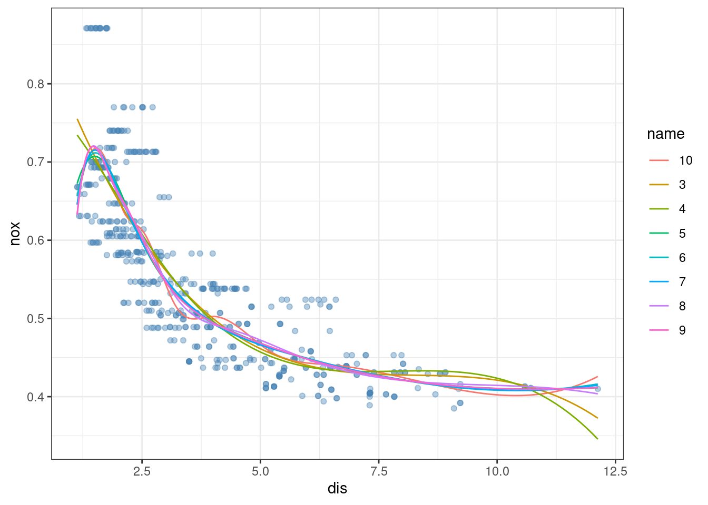

At high numbers of degrees of freedom the splines overfit the data (particularly
at extreme ends of the distribution of the predictor variable).

> f. Perform cross-validation or another approach in order to select the best
>    degrees of freedom for a regression spline on this data. Describe your
>    results.


```r
set.seed(42)
err <- sapply(3:10, function(i) {
  fit <- glm(nox ~ bs(dis, df = i), data = Boston)
  suppressWarnings(cv.glm(Boston, fit, K = 10)$delta[1])
})
which.min(err)
```

```
## [1] 8
```

This approach would select 4 degrees of freedom for the spline.

### Question 10

> This question relates to the `College` data set.
>
> a. Split the data into a training set and a test set. Using out-of-state tuition
>    as the response and the other variables as the predictors, perform forward
>    stepwise selection on the training set in order to identify a satisfactory
>    model that uses just a subset of the predictors.


```r
library(leaps)

# helper function to predict from a regsubsets model
predict.regsubsets <- function(object, newdata, id, ...) {
  form <- as.formula(object$call[[2]])
  mat <- model.matrix(form, newdata)
  coefi <- coef(object, id = id)
  xvars <- names(coefi)
  mat[, xvars] %*% coefi
}

set.seed(42)
train <- rep(TRUE, nrow(College))
train[sample(1:nrow(College), nrow(College) * 1 / 3)] <- FALSE
fit <- regsubsets(Outstate ~ ., data = College[train, ], nvmax = 17, method = "forward")

plot(summary(fit)$bic, type = "b")
```

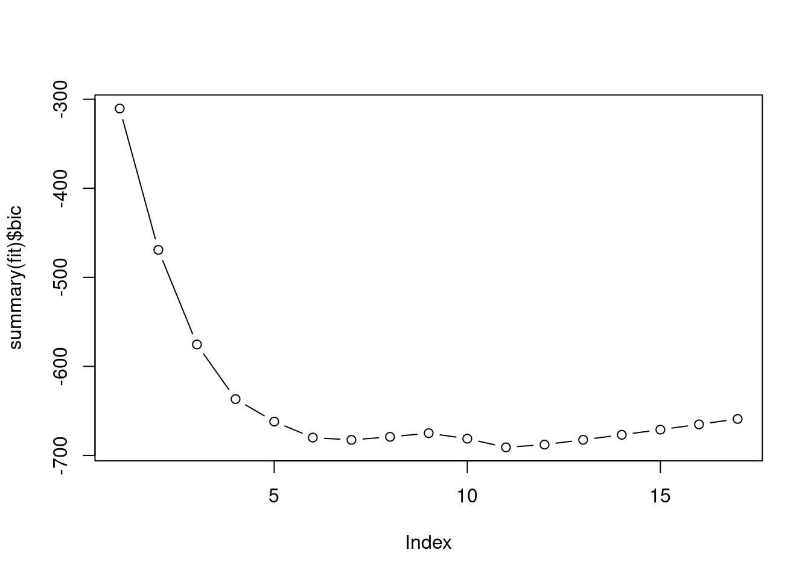

```r
which.min(summary(fit)$bic)
```

```
## [1] 11
```

```r
# or via cross-validation
err <- sapply(1:17, function(i) {
  x <- coef(fit, id = i)
  mean((College$Outstate[!train] - predict(fit, College[!train, ], i))^2)
})
which.min(err)
```

```
## [1] 16
```

```r
min(summary(fit)$bic)
```

```
## [1] -690.9375
```

For the sake of simplicity we'll choose 6


```r
coef(fit, id = 6)
```

```
##   (Intercept)    PrivateYes    Room.Board           PhD   perc.alumni 
## -3540.0544008  2736.4231642     0.9061752    33.7848157    47.1998115 
##        Expend     Grad.Rate 
##     0.2421685    33.3137332
```

> b. Fit a GAM on the training data, using out-of-state tuition as the response
>    and the features selected in the previous step as the predictors. Plot the
>    results, and explain your findings.


```r
fit <- gam(Outstate ~ Private + s(Room.Board, 2) + s(PhD, 2) + s(perc.alumni, 2) +
  s(Expend, 2) + s(Grad.Rate, 2), data = College[train, ])
```

> c. Evaluate the model obtained on the test set, and explain the results
>    obtained.


```r
pred <- predict(fit, College[!train, ])
err_gam <- mean((College$Outstate[!train] - pred)^2)
plot(err, ylim = c(min(err_gam, err), max(err)), type = "b")
abline(h = err_gam, col = "red", lty = 2)
```

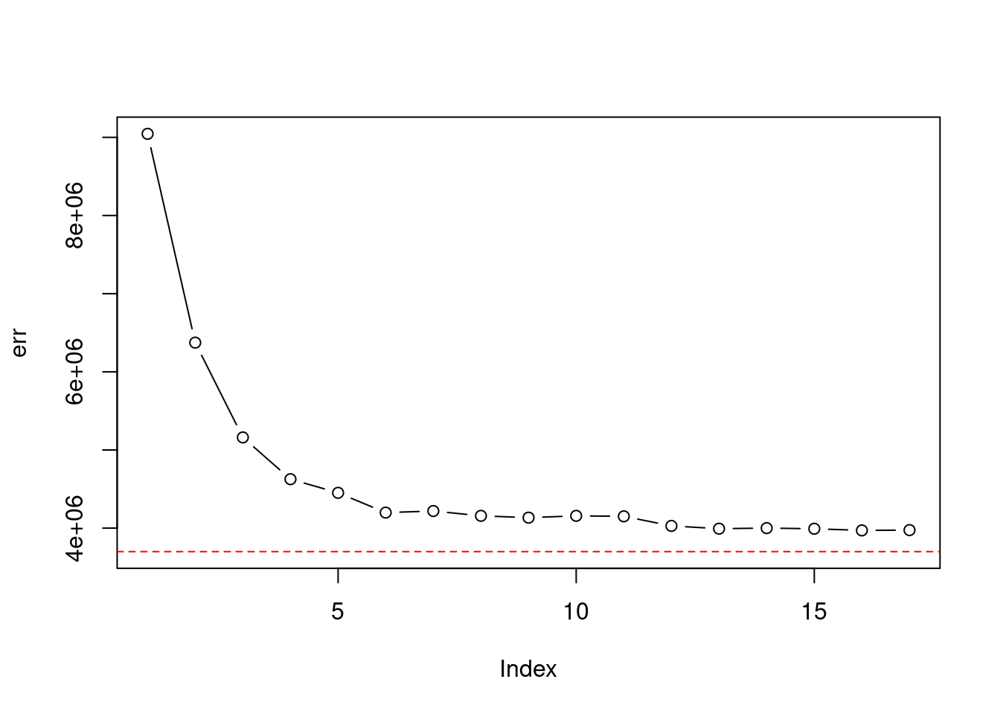

```r
# r-squared
1 - err_gam / mean((College$Outstate[!train] - mean(College$Outstate[!train]))^2)
```

```
## [1] 0.7655905
```

> d. For which variables, if any, is there evidence of a non-linear relationship
>    with the response?


```r
summary(fit)
```

```
## 
## Call: gam(formula = Outstate ~ Private + s(Room.Board, 2) + s(PhD, 
##     2) + s(perc.alumni, 2) + s(Expend, 2) + s(Grad.Rate, 2), 
##     data = College[train, ])
## Deviance Residuals:
##      Min       1Q   Median       3Q      Max 
## -7112.59 -1188.98    33.13  1238.54  8738.65 
## 
## (Dispersion Parameter for gaussian family taken to be 3577008)
## 
##     Null Deviance: 8471793308 on 517 degrees of freedom
## Residual Deviance: 1809966249 on 506.0001 degrees of freedom
## AIC: 9300.518 
## 
## Number of Local Scoring Iterations: NA 
## 
## Anova for Parametric Effects
##                    Df     Sum Sq    Mean Sq F value    Pr(>F)    
## Private             1 2327235738 2327235738 650.610 < 2.2e-16 ***
## s(Room.Board, 2)    1 1741918028 1741918028 486.976 < 2.2e-16 ***
## s(PhD, 2)           1  668408518  668408518 186.863 < 2.2e-16 ***
## s(perc.alumni, 2)   1  387819183  387819183 108.420 < 2.2e-16 ***
## s(Expend, 2)        1  625813340  625813340 174.954 < 2.2e-16 ***
## s(Grad.Rate, 2)     1  111881207  111881207  31.278 3.664e-08 ***
## Residuals         506 1809966249    3577008                      
## ---
## Signif. codes:  0 '***' 0.001 '**' 0.01 '*' 0.05 '.' 0.1 ' ' 1
## 
## Anova for Nonparametric Effects
##                   Npar Df Npar F     Pr(F)    
## (Intercept)                                   
## Private                                       
## s(Room.Board, 2)        1  2.224   0.13648    
## s(PhD, 2)               1  5.773   0.01664 *  
## s(perc.alumni, 2)       1  0.365   0.54581    
## s(Expend, 2)            1 61.182 3.042e-14 ***
## s(Grad.Rate, 2)         1  4.126   0.04274 *  
## ---
## Signif. codes:  0 '***' 0.001 '**' 0.01 '*' 0.05 '.' 0.1 ' ' 1
```

Non-linear relationships are significant for Expend and PhD.

### Question 11

> In Section 7.7, it was mentioned that GAMs are generally fit using a
> _backfitting_ approach. The idea behind backfitting is actually quite simple. We
> will now explore backfitting in the context of multiple linear regression.
>
> Suppose that we would like to perform multiple linear regression, but we do not
> have software to do so. Instead, we only have software to perform simple linear
> regression. Therefore, we take the following iterative approach: we repeatedly
> hold all but one coefficient estimate fixed at its current value, and update
> only that coefficient estimate using a simple linear regression. The process is
> continued until _convergence_---that is, until the coefficient estimates stop
> changing.
>
> We now try this out on a toy example.
>
> a. Generate a response $Y$ and two predictors $X_1$ and $X_2$, with $n = 100$.


```r
set.seed(42)
x1 <- rnorm(100)
x2 <- rnorm(100)
y <- 2 + 0.2 * x1 + 4 * x2 + rnorm(100)
```

> b. Initialize $\hat{\beta}_1$ to take on a value of your choice. It does not
>    matter 1 what value you choose.


```r
beta1 <- 20
```

> c. Keeping $\hat{\beta}_1$ fixed, fit the model
>    $$Y - \hat{\beta}_1X_1 = \beta_0 + \beta_2X_2 + \epsilon.$$
>    You can do this as follows:
>    
>    ```r
>    > a <- y - beta1 * x1
>    > beta2 <- lm(a ~ x2)$coef[2]
>    ```


```r
a <- y - beta1*x1
beta2 <- lm(a ~ x2)$coef[2]
```

> d. Keeping $\hat{\beta}_2$ fixed, fit the model
>     $$Y - \hat{\beta}_2X_2 = \beta_0 + \beta_1 X_1 + \epsilon.$$
>     You can do this as follows:
>    
>     ```r
>     > a <- y - beta2 * x2
>     > beta1 <- lm(a ~ x1)$coef[2]
>     ```


```r
a <- y - beta2 * x2
beta1 <- lm(a ~ x1)$coef[2]
```

> e. Write a for loop to repeat (c) and (d) 1,000 times. Report the estimates of
>    $\hat{\beta}_0, \hat{\beta}_1,$ and $\hat{\beta}_2$ at each iteration of the
>    for loop. Create a plot in which each of these values is displayed, with
>    $\hat{\beta}_0, \hat{\beta}_1,$ and $\hat{\beta}_2$ each shown in a different
>    color.


```r
res <- matrix(NA, nrow = 1000, ncol = 3)
colnames(res) <- c("beta0", "beta1", "beta2")
beta1 <- 20
for (i in 1:1000) {
  beta2 <- lm(y - beta1*x1 ~ x2)$coef[2]
  beta1 <- lm(y - beta2*x2 ~ x1)$coef[2]
  beta0 <- lm(y - beta2*x2 ~ x1)$coef[1]
  res[i, ] <- c(beta0, beta1, beta2)
}
res <- as.data.frame(res)
res$Iteration <- 1:1000
res <- pivot_longer(res, !Iteration)
p <- ggplot(res, aes(x=Iteration, y=value, color=name)) +
  geom_line() +
  geom_point() +
  scale_x_continuous(trans = "log10")
p
```

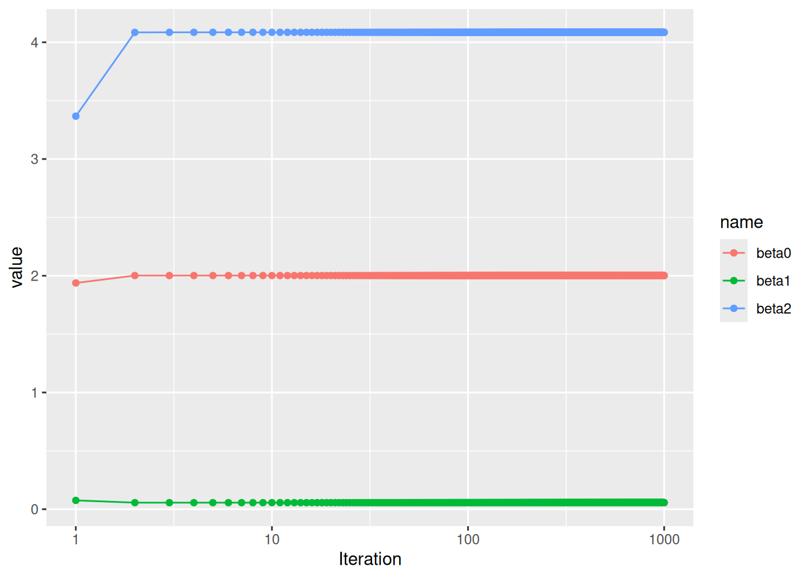

> f. Compare your answer in (e) to the results of simply performing multiple
>    linear regression to predict $Y$ using $X_1$ and $X_2$. Use the `abline()`
>    function to overlay those multiple linear regression coefficient estimates on
>    the plot obtained in (e).


```r
fit <- lm(y ~ x1 + x2)
coef(fit)
```

```
## (Intercept)          x1          x2 
##  2.00176627  0.05629075  4.08529318
```

```r
p + geom_hline(yintercept = coef(fit), lty = 2)
```

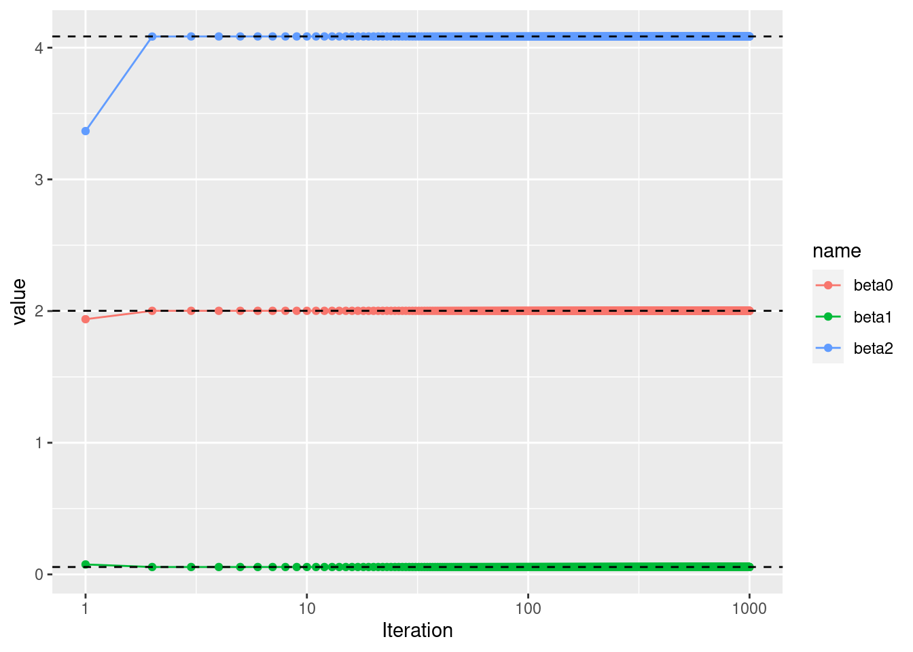

> g. On this data set, how many backfitting iterations were required in order to
>    obtain a "good" approximation to the multiple regression coefficient
>    estimates?

In this case, good estimates were obtained after 3 iterations.

### Question 12

> This problem is a continuation of the previous exercise. In a toy example with
> $p = 100$, show that one can approximate the multiple linear regression
> coefficient estimates by repeatedly performing simple linear regression in a
> backfitting procedure. How many backfitting iterations are required in order to
> obtain a "good" approximation to the multiple regression coefficient estimates?
> Create a plot to justify your answer.


```r
set.seed(42)

p <- 100
n <- 1000

betas <- rnorm(p) * 5
x <- matrix(rnorm(n * p), ncol = p, nrow = n)
y <- (x %*% betas) + rnorm(n)  # ignore beta0 for simplicity

# multiple regression
fit <- lm(y ~ x - 1)
coef(fit)
```

```
##          x1          x2          x3          x4          x5          x6 
##   6.9266184  -2.8428817   1.8686821   3.1466472   1.9601927  -0.5529214 
##          x7          x8          x9         x10         x11         x12 
##   7.4786723  -0.4454637  10.0816005  -0.2391234   6.5832468  11.4451280 
##         x13         x14         x15         x16         x17         x18 
##  -6.9684368  -1.3604495  -0.6310041   3.1786639  -1.4470502 -13.2957027 
##         x19         x20         x21         x22         x23         x24 
## -12.2061834   6.5765842  -1.5227262  -8.8855906  -0.8422954   6.1189230 
##         x25         x26         x27         x28         x29         x30 
##   9.4395267  -2.1697854  -1.2738835  -8.8457987   2.2851699  -3.1922704 
##         x31         x32         x33         x34         x35         x36 
##   2.2812995   3.4695892   5.1162617  -3.0423873   2.4985589  -8.5952764 
##         x37         x38         x39         x40         x41         x42 
##  -3.9539370  -4.2616463 -12.0038342   0.1981058   1.0559250  -1.8205017 
##         x43         x44         x45         x46         x47         x48 
##   3.7739990  -3.6240020  -6.8575534   2.1042998  -4.0228773   7.1880298 
##         x49         x50         x51         x52         x53         x54 
##  -2.1967821   3.3137115   1.6406524  -3.9402065   7.9067705   3.1815846 
##         x55         x56         x57         x58         x59         x60 
##   0.4504175   1.4003479   3.3999814   0.4317695 -14.9255798   1.3816878 
##         x61         x62         x63         x64         x65         x66 
##  -1.8071634   0.9907740   2.9771540   6.9528872  -3.5956916   6.5283946 
##         x67         x68         x69         x70         x71         x72 
##   1.6798820   5.1911857   4.5573256   3.5961319  -5.1909352  -0.4869003 
##         x73         x74         x75         x76         x77         x78 
##   3.1472166  -4.7898363  -2.7402076   2.9247173   3.8659938   2.3686379 
##         x79         x80         x81         x82         x83         x84 
##  -4.4261734  -5.5020688   7.5807239   1.3010702   0.4378713  -0.5856580 
##         x85         x86         x87         x88         x89         x90 
##  -5.9799328   3.0089329  -1.1230969  -0.8857679   4.7211363   4.1042952 
##         x91         x92         x93         x94         x95         x96 
##   6.9492037  -2.3959211   3.2188522   6.9947040  -5.5392641  -4.3114784 
##         x97         x98         x99        x100 
##  -5.7287292  -7.3148812   0.3454408   3.2830658
```

```r
# backfitting
backfit <- function(x, y, iter = 20) {
  beta <- matrix(0, ncol = ncol(x), nrow = iter + 1)
  for (i in 1:iter) {
    for (k in 1:ncol(x)) {
      residual <- y - (x[, -k] %*% beta[i, -k])
      beta[i + 1, k] <- lm(residual ~ x[, k])$coef[2]
    }
  }
  beta[-1, ]
}
res <- backfit(x, y)
error <- rowMeans(sweep(res, 2, betas)^2)
plot(error, log = "x", type = "b")
```

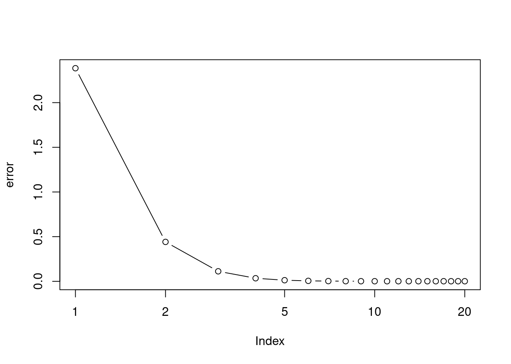

```r
# backfitting error
error[length(error)]
```

```
## [1] 0.001142494
```

```r
# lm error
mean((coef(fit) - betas)^2)
```

```
## [1] 0.001138655
```

We need around 5 to 6 iterations to obtain a good estimate of the coefficients.
