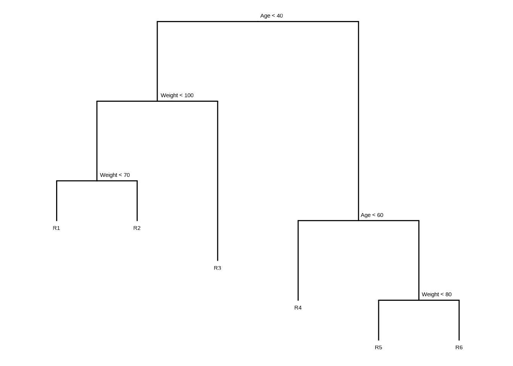
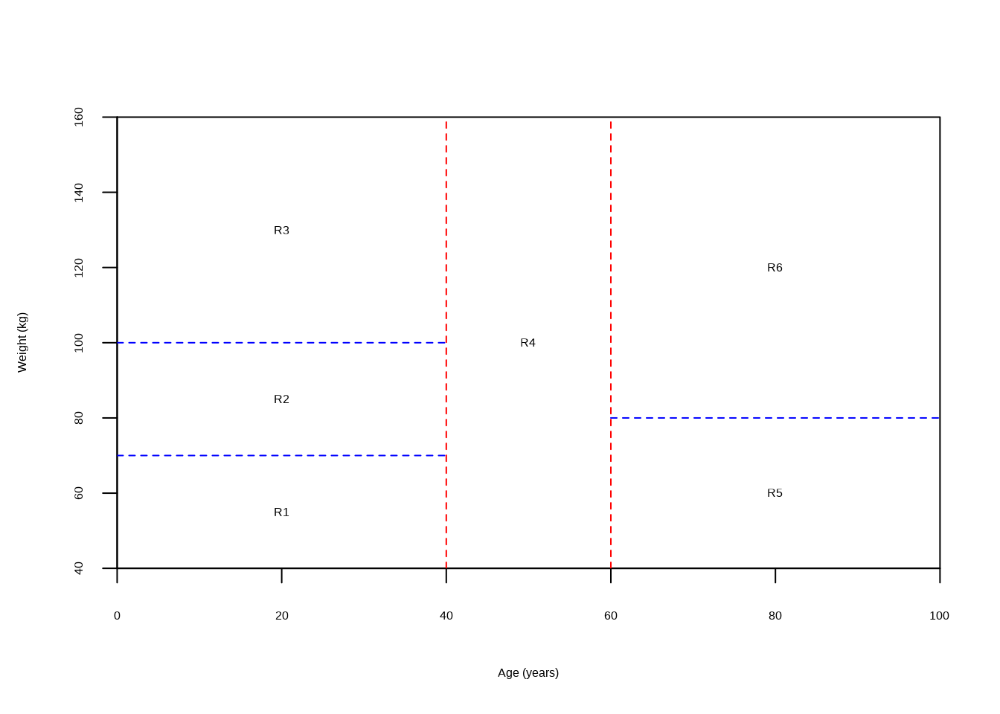
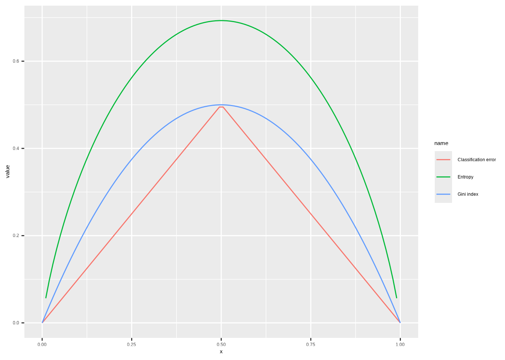
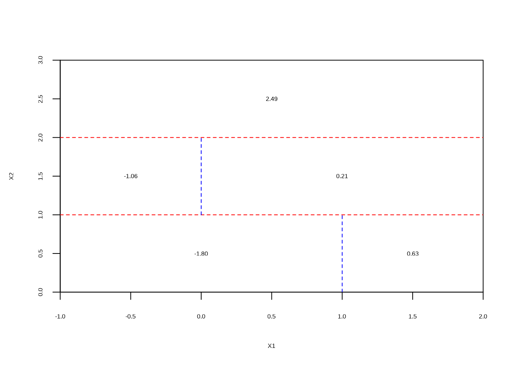
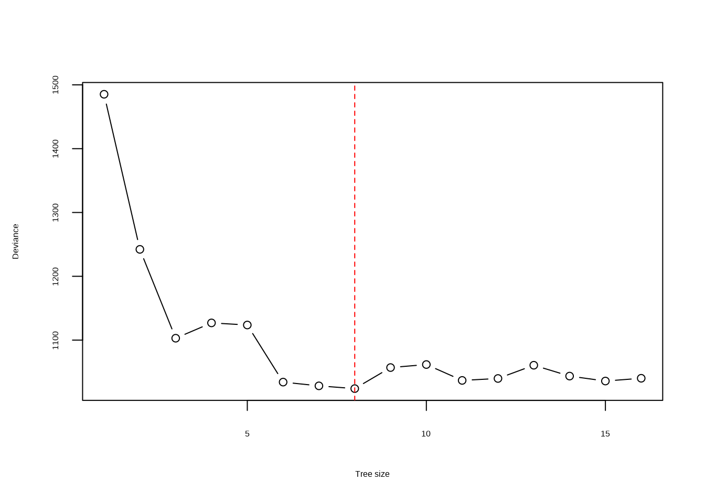
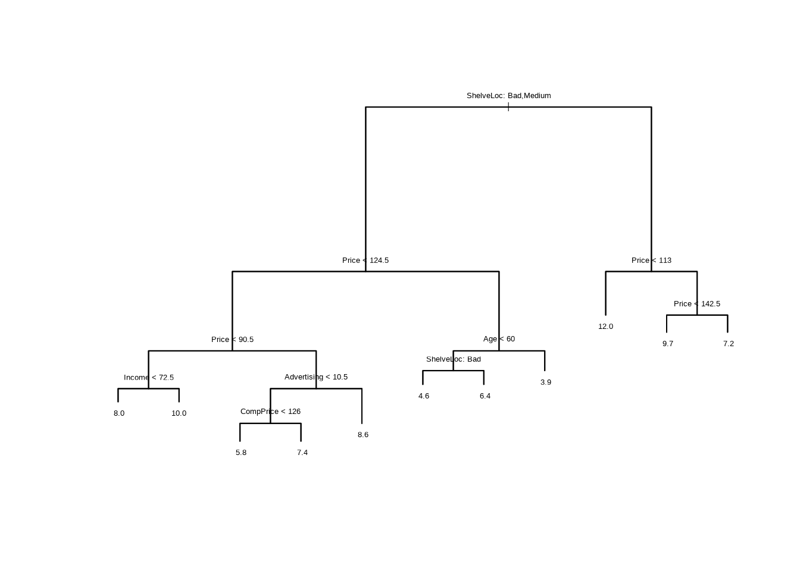
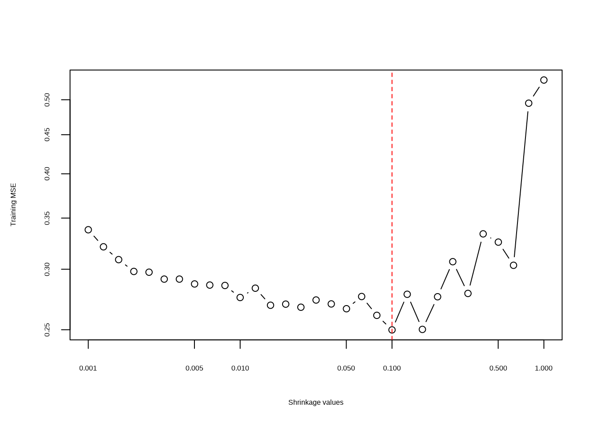
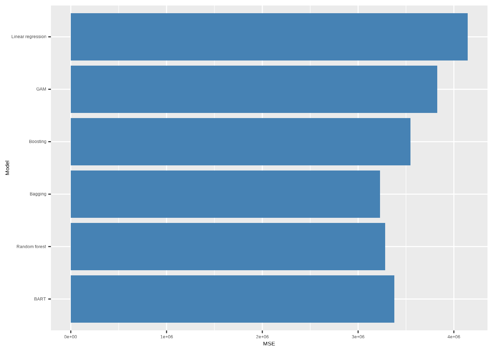

# Tree-Based Methods

## Conceptual

### Question 1

> Draw an example (of your own invention) of a partition of two-dimensional
> feature space that could result from recursive binary splitting. Your example
> should contain at least six regions. Draw a decision tree corresponding to
> this partition. Be sure to label all aspects of your figures, including the
> regions $R_1, R_2, ...,$ the cutpoints $t_1, t_2, ...,$ and so forth.
>
> _Hint: Your result should look something like Figures 8.1 and 8.2._


``` r
library(showtext)
showtext::showtext_auto()
library(ggplot2)
library(tidyverse)
library(ggtree)
```


``` r
tree <- ape::read.tree(text = "(((R1:1,R2:1)N1:2,R3:4)N2:2,(R4:2,(R5:1,R6:1)R3:2)N4:5)R;")
tree$node.label <- c("Age < 40", "Weight < 100", "Weight < 70", "Age < 60", "Weight < 80")

ggtree(tree, ladderize = FALSE) + scale_x_reverse() + coord_flip() +
  geom_tiplab(vjust = 2, hjust = 0.5) +
  geom_text2(aes(label = label, subset = !isTip), hjust = -0.1, vjust = -1)
```




``` r
plot(NULL,
  xlab = "Age (years)", ylab = "Weight (kg)",
  xlim = c(0, 100), ylim = c(40, 160), xaxs = "i", yaxs = "i"
)
abline(v = 40, col = "red", lty = 2)
lines(c(0, 40), c(100, 100), col = "blue", lty = 2)
lines(c(0, 40), c(70, 70), col = "blue", lty = 2)
abline(v = 60, col = "red", lty = 2)
lines(c(60, 100), c(80, 80), col = "blue", lty = 2)

text(
  c(20, 20, 20, 50, 80, 80),
  c(55, 85, 130, 100, 60, 120),
  labels = c("R1", "R2", "R3", "R4", "R5", "R6")
)
```



### Question 2

> It is mentioned in Section 8.2.3 that boosting using depth-one trees (or
> _stumps_) leads to an _additive_ model: that is, a model of the form
> $$
> f(X) = \sum_{j=1}^p f_j(X_j).
> $$
> Explain why this is the case. You can begin with (8.12) in Algorithm 8.2.

Equation 8.1 is:

$$
f(x) = \sum_{b=1}^B(\lambda \hat{f}^b(x)
$$

where $\hat{f}^b(x)$ represents the $b$th tree with (in this case) 1 split.
Since 1-depth trees involve only one variable, and the total function for
$x$ involves adding the outcome for each, this model is an additive. Depth
2 trees would allow for interactions between two variables.

### Question 3

> Consider the Gini index, classification error, and cross-entropy in a simple
> classification setting with two classes. Create a single plot that displays
> each of these quantities as a function of $\hat{p}_{m1}$. The $x$-axis should
> display $\hat{p}_{m1}$, ranging from 0 to 1, and the $y$-axis should display
> the value of the Gini index, classification error, and entropy.
>
> _Hint: In a setting with two classes, $\hat{p}_{m1} = 1 - \hat{p}_{m2}$. You
> could make this plot by hand, but it will be much easier to make in `R`._

The *Gini index* is defined by

$$G = \sum_{k=1}^{K} \hat{p}_{mk}(1 - \hat{p}_{mk})$$

*Entropy* is given by

$$D = -\sum_{k=1}^{K} \hat{p}_{mk}\log(\hat{p}_{mk})$$

The *classification error* is

$$E = 1 - \max_k(\hat{p}_{mk})$$


``` r
# Function definitions are for when there's two classes only
p <- seq(0, 1, length.out = 100)
data.frame(
  x = p,
  "Gini index" = p * (1 - p) * 2,
  "Entropy" = -(p * log(p) + (1 - p) * log(1 - p)),
  "Classification error" = 1 - pmax(p, 1 - p),
  check.names = FALSE
) |>
  pivot_longer(!x) |>
  ggplot(aes(x = x, y = value, color = name)) +
  geom_line(na.rm = TRUE)
```



### Question 4

> This question relates to the plots in Figure 8.12.
>
> a. Sketch the tree corresponding to the partition of the predictor space
>    illustrated in the left-hand panel of Figure 8.12. The numbers inside the
>    boxes indicate the mean of $Y$ within each region.


``` r
tree <- ape::read.tree(text = "(((3:1.5,(10:1,0:1)A:1)B:1,15:2)C:1,5:2)D;")
tree$node.label <- c("X1 < 1", "X2 < 1", "X1 < 0", "X2 < 0")

ggtree(tree, ladderize = FALSE) + scale_x_reverse() + coord_flip() +
  geom_tiplab(vjust = 2, hjust = 0.5) +
  geom_text2(aes(label = label, subset = !isTip), hjust = -0.1, vjust = -1)
```


> b. Create a diagram similar to the left-hand panel of Figure 8.12, using the
>    tree illustrated in the right-hand panel of the same figure. You should
>    divide up the predictor space into the correct regions, and indicate the
>    mean for each region.


``` r
plot(NULL, xlab = "X1", ylab = "X2", xlim = c(-1, 2), ylim = c(0, 3), xaxs = "i", yaxs = "i")
abline(h = 1, col = "red", lty = 2)
lines(c(1, 1), c(0, 1), col = "blue", lty = 2)
lines(c(-1, 2), c(2, 2), col = "red", lty = 2)
lines(c(0, 0), c(1, 2), col = "blue", lty = 2)
text(
  c(0, 1.5, -0.5, 1, 0.5),
  c(0.5, 0.5, 1.5, 1.5, 2.5),
  labels = c("-1.80", "0.63", "-1.06", "0.21", "2.49")
)
```



### Question 5

> Suppose we produce ten bootstrapped samples from a data set containing red and
> green classes. We then apply a classification tree to each bootstrapped sample
> and, for a specific value of $X$, produce 10 estimates of
> $P(\textrm{Class is Red}|X)$:
> $$0.1, 0.15, 0.2, 0.2, 0.55, 0.6, 0.6, 0.65, 0.7, \textrm{and } 0.75.$$
> There are two common ways to combine these results together into a single
> class prediction. One is the majority vote approach discussed in this chapter.
> The second approach is to classify based on the average probability. In this
> example, what is the final classification under each of these two approaches?


``` r
x <- c(0.1, 0.15, 0.2, 0.2, 0.55, 0.6, 0.6, 0.65, 0.7, 0.75)
ifelse(mean(x > 0.5), "red", "green") # majority vote
```

```
## [1] "red"
```

``` r
ifelse(mean(x) > 0.5, "red", "green") # average probability
```

```
## [1] "green"
```

### Question 6

> Provide a detailed explanation of the algorithm that is used to fit a
> regression tree.

First we perform binary recursive splitting of the data, to minimize RSS at
each split. This is continued until there are n samples present in each leaf.
Then we prune the tree to a set of subtrees determined by a parameter $\alpha$.
Using K-fold CV, we select $\alpha$ to minimize the cross validation error. The
final tree is then calculated using the complete dataset with the selected
$\alpha$ value.

## Applied

### Question 7

> In the lab, we applied random forests to the `Boston` data using `mtry = 6`
> and using `ntree = 25` and `ntree = 500`. Create a plot displaying the test
> error resulting from random forests on this data set for a more comprehensive
> range of values for `mtry` and `ntree`. You can model your plot after Figure
> 8.10. Describe the results obtained.


``` r
library(ISLR2)
library(randomForest)
```

```
## randomForest 4.7-1.2
```

```
## Type rfNews() to see new features/changes/bug fixes.
```

```
## 
## Attaching package: 'randomForest'
```

```
## The following object is masked from 'package:ggtree':
## 
##     margin
```

```
## The following object is masked from 'package:dplyr':
## 
##     combine
```

```
## The following object is masked from 'package:ggplot2':
## 
##     margin
```

``` r
set.seed(42)

train <- sample(c(TRUE, FALSE), nrow(Boston), replace = TRUE)

rf_err <- function(mtry) {
  randomForest(
    Boston[train, -13],
    y = Boston[train, 13],
    xtest = Boston[!train, -13],
    ytest = Boston[!train, 13],
    mtry = mtry,
    ntree = 500
  )$test$mse
}
res <- lapply(c(1, 2, 3, 5, 7, 10, 12), rf_err)
names(res) <- c(1, 2, 3, 5, 7, 10, 12)
data.frame(res, check.names = FALSE) |>
  mutate(n = 1:500) |>
  pivot_longer(!n) |>
  ggplot(aes(x = n, y = value, color = name)) +
  geom_line(na.rm = TRUE) +
  xlab("Number of trees") +
  ylab("Error") +
  scale_y_log10() +
  scale_color_discrete(name = "No. variables at\neach split")
```


### Question 8

> In the lab, a classification tree was applied to the `Carseats` data set after
> converting `Sales` into a qualitative response variable. Now we will seek to
> predict `Sales` using regression trees and related approaches, treating the
> response as a quantitative variable.
>
> a. Split the data set into a training set and a test set.


``` r
set.seed(42)
train <- sample(c(TRUE, FALSE), nrow(Carseats), replace = TRUE)
```

> b. Fit a regression tree to the training set. Plot the tree, and interpret the
>    results. What test error rate do you obtain?


``` r
library(tree)
tr <- tree(Sales ~ ., data = Carseats[train, ])
summary(tr)
```

```
## 
## Regression tree:
## tree(formula = Sales ~ ., data = Carseats[train, ])
## Variables actually used in tree construction:
## [1] "ShelveLoc"   "Price"       "Income"      "Advertising" "CompPrice"  
## [6] "Age"        
## Number of terminal nodes:  16 
## Residual mean deviance:  2.356 = 424.1 / 180 
## Distribution of residuals:
##     Min.  1st Qu.   Median     Mean  3rd Qu.     Max. 
## -4.54900 -0.82980  0.03075  0.00000  0.89250  4.83100
```

``` r
plot(tr)
text(tr, pretty = 0, digits = 2, cex = 0.8)
```



``` r
carseats_mse <- function(model) {
  p <- predict(model, newdata = Carseats[!train, ])
  mean((p - Carseats[!train, "Sales"])^2)
}
carseats_mse(tr)
```

```
## [1] 4.559764
```

> c. Use cross-validation in order to determine the optimal level of tree
>    complexity. Does pruning the tree improve the test error rate?


``` r
res <- cv.tree(tr)
plot(res$size, res$dev, type = "b", xlab = "Tree size", ylab = "Deviance")
min <- which.min(res$dev)
abline(v = res$size[min], lty = 2, col = "red")
```


Pruning improves performance very slightly (though this is not repeatable in
different rounds of cross-validation). Arguably, a good balance is achieved
when the tree size is 11.


``` r
ptr <- prune.tree(tr, best = 11)
plot(ptr)
text(ptr, pretty = 0, digits = 2, cex = 0.8)
```



``` r
carseats_mse(ptr)
```

```
## [1] 4.625875
```

> d. Use the bagging approach in order to analyze this data. What test error
>    rate do you obtain? Use the `importance()` function to determine which
>    variables are most important.


``` r
# Here we can use random Forest with mtry = 10 = p (the number of predictor
# variables) to perform bagging
bagged <- randomForest(Sales ~ .,
  data = Carseats[train, ], mtry = 10,
  ntree = 200, importance = TRUE
)
carseats_mse(bagged)
```

```
## [1] 2.762861
```

``` r
importance(bagged)
```

```
##                %IncMSE IncNodePurity
## CompPrice   11.2608998    104.474222
## Income       5.0953983     73.275066
## Advertising 12.9011190    125.886762
## Population   3.4071044     60.095200
## Price       34.6904380    450.952728
## ShelveLoc   33.7059874    374.808575
## Age          7.9101141    143.652934
## Education   -2.1154997     32.712444
## Urban        0.9604097      7.029648
## US           3.1336559      6.287048
```

The test error rate is ~2.8 which is a substantial improvement over the pruned
regression tree above.

> e. Use random forests to analyze this data. What test error rate do you
>    obtain? Use the `importance()` function to determine which variables are
>    most important. Describe the effect of $m$, the number of variables
>    considered at each split, on the error rate obtained.


``` r
rf <- randomForest(Sales ~ .,
  data = Carseats[train, ], mtry = 3,
  ntree = 500, importance = TRUE
)
carseats_mse(rf)
```

```
## [1] 3.439357
```

``` r
importance(rf)
```

```
##                %IncMSE IncNodePurity
## CompPrice    8.5717587     122.75189
## Income       2.8955756     116.33951
## Advertising 13.0681194     128.13563
## Population   2.0475415     104.03803
## Price       34.7934136     342.84663
## ShelveLoc   39.0704834     292.56638
## Age          7.7941744     135.69061
## Education    0.8770806      64.67614
## Urban       -0.3301478      13.83594
## US           6.2716539      22.07306
```

The test error rate is ~3.0 which is a substantial improvement over the pruned
regression tree above, although not quite as good as the bagging approach.

> f. Now analyze the data using BART, and report your results.


``` r
library(BART)
```

```
## Loading required package: nlme
```

```
## 
## Attaching package: 'nlme'
```

```
## The following object is masked from 'package:ggtree':
## 
##     collapse
```

```
## The following object is masked from 'package:dplyr':
## 
##     collapse
```

```
## Loading required package: survival
```

``` r
# For ease, we'll create a fake "predict" method that just returns
# yhat.test.mean regardless of provided "newdata"
predict.wbart <- function(model, ...) model$yhat.test.mean

bartfit <- gbart(Carseats[train, 2:11], Carseats[train, 1],
  x.test = Carseats[!train, 2:11]
)
```

```
## *****Calling gbart: type=1
## *****Data:
## data:n,p,np: 196, 14, 204
## y1,yn: 2.070867, 2.280867
## x1,x[n*p]: 138.000000, 1.000000
## xp1,xp[np*p]: 141.000000, 1.000000
## *****Number of Trees: 200
## *****Number of Cut Points: 58 ... 1
## *****burn,nd,thin: 100,1000,1
## *****Prior:beta,alpha,tau,nu,lambda,offset: 2,0.95,0.287616,3,0.21118,7.42913
## *****sigma: 1.041218
## *****w (weights): 1.000000 ... 1.000000
## *****Dirichlet:sparse,theta,omega,a,b,rho,augment: 0,0,1,0.5,1,14,0
## *****printevery: 100
## 
## MCMC
## done 0 (out of 1100)
## done 100 (out of 1100)
## done 200 (out of 1100)
## done 300 (out of 1100)
## done 400 (out of 1100)
## done 500 (out of 1100)
## done 600 (out of 1100)
## done 700 (out of 1100)
## done 800 (out of 1100)
## done 900 (out of 1100)
## done 1000 (out of 1100)
## time: 2s
## trcnt,tecnt: 1000,1000
```

``` r
carseats_mse(bartfit)
```

```
## [1] 1.631285
```

The test error rate is ~1.6 which is an improvement over random forest and
bagging.

### Question 9

> This problem involves the `OJ` data set which is part of the `ISLR2` package.
>
> a. Create a training set containing a random sample of 800 observations, and a
>    test set containing the remaining observations.


``` r
set.seed(42)
train <- sample(1:nrow(OJ), 800)
test <- setdiff(1:nrow(OJ), train)
```

> b. Fit a tree to the training data, with `Purchase` as the response and the
>    other variables except for `Buy` as predictors. Use the `summary()`
>    function to produce summary statistics about the tree, and describe the
>    results obtained. What is the training error rate? How many terminal nodes
>    does the tree have?


``` r
tr <- tree(Purchase ~ ., data = OJ[train, ])
summary(tr)
```

```
## 
## Classification tree:
## tree(formula = Purchase ~ ., data = OJ[train, ])
## Variables actually used in tree construction:
## [1] "LoyalCH"     "SalePriceMM" "PriceDiff"  
## Number of terminal nodes:  8 
## Residual mean deviance:  0.7392 = 585.5 / 792 
## Misclassification error rate: 0.1638 = 131 / 800
```

> c. Type in the name of the tree object in order to get a detailed text output.
>    Pick one of the terminal nodes, and interpret the information displayed.


``` r
tr
```

```
## node), split, n, deviance, yval, (yprob)
##       * denotes terminal node
## 
##  1) root 800 1066.00 CH ( 0.61500 0.38500 )  
##    2) LoyalCH < 0.48285 285  296.00 MM ( 0.21404 0.78596 )  
##      4) LoyalCH < 0.064156 64    0.00 MM ( 0.00000 1.00000 ) *
##      5) LoyalCH > 0.064156 221  260.40 MM ( 0.27602 0.72398 )  
##       10) SalePriceMM < 2.04 128  123.50 MM ( 0.18750 0.81250 ) *
##       11) SalePriceMM > 2.04 93  125.00 MM ( 0.39785 0.60215 ) *
##    3) LoyalCH > 0.48285 515  458.10 CH ( 0.83689 0.16311 )  
##      6) LoyalCH < 0.753545 230  282.70 CH ( 0.69565 0.30435 )  
##       12) PriceDiff < 0.265 149  203.00 CH ( 0.57718 0.42282 )  
##         24) PriceDiff < -0.165 32   38.02 MM ( 0.28125 0.71875 ) *
##         25) PriceDiff > -0.165 117  150.30 CH ( 0.65812 0.34188 )  
##           50) LoyalCH < 0.703993 105  139.60 CH ( 0.61905 0.38095 ) *
##           51) LoyalCH > 0.703993 12    0.00 CH ( 1.00000 0.00000 ) *
##       13) PriceDiff > 0.265 81   47.66 CH ( 0.91358 0.08642 ) *
##      7) LoyalCH > 0.753545 285  111.70 CH ( 0.95088 0.04912 ) *
```

> d. Create a plot of the tree, and interpret the results.


``` r
plot(tr)
text(tr, pretty = 0, digits = 2, cex = 0.8)
```


> e. Predict the response on the test data, and produce a confusion matrix
>    comparing the test labels to the predicted test labels. What is the test
>    error rate?


``` r
table(predict(tr, OJ[test, ], type = "class"), OJ[test, "Purchase"])
```

```
##     
##       CH  MM
##   CH 125  15
##   MM  36  94
```

> f. Apply the `cv.tree()` function to the training set in order to determine
>    the optimal tree size.


``` r
set.seed(42)
res <- cv.tree(tr)
```

> g. Produce a plot with tree size on the $x$-axis and cross-validated
>    classification error rate on the $y$-axis.


``` r
plot(res$size, res$dev, type = "b", xlab = "Tree size", ylab = "Deviance")
min <- which.min(res$dev)
abline(v = res$size[min], lty = 2, col = "red")
```


> h. Which tree size corresponds to the lowest cross-validated classification
>    error rate?


``` r
res$size[min]
```

```
## [1] 6
```

> i. Produce a pruned tree corresponding to the optimal tree size obtained using
>    cross-validation. If cross-validation does not lead to selection of a
>    pruned tree, then create a pruned tree with five terminal nodes.


``` r
ptr <- prune.tree(tr, best = res$size[min])
plot(ptr)
text(ptr, pretty = 0, digits = 2, cex = 0.8)
```


> j. Compare the training error rates between the pruned and unpruned trees.
>    Which is higher?


``` r
oj_misclass <- function(model) {
  summary(model)$misclass[1] / summary(model)$misclass[2]
}
oj_misclass(tr)
```

```
## [1] 0.16375
```

``` r
oj_misclass(ptr)
```

```
## [1] 0.16375
```

The training misclassification error rate is slightly higher for the pruned tree.

> k. Compare the test error rates between the pruned and unpruned trees. Which
>    is higher?


``` r
oj_err <- function(model) {
  p <- predict(model, newdata = OJ[test, ], type = "class")
  mean(p != OJ[test, "Purchase"])
}
oj_err(tr)
```

```
## [1] 0.1888889
```

``` r
oj_err(ptr)
```

```
## [1] 0.1888889
```

The test misclassification error rate is slightly higher for the pruned tree.

### Question 10

> We now use boosting to predict `Salary` in the `Hitters` data set.
>
> a. Remove the observations for whom the salary information is unknown, and
>    then log-transform the salaries.


``` r
dat <- Hitters
dat <- dat[!is.na(dat$Salary), ]
dat$Salary <- log(dat$Salary)
```

> b. Create a training set consisting of the first 200 observations, and a test
>    set consisting of the remaining observations.


``` r
train <- 1:200
test <- setdiff(1:nrow(dat), train)
```

> c. Perform boosting on the training set with 1,000 trees for a range of values
>    of the shrinkage parameter $\lambda$. Produce a plot with different
>    shrinkage values on the $x$-axis and the corresponding training set MSE on
>    the $y$-axis.


``` r
library(gbm)
```

```
## Loaded gbm 2.2.2
```

```
## This version of gbm is no longer under development. Consider transitioning to gbm3, https://github.com/gbm-developers/gbm3
```

``` r
set.seed(42)
lambdas <- 10^seq(-3, 0, by = 0.1)
fits <- lapply(lambdas, function(lam) {
  gbm(Salary ~ .,
    data = dat[train, ], distribution = "gaussian",
    n.trees = 1000, shrinkage = lam
  )
})
errs <- sapply(fits, function(fit) {
  p <- predict(fit, dat[train, ], n.trees = 1000)
  mean((p - dat[train, ]$Salary)^2)
})
plot(lambdas, errs,
  type = "b", xlab = "Shrinkage values",
  ylab = "Training MSE", log = "xy"
)
```


> d. Produce a plot with different shrinkage values on the $x$-axis and the
>    corresponding test set MSE on the $y$-axis.


``` r
errs <- sapply(fits, function(fit) {
  p <- predict(fit, dat[test, ], n.trees = 1000)
  mean((p - dat[test, ]$Salary)^2)
})
plot(lambdas, errs,
  type = "b", xlab = "Shrinkage values",
  ylab = "Training MSE", log = "xy"
)
min(errs)
```

```
## [1] 0.249881
```

``` r
abline(v = lambdas[which.min(errs)], lty = 2, col = "red")
```



> e. Compare the test MSE of boosting to the test MSE that results from applying
>    two of the regression approaches seen in Chapters 3 and 6.

Linear regression


``` r
fit1 <- lm(Salary ~ ., data = dat[train, ])
mean((predict(fit1, dat[test, ]) - dat[test, "Salary"])^2)
```

```
## [1] 0.4917959
```

Ridge regression


``` r
library(glmnet)
```

```
## Loading required package: Matrix
```

```
## 
## Attaching package: 'Matrix'
```

```
## The following object is masked from 'package:ggtree':
## 
##     expand
```

```
## The following objects are masked from 'package:tidyr':
## 
##     expand, pack, unpack
```

```
## Loaded glmnet 4.1-8
```

``` r
x <- model.matrix(Salary ~ ., data = dat[train, ])
x.test <- model.matrix(Salary ~ ., data = dat[test, ])
y <- dat[train, "Salary"]
fit2 <- glmnet(x, y, alpha = 1)
mean((predict(fit2, s = 0.1, newx = x.test) - dat[test, "Salary"])^2)
```

```
## [1] 0.4389054
```

> f. Which variables appear to be the most important predictors in the boosted
>    model?


``` r
summary(fits[[which.min(errs)]])
```


```
##                 var    rel.inf
## CAtBat       CAtBat 16.4755242
## CRBI           CRBI  9.0670759
## CHits         CHits  8.9307168
## CRuns         CRuns  7.6839786
## CWalks       CWalks  7.1014886
## PutOuts     PutOuts  6.7869382
## AtBat         AtBat  5.8567916
## Walks         Walks  5.8479836
## Years         Years  5.3349489
## Assists     Assists  5.0076392
## CHmRun       CHmRun  4.6606919
## RBI             RBI  3.9255396
## Hits           Hits  3.8123124
## HmRun         HmRun  3.4462640
## Runs           Runs  2.4779866
## Errors       Errors  2.2341326
## NewLeague NewLeague  0.5788283
## Division   Division  0.4880237
## League       League  0.2831352
```

> g. Now apply bagging to the training set. What is the test set MSE for this
>    approach?


``` r
set.seed(42)
bagged <- randomForest(Salary ~ ., data = dat[train, ], mtry = 19, ntree = 1000)
mean((predict(bagged, newdata = dat[test, ]) - dat[test, "Salary"])^2)
```

```
## [1] 0.2278813
```

### Question 11

> This question uses the `Caravan` data set.
>
> a. Create a training set consisting of the first 1,000 observations, and a
>    test set consisting of the remaining observations.


``` r
train <- 1:1000
test <- setdiff(1:nrow(Caravan), train)
```

> b. Fit a boosting model to the training set with `Purchase` as the response
>    and the other variables as predictors. Use 1,000 trees, and a shrinkage
>    value of 0.01. Which predictors appear to be the most important?


``` r
set.seed(42)
fit <- gbm(as.numeric(Purchase == "Yes") ~ ., data = Caravan[train, ], n.trees = 1000, shrinkage = 0.01)
```

```
## Distribution not specified, assuming bernoulli ...
```

```
## Warning in gbm.fit(x = x, y = y, offset = offset, distribution = distribution,
## : variable 50: PVRAAUT has no variation.
```

```
## Warning in gbm.fit(x = x, y = y, offset = offset, distribution = distribution,
## : variable 71: AVRAAUT has no variation.
```

``` r
head(summary(fit))
```


```
##               var   rel.inf
## PPERSAUT PPERSAUT 15.243041
## MKOOPKLA MKOOPKLA 10.220498
## MOPLHOOG MOPLHOOG  7.584734
## MBERMIDD MBERMIDD  5.983650
## PBRAND     PBRAND  4.557491
## ABRAND     ABRAND  4.076017
```

> c. Use the boosting model to predict the response on the test data. Predict
>    that a person will make a purchase if the estimated probability of purchase
>    is greater than 20%. Form a confusion matrix. What fraction of the people
>    predicted to make a purchase do in fact make one? How does this compare
>    with the results obtained from applying KNN or logistic regression to this
>    data set?


``` r
p <- predict(fit, Caravan[test, ], n.trees = 1000, type = "response")
table(p > 0.2, Caravan[test, "Purchase"] == "Yes")
```

```
##        
##         FALSE TRUE
##   FALSE  4415  257
##   TRUE    118   32
```

``` r
sum(p > 0.2 & Caravan[test, "Purchase"] == "Yes") / sum(p > 0.2)
```

```
## [1] 0.2133333
```

141 (109 + 32) are predicted to purchase. Of these 32 do which is 21%.


``` r
# Logistic regression
fit <- glm(Purchase == "Yes" ~ ., data = Caravan[train, ], family = "binomial")
```

```
## Warning: glm.fit: fitted probabilities numerically 0 or 1 occurred
```

``` r
p <- predict(fit, Caravan[test, ], type = "response")
```

```
## Warning in predict.lm(object, newdata, se.fit, scale = 1, type = if (type == :
## prediction from rank-deficient fit; attr(*, "non-estim") has doubtful cases
```

``` r
table(p > 0.2, Caravan[test, "Purchase"] == "Yes")
```

```
##        
##         FALSE TRUE
##   FALSE  4183  231
##   TRUE    350   58
```

``` r
sum(p > 0.2 & Caravan[test, "Purchase"] == "Yes") / sum(p > 0.2)
```

```
## [1] 0.1421569
```

For logistic regression we correctly predict 14% of those predicted to purchase.


``` r
library(class)
# KNN
fit <- knn(Caravan[train, -86], Caravan[test, -86], Caravan$Purchase[train])
table(fit, Caravan[test, "Purchase"] == "Yes")
```

```
##      
## fit   FALSE TRUE
##   No   4260  263
##   Yes   273   26
```

``` r
sum(fit == "Yes" & Caravan[test, "Purchase"] == "Yes") / sum(fit == "Yes")
```

```
## [1] 0.08695652
```

For KNN we correctly predict 8.7% of those predicted to purchase.

### Question 12

> Apply boosting, bagging, random forests and BART to a data set of your choice.
> Be sure to fit the models on a training set and to evaluate their performance
> on a test set. How accurate are the results compared to simple methods like
> linear or logistic regression? Which of these approaches yields the best
> performance?

Here I'm going to use the College dataset (used in Question 10 from Chapter 7
to compare performance with the GAM we previously built). In this model we 
were trying to predict `Outstate` using the other variables in `College`.


``` r
library(gam)
```

```
## Loading required package: splines
```

```
## Loading required package: foreach
```

```
## 
## Attaching package: 'foreach'
```

```
## The following objects are masked from 'package:purrr':
## 
##     accumulate, when
```

```
## Loaded gam 1.22-5
```

``` r
set.seed(42)
train <- sample(1:nrow(College), 400)
test <- setdiff(1:nrow(College), train)

# Linear regression
lr <- gam(Outstate ~ ., data = College[train, ])

# GAM from chapter 7
gam <- gam(Outstate ~ Private + s(Room.Board, 2) + s(PhD, 2) +
  s(perc.alumni, 2) + s(Expend, 2) + s(Grad.Rate, 2), data = College[train, ])

# Boosting
boosted <- gbm(Outstate ~ ., data = College[train, ], n.trees = 1000, shrinkage = 0.01)
```

```
## Distribution not specified, assuming gaussian ...
```

``` r
# Bagging (random forest with mtry = no. predictors)
bagged <- randomForest(Outstate ~ ., data = College[train, ], mtry = 17, ntree = 1000)

# Random forest with mtry = sqrt(no. predictors)
rf <- randomForest(Outstate ~ ., data = College[train, ], mtry = 4, ntree = 1000)

# BART
pred <- setdiff(colnames(College), "Outstate")
bart <- gbart(College[train, pred], College[train, "Outstate"],
  x.test = College[test, pred]
)
```

```
## *****Calling gbart: type=1
## *****Data:
## data:n,p,np: 400, 18, 377
## y1,yn: -4030.802500, 77.197500
## x1,x[n*p]: 1.000000, 71.000000
## xp1,xp[np*p]: 0.000000, 99.000000
## *****Number of Trees: 200
## *****Number of Cut Points: 1 ... 75
## *****burn,nd,thin: 100,1000,1
## *****Prior:beta,alpha,tau,nu,lambda,offset: 2,0.95,301.581,3,715815,10580.8
## *****sigma: 1916.969943
## *****w (weights): 1.000000 ... 1.000000
## *****Dirichlet:sparse,theta,omega,a,b,rho,augment: 0,0,1,0.5,1,18,0
## *****printevery: 100
## 
## MCMC
## done 0 (out of 1100)
## done 100 (out of 1100)
## done 200 (out of 1100)
## done 300 (out of 1100)
## done 400 (out of 1100)
## done 500 (out of 1100)
## done 600 (out of 1100)
## done 700 (out of 1100)
## done 800 (out of 1100)
## done 900 (out of 1100)
## done 1000 (out of 1100)
## time: 4s
## trcnt,tecnt: 1000,1000
```

``` r
mse <- function(model, ...) {
  pred <- predict(model, College[test, ], ...)
  mean((College$Outstate[test] - pred)^2)
}

res <- c(
  "Linear regression" = mse(lr),
  "GAM" = mse(gam),
  "Boosting" = mse(boosted, n.trees = 1000),
  "Bagging" = mse(bagged),
  "Random forest" = mse(rf),
  "BART" = mse(bart)
)
res <- data.frame("MSE" = res)
res$Model <- factor(row.names(res), levels = rev(row.names(res)))
ggplot(res, aes(Model, MSE)) +
  coord_flip() +
  geom_bar(stat = "identity", fill = "steelblue")
```



In this case, it looks like bagging produces the best performing model in terms
of test mean square error.
