# Support Vector Machines

## Conceptual

### Question 1

> This problem involves hyperplanes in two dimensions.
>
> a. Sketch the hyperplane $1 + 3X_1 − X_2 = 0$. Indicate the set of points for
>    which $1 + 3X_1 − X_2 > 0$, as well as the set of points for which
>    $1 + 3X_1 − X_2 < 0$.


``` r
library(ggplot2)
xlim <- c(-10, 10)
ylim <- c(-30, 30)
points <- expand.grid(
  X1 = seq(xlim[1], xlim[2], length.out = 50), 
  X2 = seq(ylim[1], ylim[2], length.out = 50)
)
p <- ggplot(points, aes(x = X1, y = X2)) + 
  geom_abline(intercept = 1, slope = 3) +  # X2 = 1 + 3X1 
  theme_bw()
p + geom_point(aes(color = 1 + 3*X1 - X2 > 0), size = 0.1) + 
  scale_color_discrete(name = "1 + 3X1 − X2 > 0")
```

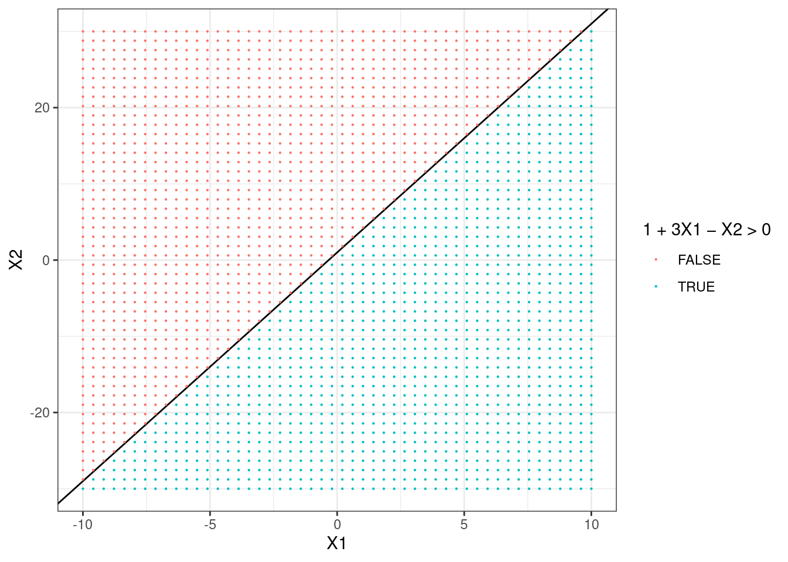

> b. On the same plot, sketch the hyperplane $−2 + X_1 + 2X_2 = 0$. Indicate the
>    set of points for which $−2 + X_1 + 2X_2 > 0$, as well as the set of points
>    for which $−2 + X_1 + 2X_2 < 0$.


``` r
p + geom_abline(intercept = 1, slope = -1/2) +  # X2 = 1 - X1/2
  geom_point(
    aes(color = interaction(1 + 3*X1 - X2 > 0, -2 + X1 + 2*X2 > 0)), 
    size = 0.5
  ) + 
  scale_color_discrete(name = "(1 + 3X1 − X2 > 0).(−2 + X1 + 2X2 > 0)")
```

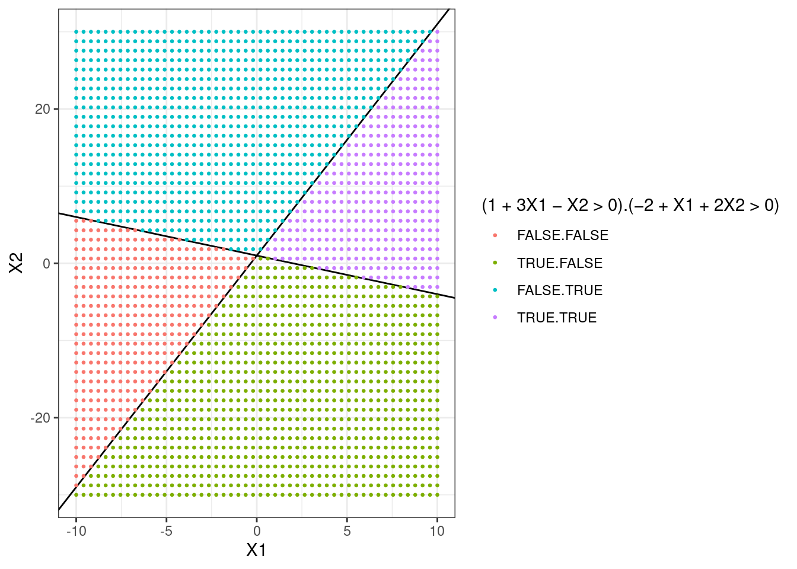

### Question 2

> We have seen that in $p = 2$ dimensions, a linear decision boundary takes the
> form $\beta_0 + \beta_1X_1 + \beta_2X_2 = 0$. We now investigate a non-linear
> decision boundary.
>
> a. Sketch the curve $$(1+X_1)^2 +(2−X_2)^2 = 4$$.


``` r
points <- expand.grid(
  X1 = seq(-4, 2, length.out = 100), 
  X2 = seq(-1, 5, length.out = 100)
)
p <- ggplot(points, aes(x = X1, y = X2, z = (1 + X1)^2 + (2 - X2)^2 - 4)) + 
  geom_contour(breaks = 0, colour = "black") + 
  theme_bw()
p
```

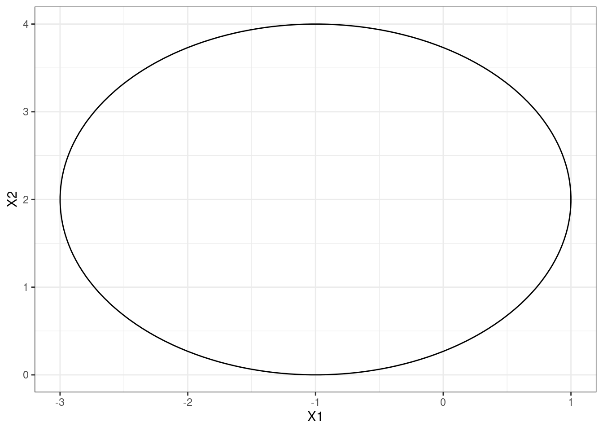

> b. On your sketch, indicate the set of points for which
>    $$(1 + X_1)^2 + (2 − X_2)^2 > 4,$$ as well as the set of points for which
>    $$(1 + X_1)^2 + (2 − X_2)^2 \leq 4.$$


``` r
p + geom_point(aes(color = (1 + X1)^2 + (2 - X2)^2 - 4 > 0), size = 0.1)
```

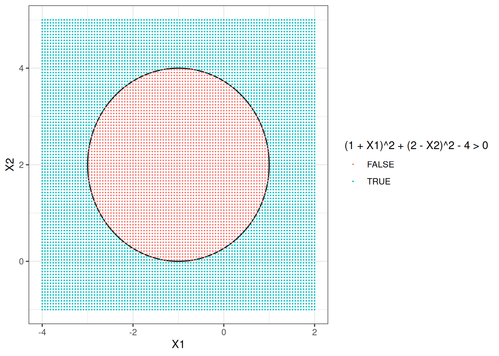

> c. Suppose that a classifier assigns an observation to the blue class if $$(1
>    + X_1)^2 + (2 − X_2)^2 > 4,$$ and to the red class otherwise. To what class
>    is the observation $(0, 0)$ classified? $(−1, 1)$? $(2, 2)$? $(3, 8)$?


``` r
points <- data.frame(
  X1 = c(0, -1, 2, 3),
  X2 = c(0, 1, 2, 8)
)
ifelse((1 + points$X1)^2 + (2 - points$X2)^2 > 4, "blue", "red")
```

```
## [1] "blue" "red"  "blue" "blue"
```

> d. Argue that while the decision boundary in (c) is not linear in terms of
>    $X_1$ and $X_2$, it is linear in terms of $X_1$, $X_1^2$, $X_2$, and
>    $X_2^2$.

The decision boundary is $$(1 + X_1)^2 + (2 − X_2)^2 -4 = 0$$ which we can expand 
to:
$$1 + 2X_1 + X_1^2 + 4 − 4X_2 + X_2^2 - 4 = 0$$
which is linear in terms of $X_1$, $X_1^2$, $X_2$, $X_2^2$.

### Question 3

> Here we explore the maximal margin classifier on a toy data set.
>
> a. We are given $n = 7$ observations in $p = 2$ dimensions. For each
>    observation, there is an associated class label.
>    
>    | Obs. | $X_1$ | $X_2$ | $Y$  |
>    |------|-------|-------|------|
>    | 1    | 3     | 4     | Red  |
>    | 2    | 2     | 2     | Red  |
>    | 3    | 4     | 4     | Red  |
>    | 4    | 1     | 4     | Red  |
>    | 5    | 2     | 1     | Blue |
>    | 6    | 4     | 3     | Blue |
>    | 7    | 4     | 1     | Blue |
>    
>    Sketch the observations.


``` r
data <- data.frame(
  X1 = c(3, 2, 4, 1, 2, 4, 4),
  X2 = c(4, 2, 4, 4, 1, 3, 1),
  Y  = c(rep("Red", 4), rep("Blue", 3))
)
p <- ggplot(data, aes(x = X1, y = X2, color = Y)) + 
  geom_point(size = 2) + 
  scale_colour_identity() +
  coord_cartesian(xlim = c(0.5, 4.5), ylim = c(0.5, 4.5))
p
```

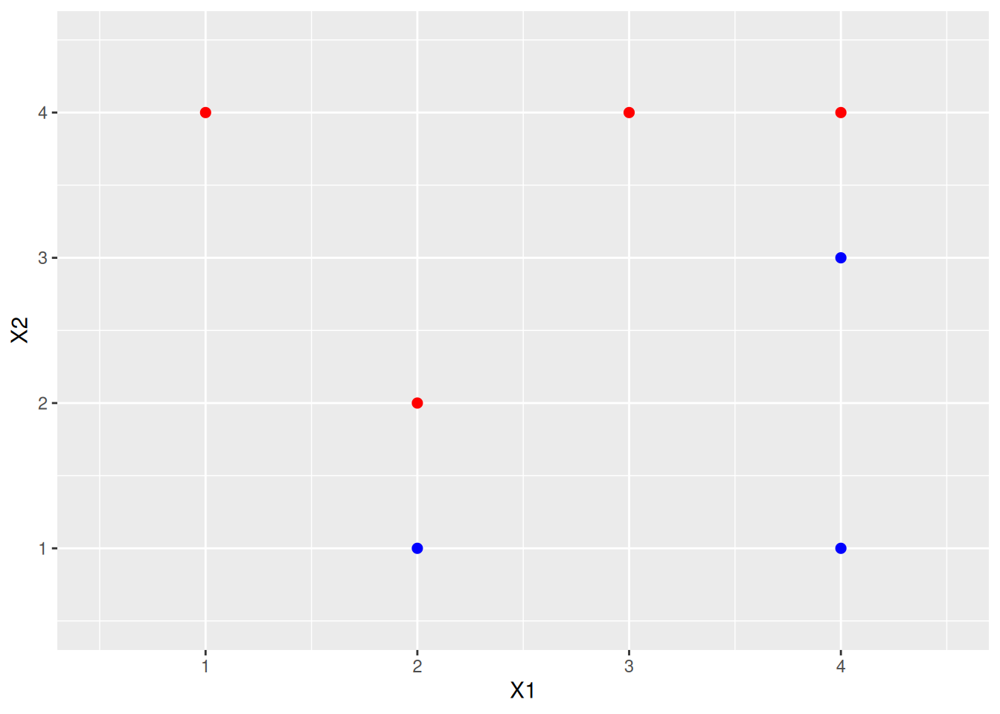

> b. Sketch the optimal separating hyperplane, and provide the equation for this
>    hyperplane (of the form (9.1)).


``` r
library(e1071)

fit <- svm(as.factor(Y) ~ ., data = data, kernel = "linear", cost = 10, scale = FALSE)

# Extract beta_0, beta_1, beta_2
beta <- c(
  -fit$rho,
  drop(t(fit$coefs) %*% as.matrix(data[fit$index, 1:2]))
)
names(beta) <- c("B0", "B1", "B2")
p <- p + geom_abline(intercept = -beta[1] / beta[3], slope = -beta[2] / beta[3], lty = 2)
p
```

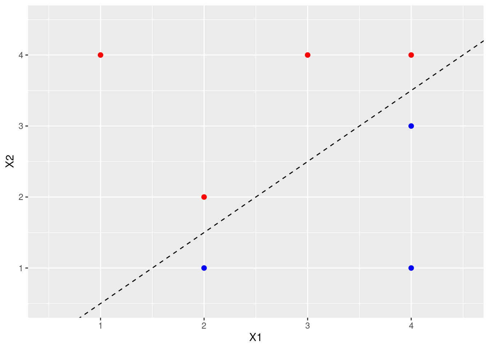

> c. Describe the classification rule for the maximal margin classifier. It
>    should be something along the lines of "Classify to Red if $\beta_0 +
>    \beta_1X_1 + \beta_2X_2 > 0$, and classify to Blue otherwise." Provide the
>    values for $\beta_0, \beta_1,$ and $\beta_2$.

Classify to red if $\beta_0 + \beta_1X_1 + \beta_2X_2 > 0$ and blue otherwise
where $\beta_0 = 1$,  $\beta_1 = -2$,
$\beta_2 = 2$.

> d. On your sketch, indicate the margin for the maximal margin hyperplane.


``` r
p <- p + geom_ribbon(
  aes(x = x, ymin = ymin, ymax = ymax),
  data = data.frame(x = c(0, 5), ymin = c(-1, 4), ymax = c(0, 5)),
  alpha = 0.1, fill = "blue",
  inherit.aes = FALSE
)
p
```

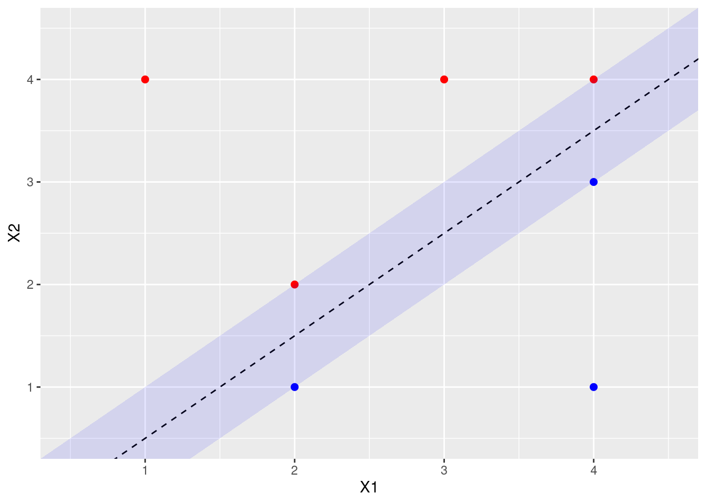

> e. Indicate the support vectors for the maximal margin classifier.


``` r
p <- p + geom_point(data = data[fit$index, ], size = 4)
p
```

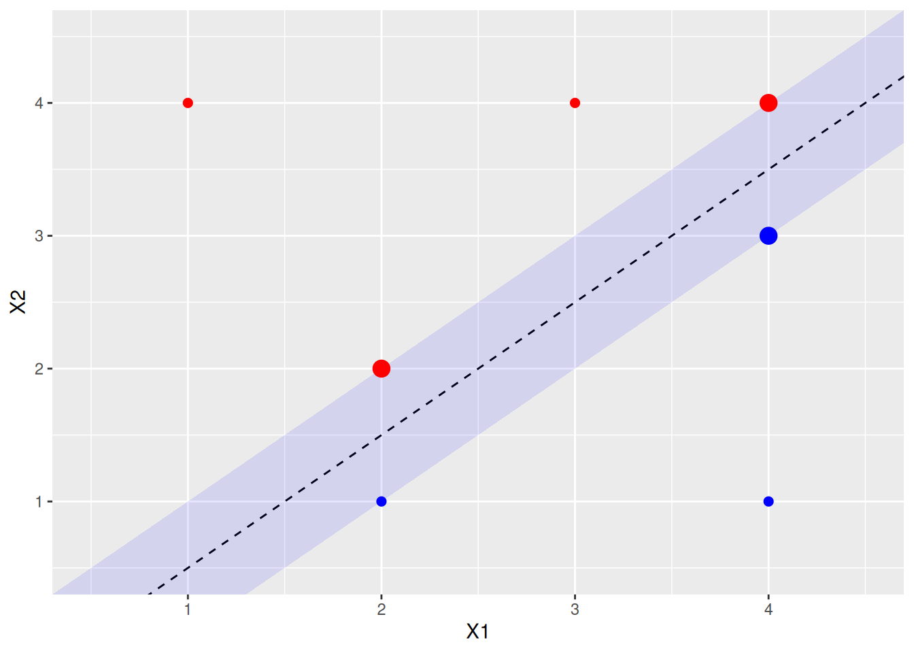

The support vectors (from the svm fit object) are shown above. Arguably, 
there's another support vector, since four points exactly touch the margin.

> f. Argue that a slight movement of the seventh observation would not affect
>    the maximal margin hyperplane.


``` r
p + geom_point(data = data[7, , drop = FALSE], size = 4, color = "purple")
```

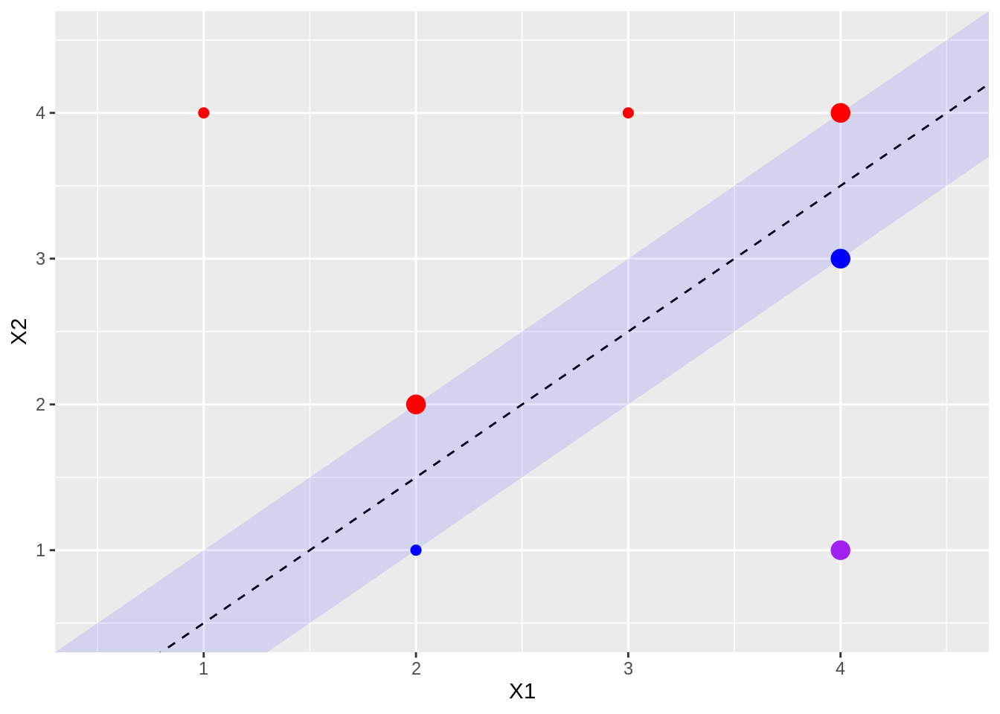

The 7th point is shown in purple above. It is not a support vector, and not 
close to the margin, so small changes in its X1, X2 values would not affect the
current calculated margin. 

> g. Sketch a hyperplane that is _not_ the optimal separating hyperplane, and
>    provide the equation for this hyperplane.

A non-optimal hyperline that still separates the blue and red points would 
be one that touches the (red) point at X1 = 2, X2 = 2 and the (blue) point at
X1 = 4, X2 = 3. This gives line $y = x/2 + 1$  or, when  $\beta_0 = -1$, 
$\beta_1 = -1/2$, $\beta_2 = 1$.


``` r
p + geom_abline(intercept = 1, slope = 0.5, lty = 2, col = "red")
```

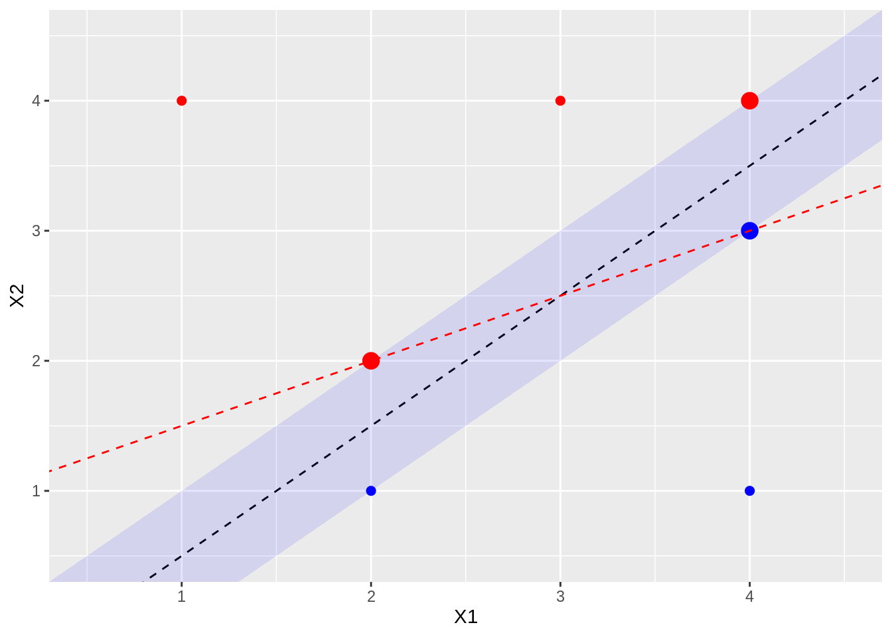

> h. Draw an additional observation on the plot so that the two classes are no
>    longer separable by a hyperplane.


``` r
p + geom_point(data = data.frame(X1 = 1, X2 = 3, Y  = "Blue"), shape = 15, size = 4)
```

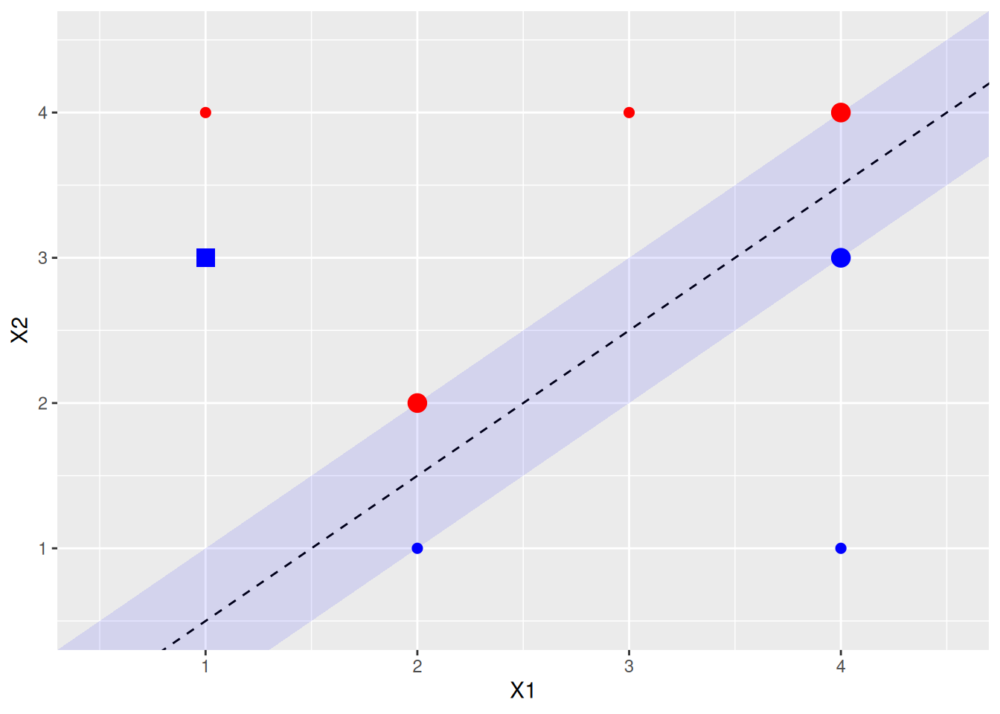

## Applied

### Question 4

> Generate a simulated two-class data set with 100 observations and two features
> in which there is a visible but non-linear separation between the two classes.
> Show that in this setting, a support vector machine with a polynomial kernel
> (with degree greater than 1) or a radial kernel will outperform a support
> vector classifier on the training data. Which technique performs best on the
> test data? Make plots and report training and test error rates in order to
> back up your assertions.


``` r
set.seed(10)
data <- data.frame(
  x = runif(100),
  y = runif(100)
)
score <- (2*data$x-0.5)^2 + (data$y)^2 - 0.5
data$class <- factor(ifelse(score > 0, "red", "blue"))

p <- ggplot(data, aes(x = x, y = y, color = class)) + 
  geom_point(size = 2) + scale_colour_identity()
p
```

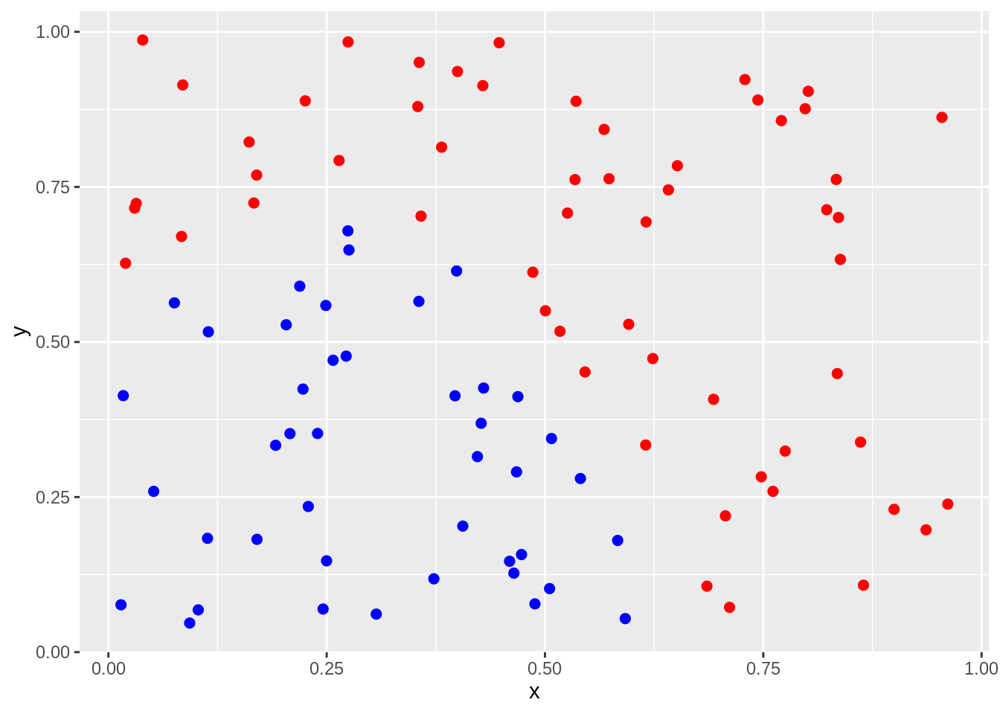

``` r
train <- 1:50
test <- 51:100

fits <- list(
  "Radial" = svm(class ~ ., data = data[train, ], kernel = "radial"),
  "Polynomial" = svm(class ~ ., data = data[train, ], kernel = "polynomial", degree = 2),
  "Linear" = svm(class ~ ., data = data[train, ], kernel = "linear")
)

err <- function(model, data) {
  out <- table(predict(model, data), data$class)
  (out[1, 2] + out[2, 1]) / sum(out)
}
plot(fits[[1]], data)
```

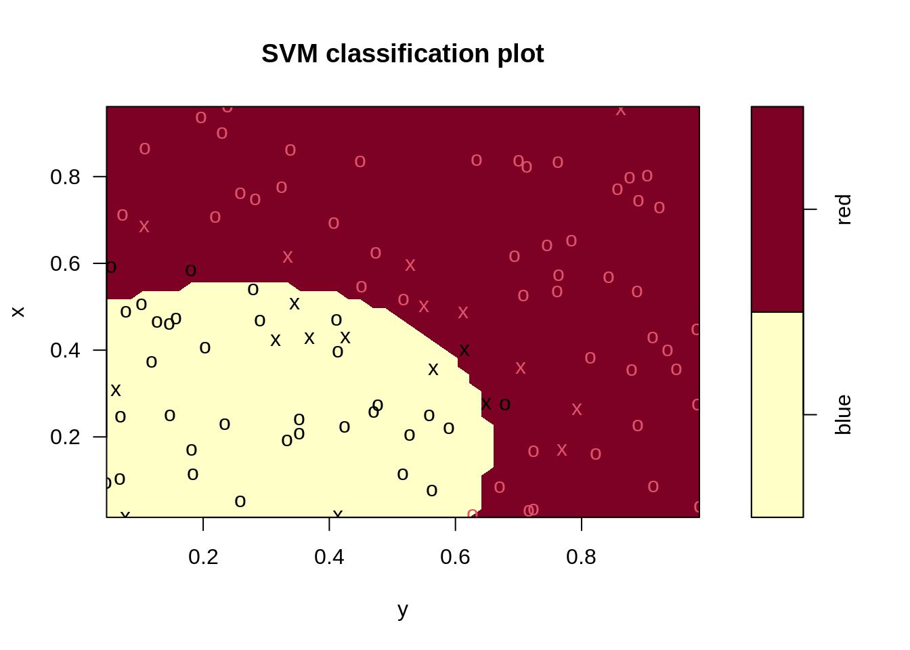

``` r
plot(fits[[2]], data)
```

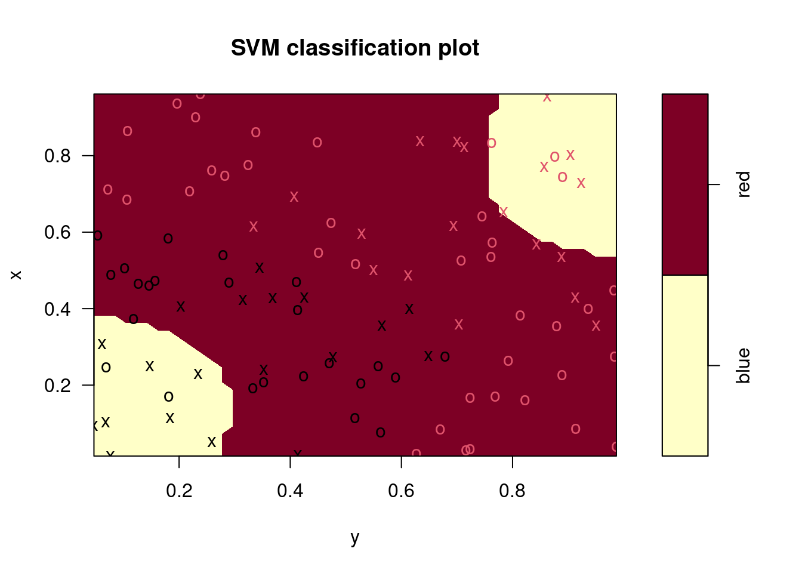

``` r
plot(fits[[3]], data)
```

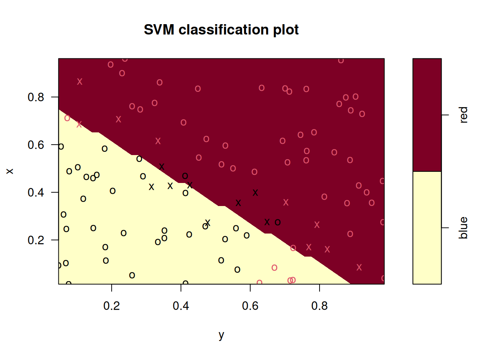

``` r
sapply(fits, err, data = data[train, ])
```

```
##     Radial Polynomial     Linear 
##       0.04       0.30       0.10
```

``` r
sapply(fits, err, data = data[test, ])
```

```
##     Radial Polynomial     Linear 
##       0.06       0.48       0.14
```

In this case, the radial kernel performs best, followed by a linear kernel with
the 2nd degree polynomial performing worst. The ordering of these models is the
same for the training and test data sets.

### Question 5

> We have seen that we can fit an SVM with a non-linear kernel in order to
> perform classification using a non-linear decision boundary. We will now see
> that we can also obtain a non-linear decision boundary by performing logistic
> regression using non-linear transformations of the features.
>
> a. Generate a data set with $n = 500$ and $p = 2$, such that the observations
>    belong to two classes with a quadratic decision boundary between them. For
>    instance, you can do this as follows:
>    
>    ```r
>    > x1 <- runif(500) - 0.5
>    > x2 <- runif(500) - 0.5
>    > y <- 1 * (x1^2 - x2^2 > 0)
>    ```


``` r
set.seed(42)
train <- data.frame(
  x1 = runif(500) - 0.5,
  x2 = runif(500) - 0.5
)
train$y <- factor(as.numeric((train$x1^2 - train$x2^2 > 0)))
```

> b. Plot the observations, colored according to their class labels. Your plot
>    should display $X_1$ on the $x$-axis, and $X_2$ on the $y$-axis.


``` r
p <- ggplot(train, aes(x = x1, y = x2, color = y)) + 
  geom_point(size = 2)
p
```


> c. Fit a logistic regression model to the data, using $X_1$ and $X_2$ as 
>    predictors.


``` r
fit1 <- glm(y ~ ., data = train, family = "binomial")
```

> d. Apply this model to the _training data_ in order to obtain a predicted class
>    label for each training observation. Plot the observations, colored
>    according to the _predicted_ class labels. The decision boundary should be
>    linear.


``` r
plot_model <- function(fit) {
  if (inherits(fit, "svm")) {
    train$p <- predict(fit)
  } else {
    train$p <- factor(as.numeric(predict(fit) > 0))
  }
  ggplot(train, aes(x = x1, y = x2, color = p)) + 
    geom_point(size = 2)
}

plot_model(fit1)
```

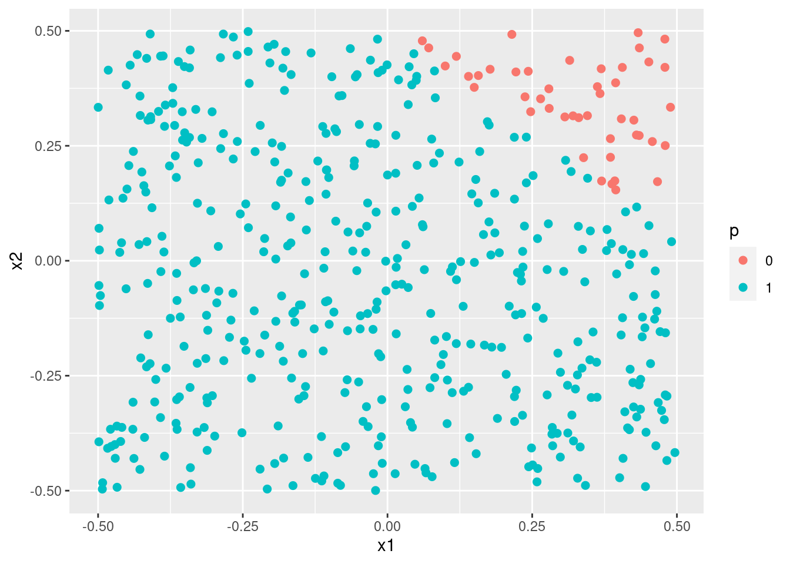

> e. Now fit a logistic regression model to the data using non-linear functions
>    of $X_1$ and $X_2$ as predictors (e.g. $X_1^2, X_1 \times X_2, \log(X_2),$
>    and so forth).


``` r
fit2 <- glm(y ~ poly(x1, 2) + poly(x2, 2), data = train, family = "binomial")
```

```
## Warning: glm.fit: algorithm did not converge
```

```
## Warning: glm.fit: fitted probabilities numerically 0 or 1 occurred
```

> f. Apply this model to the _training data_ in order to obtain a predicted
>    class label for each training observation. Plot the observations, colored
>    according to the _predicted_ class labels. The decision boundary should be
>    obviously non-linear. If it is not, then repeat (a)-(e) until you come up
>    with an example in which the predicted class labels are obviously
>    non-linear.


``` r
plot_model(fit2)
```

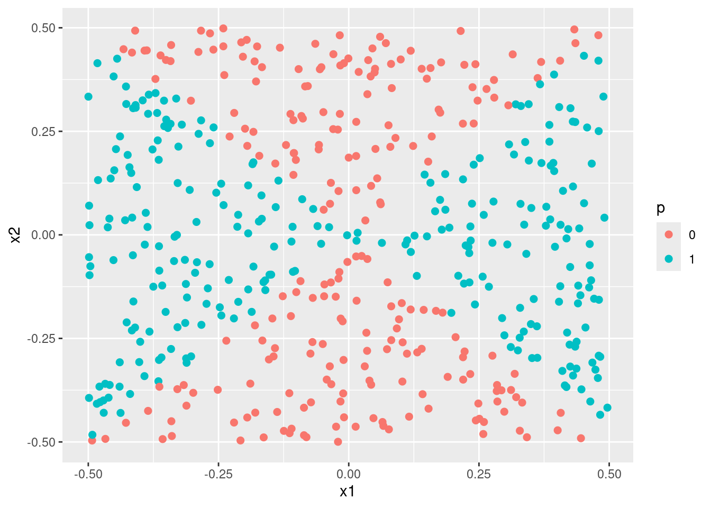

> g. Fit a support vector classifier to the data with $X_1$ and $X_2$ as
>    predictors. Obtain a class prediction for each training observation. Plot
>    the observations, colored according to the _predicted class labels_.


``` r
fit3 <- svm(y ~ x1 + x2, data = train, kernel = "linear")
plot_model(fit3)
```

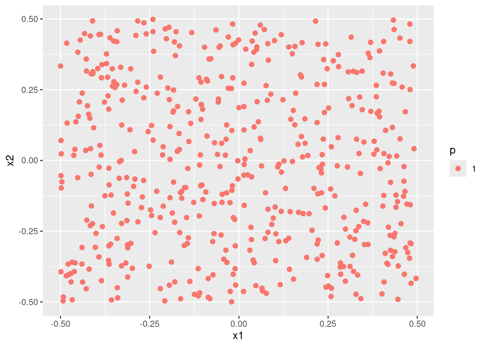

> h. Fit a SVM using a non-linear kernel to the data. Obtain a class prediction
>    for each training observation. Plot the observations, colored according to
>    the _predicted class labels_.


``` r
fit4 <- svm(y ~ x1 + x2, data = train, kernel = "polynomial", degree = 2)
plot_model(fit4)
```


> i. Comment on your results.

When simulating data with a quadratic decision boundary, a logistic model with
quadratic transformations of the variables and an svm model with a quadratic
kernel both produce much better (and similar fits) than standard linear methods.

### Question 6

> At the end of Section 9.6.1, it is claimed that in the case of data that is
> just barely linearly separable, a support vector classifier with a small
> value of `cost` that misclassifies a couple of training observations may
> perform better on test data than one with a huge value of `cost` that does not
> misclassify any training observations. You will now investigate this claim.
>
> a. Generate two-class data with $p = 2$ in such a way that the classes are
>    just barely linearly separable.


``` r
set.seed(2)

# Simulate data that is separable by a line at y = 2.5
data <- data.frame(
  x = rnorm(200),
  class = sample(c("red", "blue"), 200, replace = TRUE)
)
data$y <- (data$class == "red") * 5 + rnorm(200)

# Add barley separable points (these are simulated "noise" values)
newdata <- data.frame(x = rnorm(30))
newdata$y <- 1.5*newdata$x + 3 + rnorm(30, 0, 1)
newdata$class = ifelse((1.5*newdata$x + 3) - newdata$y > 0, "blue", "red")

data <- rbind(data, newdata)

# remove any that cause misclassification leaving data that is barley linearly
# separable, but along an axis that is not y = 2.5 (which would be correct
# for the "true" data.
data <- data[!(data$class == "red") == ((1.5*data$x + 3 - data$y) > 0), ]
data <- data[sample(seq_len(nrow(data)), 200), ]

p <- ggplot(data, aes(x = x, y = y, color = class)) + 
  geom_point(size = 2) + scale_colour_identity() + 
  geom_abline(intercept = 3, slope = 1.5, lty = 2)
p
```

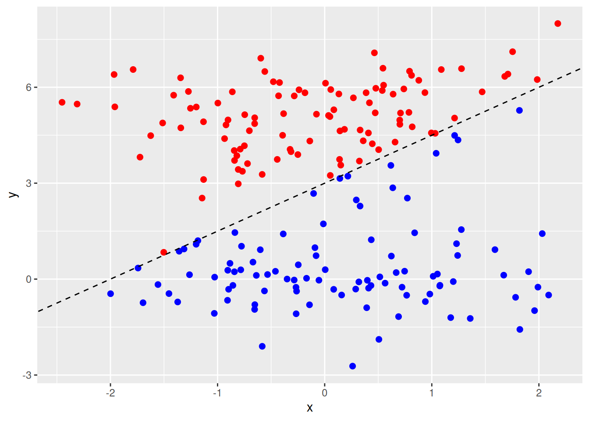

> b. Compute the cross-validation error rates for support vector classifiers
>    with a range of `cost` values. How many training errors are misclassified
>    for each value of `cost` considered, and how does this relate to the
>    cross-validation errors obtained?

How many training errors are misclassified for each value of cost?


``` r
costs <- 10^seq(-3, 5)

sapply(costs, function(cost) {
    fit <- svm(as.factor(class) ~ ., data = data, kernel = "linear", cost = cost)
    pred <- predict(fit, data)
    sum(pred != data$class)
})
```

```
## [1] 98  8  9  4  1  1  0  0  0
```

Cross-validation errors


``` r
out <- tune(svm, as.factor(class) ~ ., data = data, kernel = "linear", ranges = list(cost = costs))
summary(out)
```

```
## 
## Parameter tuning of 'svm':
## 
## - sampling method: 10-fold cross validation 
## 
## - best parameters:
##  cost
##    10
## 
## - best performance: 0.005 
## 
## - Detailed performance results:
##    cost error dispersion
## 1 1e-03 0.540 0.09067647
## 2 1e-02 0.045 0.02838231
## 3 1e-01 0.045 0.03689324
## 4 1e+00 0.020 0.02581989
## 5 1e+01 0.005 0.01581139
## 6 1e+02 0.005 0.01581139
## 7 1e+03 0.005 0.01581139
## 8 1e+04 0.010 0.02108185
## 9 1e+05 0.010 0.02108185
```

``` r
data.frame(
  cost = out$performances$cost, 
  misclass = out$performances$error * nrow(data)
)
```

```
##    cost misclass
## 1 1e-03      108
## 2 1e-02        9
## 3 1e-01        9
## 4 1e+00        4
## 5 1e+01        1
## 6 1e+02        1
## 7 1e+03        1
## 8 1e+04        2
## 9 1e+05        2
```

> c. Generate an appropriate test data set, and compute the test errors
>    corresponding to each of the values of `cost` considered. Which value of
>    `cost` leads to the fewest test errors, and how does this compare to the
>    values of `cost` that yield the fewest training errors and the fewest
>    cross-validation errors?


``` r
set.seed(2)
test <- data.frame(
  x = rnorm(200),
  class = sample(c("red", "blue"), 200, replace = TRUE)
)
test$y <- (test$class == "red") * 5 + rnorm(200)
p + geom_point(data = test, pch = 21)
```

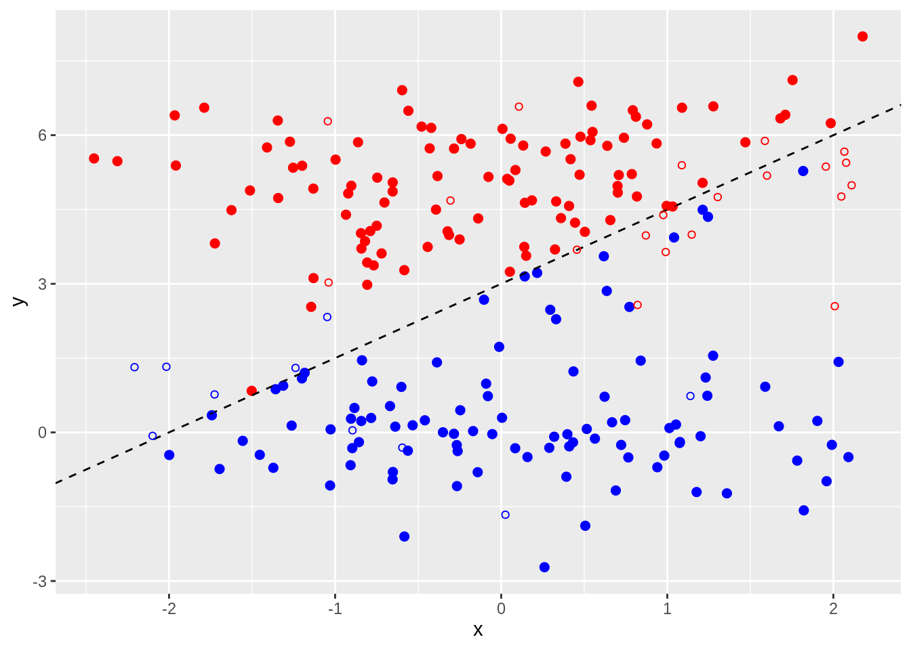

``` r
(errs <- sapply(costs, function(cost) {
    fit <- svm(as.factor(class) ~ ., data = data, kernel = "linear", cost = cost)
    pred <- predict(fit, test)
    sum(pred != test$class)
}))
```

```
## [1] 95  2  3  9 16 16 19 19 19
```

``` r
(cost <- costs[which.min(errs)])
```

```
## [1] 0.01
```

``` r
(fit <- svm(as.factor(class) ~ ., data = data, kernel = "linear", cost = cost))
```

```
## 
## Call:
## svm(formula = as.factor(class) ~ ., data = data, kernel = "linear", 
##     cost = cost)
## 
## 
## Parameters:
##    SVM-Type:  C-classification 
##  SVM-Kernel:  linear 
##        cost:  0.01 
## 
## Number of Support Vectors:  135
```

``` r
test$prediction <- predict(fit, test)
p <- ggplot(test, aes(x = x, y = y, color = class, shape = prediction == class)) + 
  geom_point(size = 2) + 
  scale_colour_identity() 
p
```

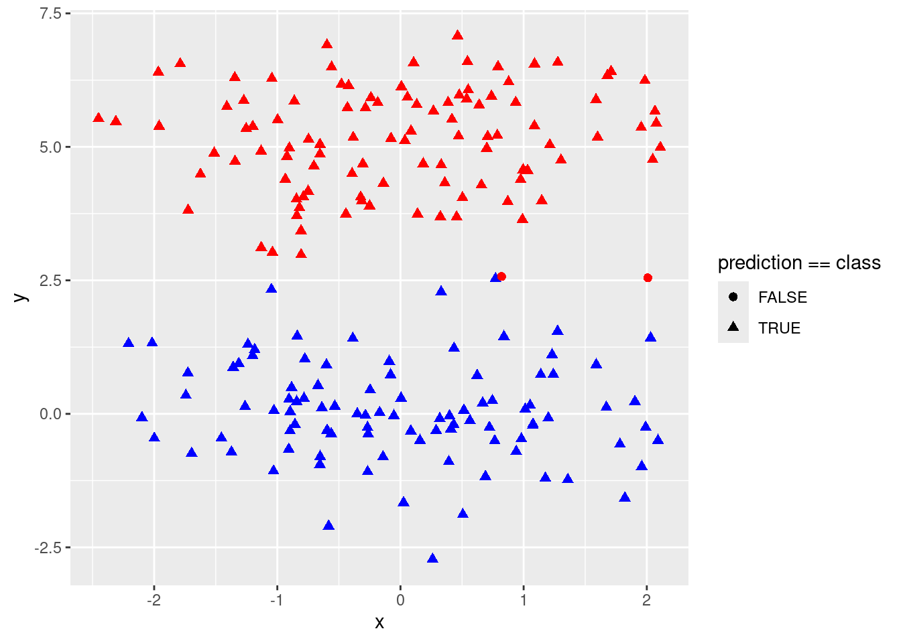

> d. Discuss your results.

A large cost leads to overfitting as the model finds the perfect linear 
separation between red and blue in the training data. A lower cost then 
leads to improved prediction in the test data.

### Question 7

> In this problem, you will use support vector approaches in order to predict
> whether a given car gets high or low gas mileage based on the `Auto` data set.
> 
> a. Create a binary variable that takes on a 1 for cars with gas mileage above
>    the median, and a 0 for cars with gas mileage below the median.


``` r
library(ISLR2)
data <- Auto
data$high_mpg <- as.factor(as.numeric(data$mpg > median(data$mpg)))
```

> b. Fit a support vector classifier to the data with various values of `cost`,
>    in order to predict whether a car gets high or low gas mileage. Report the
>    cross-validation errors associated with different values of this parameter.
>    Comment on your results. Note you will need to fit the classifier without
>    the gas mileage variable to produce sensible results.


``` r
set.seed(42)
costs <- 10^seq(-4, 3, by = 0.5)
results <- list()
f <- high_mpg ~ displacement + horsepower + weight
results$linear <- tune(svm, f, data = data, kernel = "linear", 
  ranges = list(cost = costs))
summary(results$linear)
```

```
## 
## Parameter tuning of 'svm':
## 
## - sampling method: 10-fold cross validation 
## 
## - best parameters:
##        cost
##  0.03162278
## 
## - best performance: 0.1019231 
## 
## - Detailed performance results:
##            cost     error dispersion
## 1  1.000000e-04 0.5967949 0.05312225
## 2  3.162278e-04 0.5967949 0.05312225
## 3  1.000000e-03 0.2199359 0.08718077
## 4  3.162278e-03 0.1353846 0.06058195
## 5  1.000000e-02 0.1121795 0.04011293
## 6  3.162278e-02 0.1019231 0.05087176
## 7  1.000000e-01 0.1096154 0.05246238
## 8  3.162278e-01 0.1044872 0.05154934
## 9  1.000000e+00 0.1044872 0.05154934
## 10 3.162278e+00 0.1044872 0.05154934
## 11 1.000000e+01 0.1019231 0.05501131
## 12 3.162278e+01 0.1019231 0.05501131
## 13 1.000000e+02 0.1019231 0.05501131
## 14 3.162278e+02 0.1019231 0.05501131
## 15 1.000000e+03 0.1019231 0.05501131
```

> c. Now repeat (b), this time using SVMs with radial and polynomial basis
>    kernels, with different values of `gamma` and `degree` and `cost`. Comment
>    on your results.


``` r
results$polynomial <- tune(svm, f, data = data, kernel = "polynomial", 
  ranges = list(cost = costs, degree = 1:3))
summary(results$polynomial)
```

```
## 
## Parameter tuning of 'svm':
## 
## - sampling method: 10-fold cross validation 
## 
## - best parameters:
##  cost degree
##   0.1      1
## 
## - best performance: 0.101859 
## 
## - Detailed performance results:
##            cost degree     error dispersion
## 1  1.000000e-04      1 0.5842949 0.04703306
## 2  3.162278e-04      1 0.5842949 0.04703306
## 3  1.000000e-03      1 0.5842949 0.04703306
## 4  3.162278e-03      1 0.2167949 0.07891173
## 5  1.000000e-02      1 0.1275641 0.04806885
## 6  3.162278e-02      1 0.1147436 0.05661708
## 7  1.000000e-01      1 0.1018590 0.05732429
## 8  3.162278e-01      1 0.1069231 0.05949679
## 9  1.000000e+00      1 0.1069231 0.06307278
## 10 3.162278e+00      1 0.1069231 0.06307278
## 11 1.000000e+01      1 0.1043590 0.06603760
## 12 3.162278e+01      1 0.1043590 0.06603760
## 13 1.000000e+02      1 0.1043590 0.06603760
## 14 3.162278e+02      1 0.1043590 0.06603760
## 15 1.000000e+03      1 0.1043590 0.06603760
## 16 1.000000e-04      2 0.5842949 0.04703306
## 17 3.162278e-04      2 0.5842949 0.04703306
## 18 1.000000e-03      2 0.5842949 0.04703306
## 19 3.162278e-03      2 0.5255128 0.08090636
## 20 1.000000e-02      2 0.3980769 0.08172400
## 21 3.162278e-02      2 0.3674359 0.07974741
## 22 1.000000e-01      2 0.3597436 0.08336609
## 23 3.162278e-01      2 0.3597436 0.09010398
## 24 1.000000e+00      2 0.3444872 0.08767258
## 25 3.162278e+00      2 0.3545513 0.10865903
## 26 1.000000e+01      2 0.3239103 0.09593710
## 27 3.162278e+01      2 0.3035256 0.08184137
## 28 1.000000e+02      2 0.3061538 0.08953945
## 29 3.162278e+02      2 0.3060897 0.08919821
## 30 1.000000e+03      2 0.3035897 0.09305216
## 31 1.000000e-04      3 0.5842949 0.04703306
## 32 3.162278e-04      3 0.4955128 0.10081350
## 33 1.000000e-03      3 0.3750641 0.08043982
## 34 3.162278e-03      3 0.3036538 0.09096445
## 35 1.000000e-02      3 0.2601282 0.07774595
## 36 3.162278e-02      3 0.2499359 0.08407106
## 37 1.000000e-01      3 0.2017949 0.07547413
## 38 3.162278e-01      3 0.1937179 0.08427411
## 39 1.000000e+00      3 0.1478205 0.04579654
## 40 3.162278e+00      3 0.1451923 0.05169638
## 41 1.000000e+01      3 0.1451282 0.04698931
## 42 3.162278e+01      3 0.1500000 0.07549058
## 43 1.000000e+02      3 0.1373718 0.05772558
## 44 3.162278e+02      3 0.1271795 0.06484766
## 45 1.000000e+03      3 0.1322436 0.06764841
```

``` r
results$radial <- tune(svm, f, data = data, kernel = "radial", 
  ranges = list(cost = costs, gamma = 10^(-2:1)))
summary(results$radial)
```

```
## 
## Parameter tuning of 'svm':
## 
## - sampling method: 10-fold cross validation 
## 
## - best parameters:
##  cost gamma
##  1000   0.1
## 
## - best performance: 0.08179487 
## 
## - Detailed performance results:
##            cost gamma      error dispersion
## 1  1.000000e-04  0.01 0.58410256 0.05435320
## 2  3.162278e-04  0.01 0.58410256 0.05435320
## 3  1.000000e-03  0.01 0.58410256 0.05435320
## 4  3.162278e-03  0.01 0.58410256 0.05435320
## 5  1.000000e-02  0.01 0.58410256 0.05435320
## 6  3.162278e-02  0.01 0.26557692 0.10963269
## 7  1.000000e-01  0.01 0.15038462 0.05783237
## 8  3.162278e-01  0.01 0.11224359 0.04337812
## 9  1.000000e+00  0.01 0.10730769 0.04512161
## 10 3.162278e+00  0.01 0.10730769 0.04512161
## 11 1.000000e+01  0.01 0.10737179 0.05526490
## 12 3.162278e+01  0.01 0.10480769 0.05610124
## 13 1.000000e+02  0.01 0.10480769 0.05610124
## 14 3.162278e+02  0.01 0.10737179 0.05526490
## 15 1.000000e+03  0.01 0.10993590 0.05690926
## 16 1.000000e-04  0.10 0.58410256 0.05435320
## 17 3.162278e-04  0.10 0.58410256 0.05435320
## 18 1.000000e-03  0.10 0.58410256 0.05435320
## 19 3.162278e-03  0.10 0.58410256 0.05435320
## 20 1.000000e-02  0.10 0.15301282 0.06026554
## 21 3.162278e-02  0.10 0.11480769 0.04514816
## 22 1.000000e-01  0.10 0.10730769 0.04512161
## 23 3.162278e-01  0.10 0.10730769 0.04512161
## 24 1.000000e+00  0.10 0.10737179 0.05526490
## 25 3.162278e+00  0.10 0.10737179 0.05526490
## 26 1.000000e+01  0.10 0.10737179 0.05526490
## 27 3.162278e+01  0.10 0.10737179 0.05526490
## 28 1.000000e+02  0.10 0.09967949 0.04761387
## 29 3.162278e+02  0.10 0.08429487 0.03207585
## 30 1.000000e+03  0.10 0.08179487 0.03600437
## 31 1.000000e-04  1.00 0.58410256 0.05435320
## 32 3.162278e-04  1.00 0.58410256 0.05435320
## 33 1.000000e-03  1.00 0.58410256 0.05435320
## 34 3.162278e-03  1.00 0.58410256 0.05435320
## 35 1.000000e-02  1.00 0.12506410 0.05342773
## 36 3.162278e-02  1.00 0.10730769 0.06255920
## 37 1.000000e-01  1.00 0.10993590 0.05561080
## 38 3.162278e-01  1.00 0.10737179 0.05526490
## 39 1.000000e+00  1.00 0.09711538 0.05107441
## 40 3.162278e+00  1.00 0.08429487 0.03634646
## 41 1.000000e+01  1.00 0.08692308 0.03877861
## 42 3.162278e+01  1.00 0.08948718 0.03503648
## 43 1.000000e+02  1.00 0.09198718 0.03272127
## 44 3.162278e+02  1.00 0.10217949 0.04214031
## 45 1.000000e+03  1.00 0.09692308 0.04645046
## 46 1.000000e-04 10.00 0.58410256 0.05435320
## 47 3.162278e-04 10.00 0.58410256 0.05435320
## 48 1.000000e-03 10.00 0.58410256 0.05435320
## 49 3.162278e-03 10.00 0.58410256 0.05435320
## 50 1.000000e-02 10.00 0.58410256 0.05435320
## 51 3.162278e-02 10.00 0.22205128 0.12710181
## 52 1.000000e-01 10.00 0.11237179 0.03888895
## 53 3.162278e-01 10.00 0.10217949 0.04375722
## 54 1.000000e+00 10.00 0.09717949 0.03809440
## 55 3.162278e+00 10.00 0.09717949 0.03809440
## 56 1.000000e+01 10.00 0.09711538 0.04161705
## 57 3.162278e+01 10.00 0.11487179 0.04240664
## 58 1.000000e+02 10.00 0.13019231 0.03541140
## 59 3.162278e+02 10.00 0.13532051 0.03865626
## 60 1.000000e+03 10.00 0.14044872 0.04251917
```

``` r
sapply(results, function(x) x$best.performance)
```

```
##     linear polynomial     radial 
## 0.10192308 0.10185897 0.08179487
```

``` r
sapply(results, function(x) x$best.parameters)
```

```
## $linear
##         cost
## 6 0.03162278
## 
## $polynomial
##   cost degree
## 7  0.1      1
## 
## $radial
##    cost gamma
## 30 1000   0.1
```

> d. Make some plots to back up your assertions in (b) and (c).
> 
>    _Hint: In the lab, we used the `plot()` function for `svm` objects only in 
>    cases with $p = 2$. When $p > 2$, you can use the `plot()` function to 
>    create plots displaying pairs of variables at a time. Essentially, instead 
>    of typing_
>    
>    ```r
>    > plot(svmfit, dat)
>    ```
>    
>    _where `svmfit` contains your fitted model and dat is a data frame 
>    containing your data, you can type_
>    
>    ```r
>    > plot(svmfit, dat, x1 ∼ x4)
>    ``` 
>    
>    _in order to plot just the first and fourth variables. However, you must 
>    replace `x1` and `x4` with the correct variable names. To find out more, 
>    type `?plot.svm`._


``` r
table(predict(results$radial$best.model, data), data$high_mpg)
```

```
##    
##       0   1
##   0 176   5
##   1  20 191
```

``` r
plot(results$radial$best.model, data, horsepower~displacement)
```

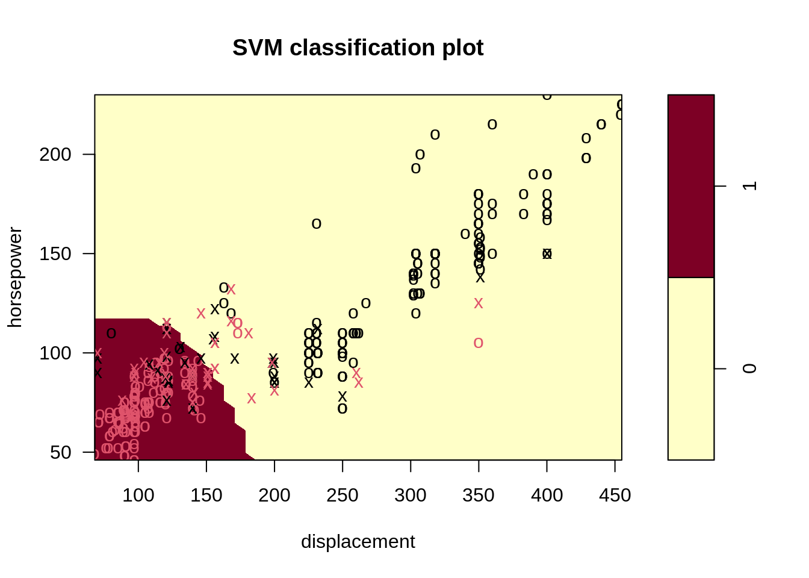

``` r
plot(results$radial$best.model, data, horsepower~weight)
```

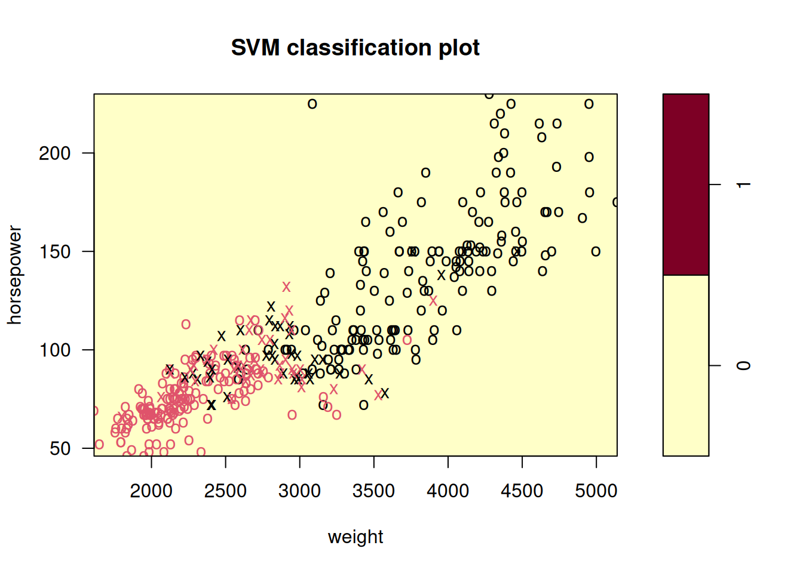

``` r
plot(results$radial$best.model, data, displacement~weight)
```

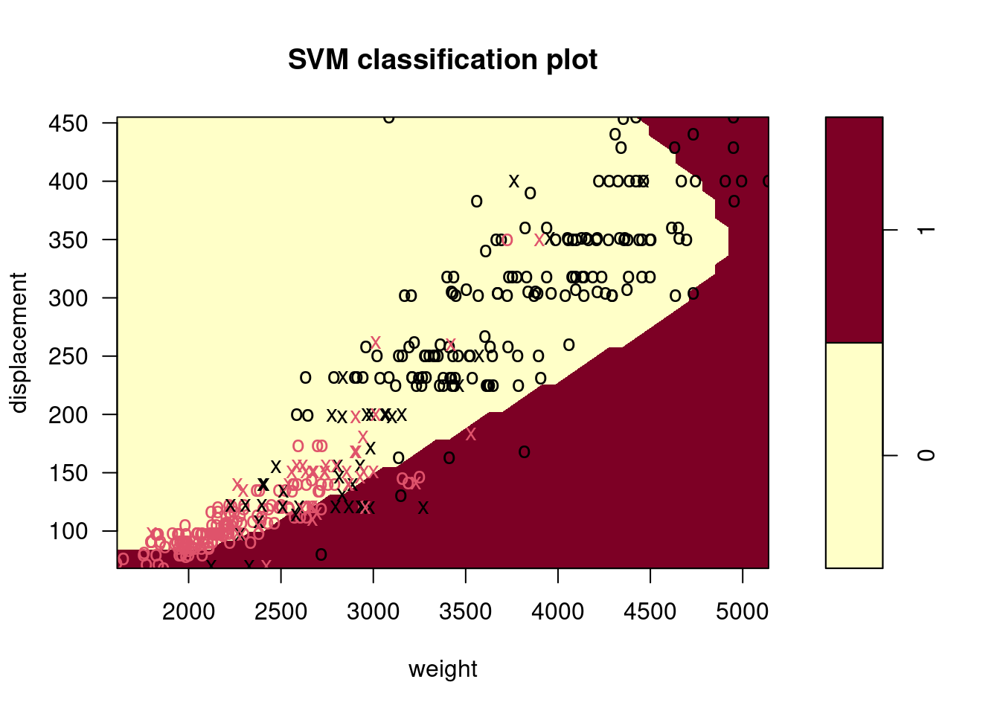

### Question 8

> This problem involves the `OJ` data set which is part of the `ISLR2` package.
> 
> a. Create a training set containing a random sample of 800 observations, and a
>    test set containing the remaining observations.


``` r
set.seed(42)
train <- sample(seq_len(nrow(OJ)), 800)
test <- setdiff(seq_len(nrow(OJ)), train)
```

> b. Fit a support vector classifier to the training data using `cost = 0.01`,
>    with `Purchase` as the response and the other variables as predictors. Use
>    the `summary()` function to produce summary statistics, and describe the
>    results obtained.


``` r
fit <- svm(Purchase ~ ., data = OJ[train, ], kernel = "linear", cost = 0.01)
summary(fit)
```

```
## 
## Call:
## svm(formula = Purchase ~ ., data = OJ[train, ], kernel = "linear", 
##     cost = 0.01)
## 
## 
## Parameters:
##    SVM-Type:  C-classification 
##  SVM-Kernel:  linear 
##        cost:  0.01 
## 
## Number of Support Vectors:  432
## 
##  ( 215 217 )
## 
## 
## Number of Classes:  2 
## 
## Levels: 
##  CH MM
```

> c. What are the training and test error rates?


``` r
err <- function(model, data) {
  t <- table(predict(model, data), data[["Purchase"]])
  1 - sum(diag(t)) / sum(t)
}
errs <- function(model) {
  c(train = err(model, OJ[train, ]), test = err(model, OJ[test, ]))
}
errs(fit)
```

```
##    train     test 
## 0.171250 0.162963
```

> d. Use the `tune()` function to select an optimal cost. Consider values in the
>    range 0.01 to 10.


``` r
tuned <- tune(svm, Purchase ~ ., data = OJ[train, ], kernel = "linear", 
  ranges = list(cost = 10^seq(-2, 1, length.out = 10)))
tuned$best.parameters
```

```
##   cost
## 7    1
```

``` r
summary(tuned)
```

```
## 
## Parameter tuning of 'svm':
## 
## - sampling method: 10-fold cross validation 
## 
## - best parameters:
##  cost
##     1
## 
## - best performance: 0.1775 
## 
## - Detailed performance results:
##           cost   error dispersion
## 1   0.01000000 0.18250 0.04133199
## 2   0.02154435 0.18000 0.04005205
## 3   0.04641589 0.18000 0.05041494
## 4   0.10000000 0.18000 0.04901814
## 5   0.21544347 0.18250 0.04377975
## 6   0.46415888 0.18250 0.04090979
## 7   1.00000000 0.17750 0.04031129
## 8   2.15443469 0.18000 0.03961621
## 9   4.64158883 0.17875 0.03821086
## 10 10.00000000 0.18375 0.03438447
```

> e. Compute the training and test error rates using this new value for `cost`.


``` r
errs(tuned$best.model)
```

```
##    train     test 
## 0.167500 0.162963
```

> f. Repeat parts (b) through (e) using a support vector machine with a radial
>    kernel. Use the default value for `gamma`.


``` r
tuned2 <- tune(svm, Purchase ~ ., data = OJ[train, ], kernel = "radial", 
  ranges = list(cost = 10^seq(-2, 1, length.out = 10)))
tuned2$best.parameters
```

```
##        cost
## 6 0.4641589
```

``` r
errs(tuned2$best.model)
```

```
##     train      test 
## 0.1525000 0.1666667
```

> g. Repeat parts (b) through (e) using a support vector machine with a
>    polynomial kernel. Set `degree = 2`.


``` r
tuned3 <- tune(svm, Purchase ~ ., data = OJ[train, ], kernel = "polynomial", 
  ranges = list(cost = 10^seq(-2, 1, length.out = 10)), degree = 2)
tuned3$best.parameters
```

```
##       cost
## 9 4.641589
```

``` r
errs(tuned3$best.model)
```

```
##     train      test 
## 0.1487500 0.1703704
```

> h. Overall, which approach seems to give the best results on this data?

Overall the "radial" kernel appears to perform best in this case.
