# Unsupervised Learning

## Conceptual

### Question 1

> This problem involves the $K$-means clustering algorithm.
>
> a. Prove (12.18).

12.18 is:

$$
\frac{1}{|C_k|}\sum_{i,i' \in C_k} \sum_{j=1}^p (x_{ij} - x_{i'j})^2 =
2 \sum_{i \in C_k} \sum_{j=1}^p  (x_{ij} - \bar{x}_{kj})^2
$$

where $$\bar{x}_{kj} = \frac{1}{|C_k|}\sum_{i \in C_k} x_{ij}$$

On the left hand side we compute the difference between each observation
(indexed by $i$ and $i'$). In the second we compute the difference between
each observation and the mean. Intuitively this identity is clear (the factor
of 2 is present because we calculate the difference between each pair twice).
A formal proof follows.

Note first that,
\begin{align}
(x_{ij} - x_{i'j})^2
  = & ((x_{ij} - \bar{x}_{kj}) - (x_{i'j} - \bar{x}_{kj}))^2 \\
  = & (x_{ij} - \bar{x}_{kj})^2 -
      2(x_{ij} - \bar{x}_{kj})(x_{i'j} - \bar{x}_{kj}) +
      (x_{i'j} - \bar{x}_{kj})^2
\end{align}

Note that the first term is independent of $i'$ and the last is independent of
$i$.

Therefore, 12.18 can be written as:

\begin{align}
\frac{1}{|C_k|}\sum_{i,i' \in C_k} \sum_{j=1}^p (x_{ij} - x_{i'j})^2
= & \frac{1}{|C_k|}\sum_{i,i' \in C_k}\sum_{j=1}^p (x_{ij} - \bar{x}_{kj})^2 -
    \frac{1}{|C_k|}\sum_{i,i' \in C_k}\sum_{j=1}^p 2(x_{ij} - \bar{x}_{kj})(x_{i'j} - \bar{x}_{kj}) +
    \frac{1}{|C_k|}\sum_{i,i' \in C_k}\sum_{j=1}^p (x_{i'j} - \bar{x}_{kj})^2 \\
= & \frac{|C_k|}{|C_k|}\sum_{i \in C_k}\sum_{j=1}^p (x_{ij} - \bar{x}_{kj})^2 -
    \frac{2}{|C_k|}\sum_{i,i' \in C_k}\sum_{j=1}^p (x_{ij} - \bar{x}_{kj})(x_{i'j} - \bar{x}_{kj}) +
    \frac{|C_k|}{|C_k|}\sum_{i \in C_k}\sum_{j=1}^p (x_{ij} - \bar{x}_{kj})^2 \\
= & 2 \sum_{i \in C_k}\sum_{j=1}^p (x_{ij} - \bar{x}_{kj})^2
\end{align}

Note that we can drop the term containing
$(x_{ij} - \bar{x}_{kj})(x_{i'j} - \bar{x}_{kj})$ since this is 0 when summed
over combinations of $i$ and $i'$ for a given $j$.

> b. On the basis of this identity, argue that the $K$-means clustering
>    algorithm (Algorithm 12.2) decreases the objective (12.17) at each
>    iteration.

Equation 12.18 demonstrates that the euclidean distance between each possible
pair of samples can be related to the difference from each sample to the mean
of the cluster. The K-means algorithm works by minimizing the euclidean distance
to each centroid, thus also minimizes the within-cluster variance.

### Question 2

> Suppose that we have four observations, for which we compute a dissimilarity
> matrix, given by
> 
> \begin{bmatrix}
>      & 0.3  & 0.4  & 0.7  \\
> 0.3  &      & 0.5  & 0.8  \\
> 0.4  & 0.5  &      & 0.45 \\
> 0.7  & 0.8  & 0.45 &      \\
> \end{bmatrix}
> 
> For instance, the dissimilarity between the first and second observations is
> 0.3, and the dissimilarity between the second and fourth observations is 0.8.
> 
> a. On the basis of this dissimilarity matrix, sketch the dendrogram that
>    results from hierarchically clustering these four observations using
>    complete linkage. Be sure to indicate on the plot the height at which each
>    fusion occurs, as well as the observations corresponding to each leaf in
>    the dendrogram.


``` r
m <- matrix(c(0, 0.3, 0.4, 0.7, 0.3, 0, 0.5, 0.8, 0.4, 0.5, 0., 0.45, 0.7, 0.8, 0.45, 0), ncol = 4)
c1 <- hclust(as.dist(m), method = "complete")
plot(c1)
```

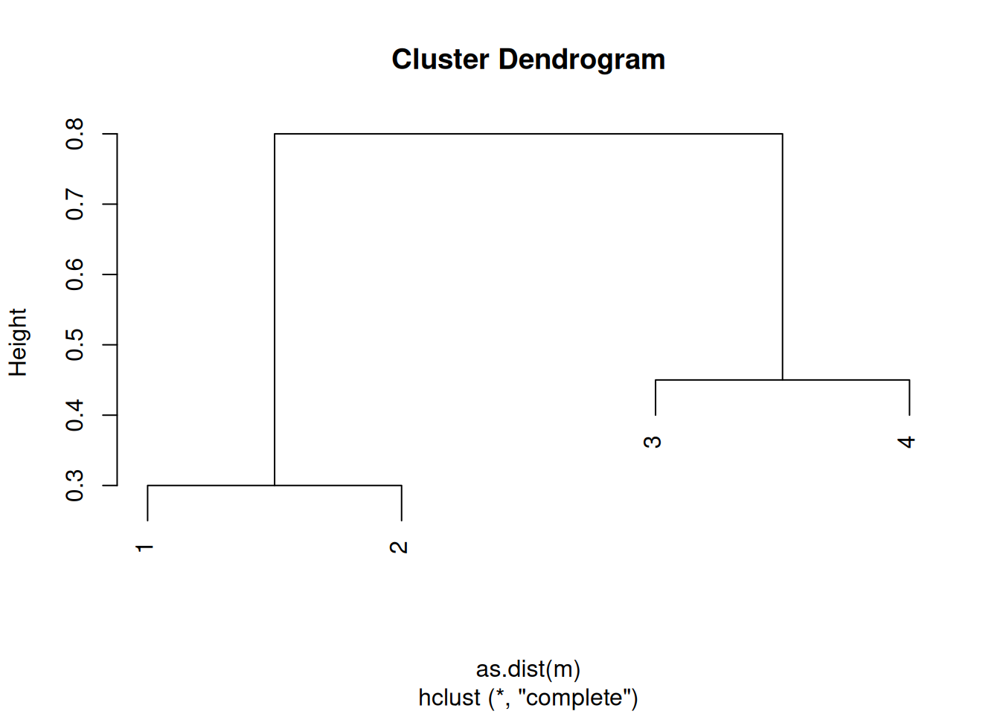

> b. Repeat (a), this time using single linkage clustering.


``` r
c2 <- hclust(as.dist(m), method = "single")
plot(c2)
```

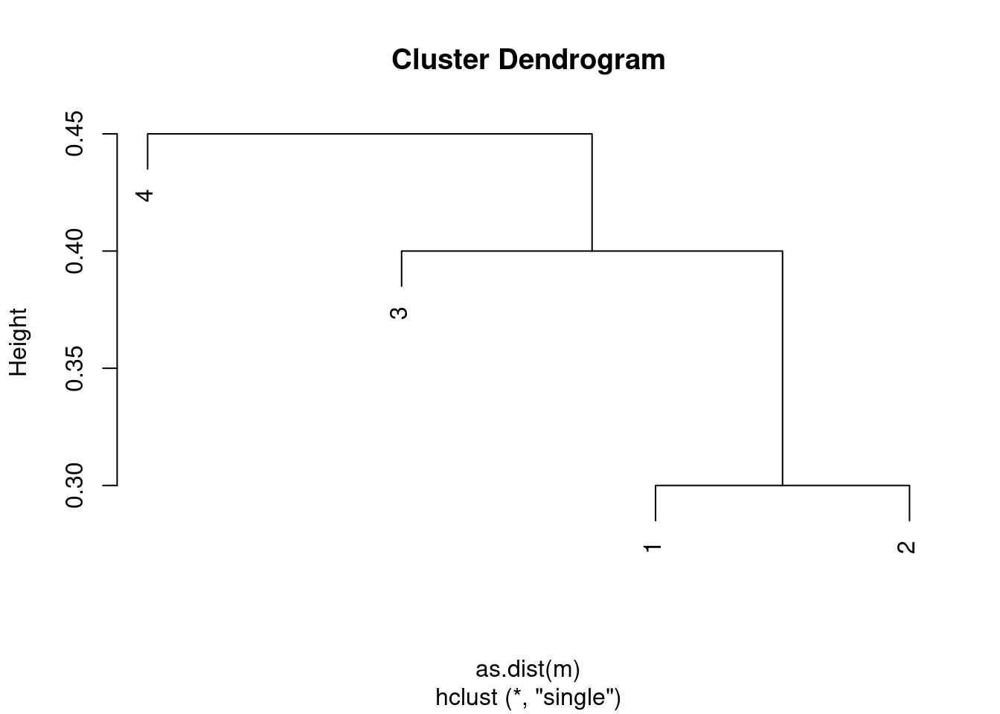

> c. Suppose that we cut the dendrogram obtained in (a) such that two clusters
>    result. Which observations are in each cluster?


``` r
table(1:4, cutree(c1, 2))
```

```
##    
##     1 2
##   1 1 0
##   2 1 0
##   3 0 1
##   4 0 1
```

> d. Suppose that we cut the dendrogram obtained in (b) such that two clusters
>    result. Which observations are in each cluster?


``` r
table(1:4, cutree(c2, 2))
```

```
##    
##     1 2
##   1 1 0
##   2 1 0
##   3 1 0
##   4 0 1
```

> e. It is mentioned in the chapter that at each fusion in the dendrogram, the
>    position of the two clusters being fused can be swapped without changing
>    the meaning of the dendrogram. Draw a dendrogram that is equivalent to the
>    dendrogram in (a), for which two or more of the leaves are repositioned,
>    but for which the meaning of the dendrogram is the same.


``` r
plot(c1, labels = c(2, 1, 3, 4))
```

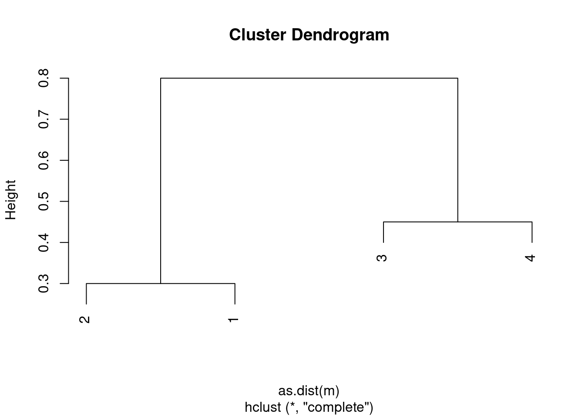

### Question 3

> In this problem, you will perform $K$-means clustering manually, with $K = 2$,
> on a small example with $n = 6$ observations and $p = 2$ features. The
> observations are as follows.
> 
> | Obs. | $X_1$ | $X_2$ |
> |------|-------|-------|
> | 1    | 1     | 4     |
> | 2    | 1     | 3     |
> | 3    | 0     | 4     |
> | 4    | 5     | 1     |
> | 5    | 6     | 2     |
> | 6    | 4     | 0     |
> 
> a. Plot the observations.


``` r
library(ggplot2)
d <- data.frame(
  x1 = c(1, 1, 0, 5, 6, 4),
  x2 = c(4, 3, 4, 1, 2, 0)
)
ggplot(d, aes(x = x1, y = x2)) +
  geom_point()
```

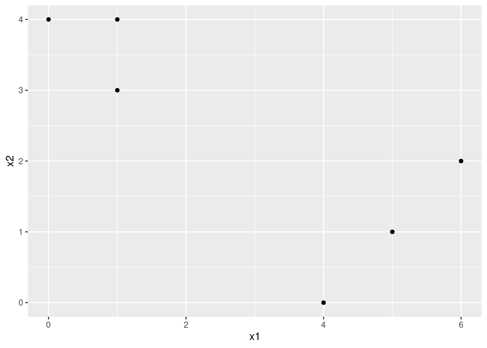

> b. Randomly assign a cluster label to each observation. You can use the
>    `sample()` command in `R` to do this. Report the cluster labels for each
>    observation.


``` r
set.seed(42)
d$cluster <- sample(c(1, 2), size = nrow(d), replace = TRUE)
```

> c. Compute the centroid for each cluster.


``` r
centroids <- sapply(c(1, 2), function(i) colMeans(d[d$cluster == i, 1:2]))
```

> d. Assign each observation to the centroid to which it is closest, in terms of
>    Euclidean distance. Report the cluster labels for each observation.


``` r
dist <- sapply(1:2, function(i) {
  sqrt((d$x1 - centroids[1, i])^2 + (d$x2 - centroids[2, i])^2)
})
d$cluster <- apply(dist, 1, which.min)
```

> e. Repeat (c) and (d) until the answers obtained stop changing.


``` r
centroids <- sapply(c(1, 2), function(i) colMeans(d[d$cluster == i, 1:2]))
dist <- sapply(1:2, function(i) {
  sqrt((d$x1 - centroids[1, i])^2 + (d$x2 - centroids[2, i])^2)
})
d$cluster <- apply(dist, 1, which.min)
```

In this case, we get stable labels after the first iteration.

> f. In your plot from (a), color the observations according to the cluster
>    labels obtained.


``` r
ggplot(d, aes(x = x1, y = x2, color = factor(cluster))) +
  geom_point()
```

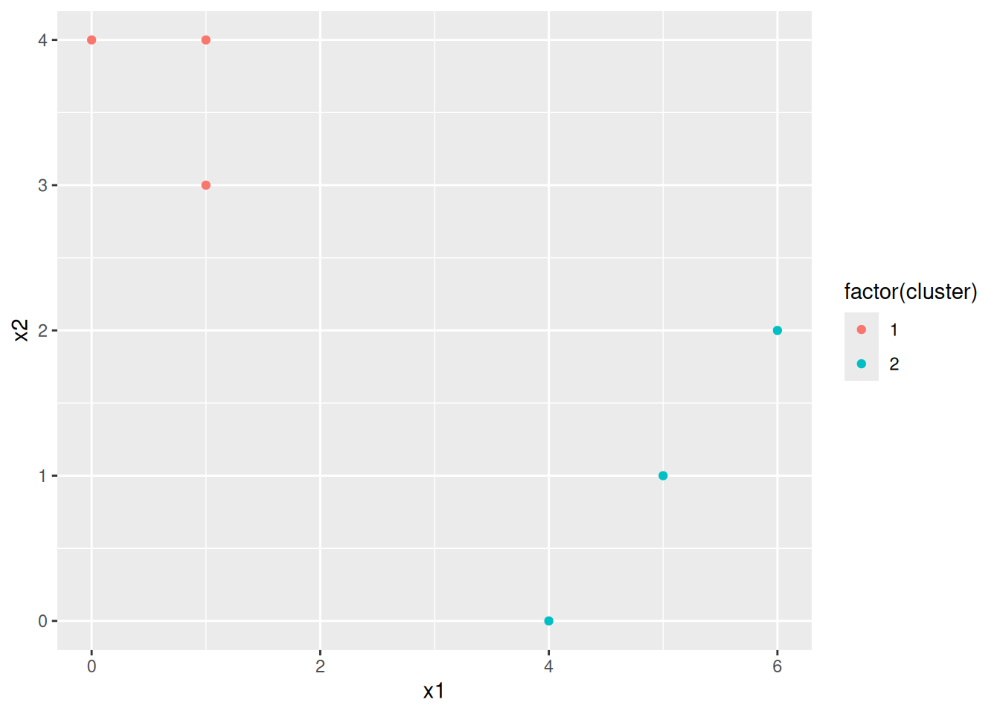

### Question 4

> Suppose that for a particular data set, we perform hierarchical clustering
> using single linkage and using complete linkage. We obtain two dendrograms.
>
> a. At a certain point on the single linkage dendrogram, the clusters {1, 2, 3}
>    and {4, 5} fuse. On the complete linkage dendrogram, the clusters {1, 2, 3}
>    and {4, 5} also fuse at a certain point. Which fusion will occur higher on
>    the tree, or will they fuse at the same height, or is there not enough
>    information to tell?

The complete linkage fusion will likely be higher in the tree since single
linkage is defined as being the minimum distance between two clusters. However,
there is a chance that they could be at the same height (so technically there
is not enough information to tell).

> b. At a certain point on the single linkage dendrogram, the clusters {5} and
>    {6} fuse. On the complete linkage dendrogram, the clusters {5} and {6} also
>    fuse at a certain point. Which fusion will occur higher on the tree, or
>    will they fuse at the same height, or is there not enough information to
>    tell?

They will fuse at the same height (the algorithm for calculating distance is
the same when the clusters are of size 1).

### Question 5

> In words, describe the results that you would expect if you performed
> $K$-means clustering of the eight shoppers in Figure 12.16, on the basis of
> their sock and computer purchases, with $K = 2$. Give three answers, one for
> each of the variable scalings displayed. Explain.

In cases where variables are scaled we would expect clusters to correspond
to whether or not the retainer sold a computer. In the first case (raw numbers
of items sold), we would expect clusters to represent low vs high numbers of 
sock purchases.

To test, we can run the analysis in R:


``` r
set.seed(42)
dat <- data.frame(
  socks = c(8, 11, 7, 6, 5, 6, 7, 8),
  computers = c(0, 0, 0, 0, 1, 1, 1, 1)
)
kmeans(dat, 2)$cluster
```

```
## [1] 1 1 2 2 2 2 2 1
```

``` r
kmeans(scale(dat), 2)$cluster
```

```
## [1] 1 1 1 1 2 2 2 2
```

``` r
dat$computers <- dat$computers * 2000
kmeans(dat, 2)$cluster
```

```
## [1] 1 1 1 1 2 2 2 2
```

### Question 6

> We saw in Section 12.2.2 that the principal component loading and score
> vectors provide an approximation to a matrix, in the sense of (12.5).
> Specifically, the principal component score and loading vectors solve the
> optimization problem given in (12.6).
>
> Now, suppose that the M principal component score vectors zim, $m = 1,...,M$,
> are known. Using (12.6), explain that the first $M$ principal component
> loading vectors $\phi_{jm}$, $m = 1,...,M$, can be obtaining by performing $M$
> separate least squares linear regressions. In each regression, the principal
> component score vectors are the predictors, and one of the features of the
> data matrix is the response.

## Applied

### Question 7

> In the chapter, we mentioned the use of correlation-based distance and
> Euclidean distance as dissimilarity measures for hierarchical clustering.
> It turns out that these two measures are almost equivalent: if each
> observation has been centered to have mean zero and standard deviation one,
> and if we let $r_{ij}$ denote the correlation between the $i$th and $j$th
> observations, then the quantity $1 - r_{ij}$ is proportional to the squared
> Euclidean distance between the ith and jth observations.
>
> On the `USArrests` data, show that this proportionality holds.
>
> _Hint: The Euclidean distance can be calculated using the `dist()` function,_
> _and correlations can be calculated using the `cor()` function._


``` r
dat <- t(scale(t(USArrests)))
d1 <- dist(dat)^2
d2 <- as.dist(1 - cor(t(dat)))
plot(d1, d2)
```

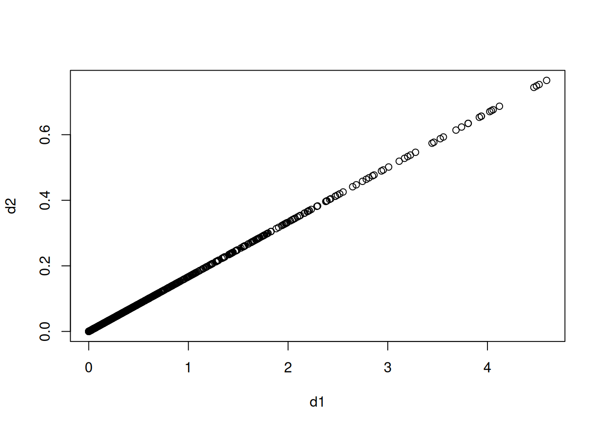

### Question 8

> In Section 12.2.3, a formula for calculating PVE was given in Equation
> 12.10. We also saw that the PVE can be obtained using the `sdev` output of the
> `prcomp()` function.
>
> On the `USArrests` data, calculate PVE in two ways:
>
> a. Using the `sdev` output of the `prcomp()` function, as was done in Section
>    12.2.3.


``` r
pr <- prcomp(USArrests, scale = TRUE)
pr$sdev^2 / sum(pr$sdev^2)
```

```
## [1] 0.62006039 0.24744129 0.08914080 0.04335752
```

> b. By applying Equation 12.10 directly. That is, use the `prcomp()` function to
>    compute the principal component loadings. Then, use those loadings in
>    Equation 12.10 to obtain the PVE. 
>
> These two approaches should give the same results.


``` r
colSums(pr$x^2) / sum(colSums(scale(USArrests)^2))
```

```
##        PC1        PC2        PC3        PC4 
## 0.62006039 0.24744129 0.08914080 0.04335752
```

> _Hint: You will only obtain the same results in (a) and (b) if the same_
> _data is used in both cases. For instance, if in (a) you performed_
> _`prcomp()` using centered and scaled variables, then you must center and_
> _scale the variables before applying Equation 12.10 in (b)._

### Question 9

> Consider the `USArrests` data. We will now perform hierarchical clustering on
> the states.
>
> a. Using hierarchical clustering with complete linkage and Euclidean distance,
>    cluster the states.


``` r
set.seed(42)
hc <- hclust(dist(USArrests), method = "complete")
```

> b. Cut the dendrogram at a height that results in three distinct clusters.
>    Which states belong to which clusters?


``` r
ct <- cutree(hc, 3)
sapply(1:3, function(i) names(ct)[ct == i])
```

```
## [[1]]
##  [1] "Alabama"        "Alaska"         "Arizona"        "California"    
##  [5] "Delaware"       "Florida"        "Illinois"       "Louisiana"     
##  [9] "Maryland"       "Michigan"       "Mississippi"    "Nevada"        
## [13] "New Mexico"     "New York"       "North Carolina" "South Carolina"
## 
## [[2]]
##  [1] "Arkansas"      "Colorado"      "Georgia"       "Massachusetts"
##  [5] "Missouri"      "New Jersey"    "Oklahoma"      "Oregon"       
##  [9] "Rhode Island"  "Tennessee"     "Texas"         "Virginia"     
## [13] "Washington"    "Wyoming"      
## 
## [[3]]
##  [1] "Connecticut"   "Hawaii"        "Idaho"         "Indiana"      
##  [5] "Iowa"          "Kansas"        "Kentucky"      "Maine"        
##  [9] "Minnesota"     "Montana"       "Nebraska"      "New Hampshire"
## [13] "North Dakota"  "Ohio"          "Pennsylvania"  "South Dakota" 
## [17] "Utah"          "Vermont"       "West Virginia" "Wisconsin"
```

> c. Hierarchically cluster the states using complete linkage and Euclidean
>    distance, _after scaling the variables to have standard deviation one_.


``` r
hc2 <- hclust(dist(scale(USArrests)), method = "complete")
```

> d. What effect does scaling the variables have on the hierarchical clustering
>    obtained? In your opinion, should the variables be scaled before the
>    inter-observation dissimilarities are computed? Provide a justification for
>    your answer.


``` r
ct <- cutree(hc2, 3)
sapply(1:3, function(i) names(ct)[ct == i])
```

```
## [[1]]
## [1] "Alabama"        "Alaska"         "Georgia"        "Louisiana"     
## [5] "Mississippi"    "North Carolina" "South Carolina" "Tennessee"     
## 
## [[2]]
##  [1] "Arizona"    "California" "Colorado"   "Florida"    "Illinois"  
##  [6] "Maryland"   "Michigan"   "Nevada"     "New Mexico" "New York"  
## [11] "Texas"     
## 
## [[3]]
##  [1] "Arkansas"      "Connecticut"   "Delaware"      "Hawaii"       
##  [5] "Idaho"         "Indiana"       "Iowa"          "Kansas"       
##  [9] "Kentucky"      "Maine"         "Massachusetts" "Minnesota"    
## [13] "Missouri"      "Montana"       "Nebraska"      "New Hampshire"
## [17] "New Jersey"    "North Dakota"  "Ohio"          "Oklahoma"     
## [21] "Oregon"        "Pennsylvania"  "Rhode Island"  "South Dakota" 
## [25] "Utah"          "Vermont"       "Virginia"      "Washington"   
## [29] "West Virginia" "Wisconsin"     "Wyoming"
```

Scaling results in different clusters and the choice of whether to scale or 
not depends on the data in question. In this case, the variables are:

  - Murder    numeric  Murder arrests (per 100,000)  
  - Assault   numeric  Assault arrests (per 100,000) 
  - UrbanPop  numeric  Percent urban population      
  - Rape      numeric  Rape arrests (per 100,000)    

These variables are not naturally on the same unit and the units involved are
somewhat arbitrary (so for example, Murder could be measured per 1 million 
rather than per 100,000) so in this case I would argue the data should be 
scaled.

### Question 10

> In this problem, you will generate simulated data, and then perform PCA and
> $K$-means clustering on the data.
>
> a. Generate a simulated data set with 20 observations in each of three classes
>    (i.e. 60 observations total), and 50 variables. 
>    
>    _Hint: There are a number of functions in `R` that you can use to generate_
>    _data. One example is the `rnorm()` function; `runif()` is another option._
>    _Be sure to add a mean shift to the observations in each class so that_
>    _there are three distinct classes._


``` r
set.seed(42)
data <- matrix(rnorm(60 * 50), ncol = 50)
classes <- rep(c("A", "B", "C"), each = 20)
dimnames(data) <- list(classes, paste0("v", 1:50))
data[classes == "B", 1:10] <- data[classes == "B", 1:10] + 1.2
data[classes == "C", 5:30] <- data[classes == "C", 5:30] + 1
```

> b. Perform PCA on the 60 observations and plot the first two principal
>    component score vectors. Use a different color to indicate the
>    observations in each of the three classes. If the three classes appear
>    separated in this plot, then continue on to part (c). If not, then return
>    to part (a) and modify the simulation so that there is greater separation
>    between the three classes. Do not continue to part (c) until the three
>    classes show at least some separation in the first two principal component
>    score vectors.


``` r
pca <- prcomp(data)
ggplot(
  data.frame(Class = classes, PC1 = pca$x[, 1], PC2 = pca$x[, 2]),
  aes(x = PC1, y = PC2, col = Class)
) +
  geom_point()
```

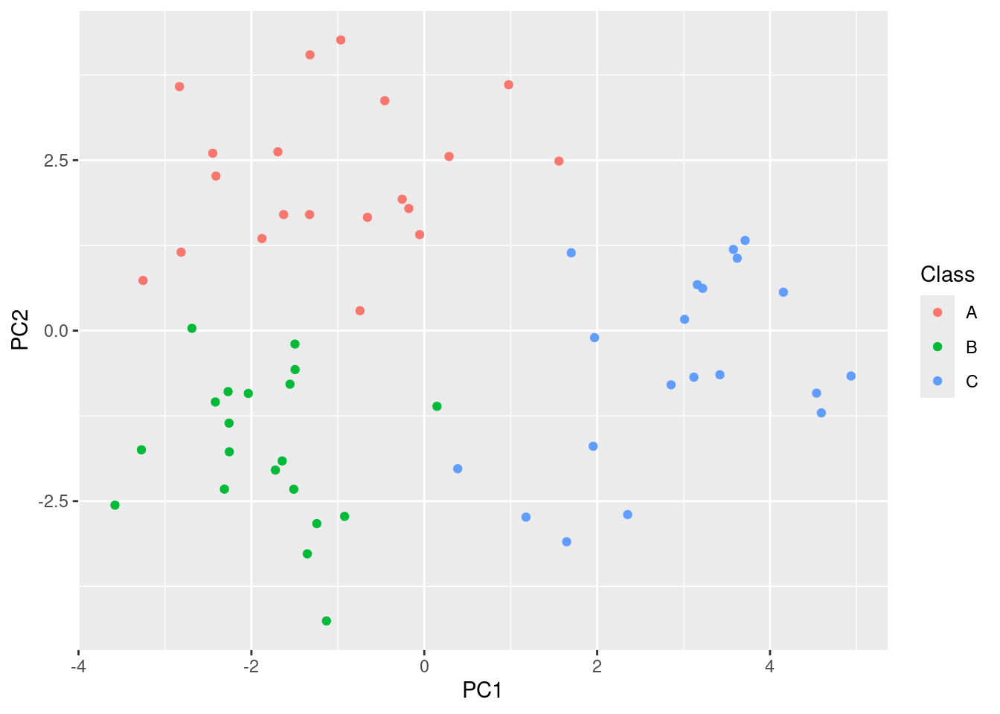

> c. Perform $K$-means clustering of the observations with $K = 3$. How well do
>    the clusters that you obtained in $K$-means clustering compare to the true
>    class labels?
>    
>    _Hint: You can use the `table()` function in `R` to compare the true class_
>    _labels to the class labels obtained by clustering. Be careful how you_
>    _interpret the results: $K$-means clustering will arbitrarily number the_
>    _clusters, so you cannot simply check whether the true class labels and_
>    _clustering labels are the same._


``` r
km <- kmeans(data, 3)$cluster
table(km, names(km))
```

```
##    
## km   A  B  C
##   1  1 20  1
##   2  0  0 19
##   3 19  0  0
```

$K$-means separates out the clusters nearly perfectly.

> d.  Perform $K$-means clustering with $K = 2$. Describe your results.


``` r
km <- kmeans(data, 2)$cluster
table(km, names(km))
```

```
##    
## km   A  B  C
##   1 18 20  1
##   2  2  0 19
```

$K$-means effectively defines cluster 2 to be class C (capturing 19 of 20
class-C observations), while cluster 1 absorbs all of class B together with
most of class A.

> e.  Now perform $K$-means clustering with $K = 4$, and describe your results.


``` r
km <- kmeans(data, 4)$cluster
table(km, names(km))
```

```
##    
## km   A  B  C
##   1  0  7  2
##   2 18  1  0
##   3  0  0 18
##   4  2 12  0
```

$K$-means effectively defines cluster 2 to be class A and cluster 3 to be
class C, while clusters 1 and 4 split class B between them.

> f.  Now perform $K$-means clustering with $K = 3$ on the first two principal
>     component score vectors, rather than on the raw data. That is, perform
>     $K$-means clustering on the $60 \times 2$ matrix of which the first column
>     is the first principal component score vector, and the second column is
>     the second principal component score vector. Comment on the results.


``` r
km <- kmeans(pca$x[, 1:2], 3)$cluster
table(km, names(km))
```

```
##    
## km   A  B  C
##   1  0 20  2
##   2 20  0  0
##   3  0  0 18
```

$K$-means again separates out the clusters nearly perfectly.

> g.  Using the `scale()` function, perform $K$-means clustering with $K = 3$ on
>     the data _after scaling each variable to have standard deviation one_. How
>     do these results compare to those obtained in (b)? Explain.


``` r
km <- kmeans(scale(data), 3)$cluster
table(km, names(km))
```

```
##    
## km   A  B  C
##   1  1 20  1
##   2 19  0  0
##   3  0  0 19
```

$K$-means performs about as well on the scaled data as on the raw data (in
this case the same two observations are misclassified). Because the variables
were simulated on a common scale, scaling each variable to unit variance does
not change the relative geometry much.

### Question 11

> Write an `R` function to perform matrix completion as in Algorithm 12.1, and
> as outlined in Section 12.5.2. In each iteration, the function should keep
> track of the relative error, as well as the iteration count. Iterations should
> continue until the relative error is small enough or until some maximum number
> of iterations is reached (set a default value for this maximum number).
> Furthermore, there should be an option to print out the progress in each
> iteration.
> 
> Test your function on the `Boston` data. First, standardize the features to
> have mean zero and standard deviation one using the `scale()` function. Run an
> experiment where you randomly leave out an increasing (and nested) number of
> observations from 5% to 30%, in steps of 5%. Apply Algorithm 12.1 with $M =
> 1,2,...,8$. Display the approximation error as a function of the fraction of
> observations that are missing, and the value of $M$, averaged over 10
> repetitions of the experiment.

We follow Algorithm 12.1: missing entries are initialised to the column mean,
then on each iteration we replace them with the entries from the rank-$M$ SVD
approximation of the current matrix. Convergence is tracked via the relative
reduction in mean squared error on the _observed_ entries.


``` r
fit_svd <- function(X, M) {
  s <- svd(X)
  s$u[, 1:M, drop = FALSE] %*% (s$d[1:M] * t(s$v[, 1:M, drop = FALSE]))
}

matrix_completion <- function(X, M = 1, max_iter = 100, tol = 1e-7,
                              verbose = FALSE, fit = fit_svd) {
  obs <- !is.na(X)
  Xhat <- X
  cm <- colMeans(X, na.rm = TRUE)
  for (j in seq_len(ncol(X))) Xhat[!obs[, j], j] <- cm[j]

  mss0 <- mean(X[obs]^2)
  mss_old <- mss0
  rel_err <- Inf
  iter <- 0
  while (iter < max_iter && rel_err > tol) {
    iter <- iter + 1
    Xapp <- fit(Xhat, M)
    Xhat[!obs] <- Xapp[!obs]
    mss <- mean((X[obs] - Xapp[obs])^2)
    rel_err <- (mss_old - mss) / mss0
    mss_old <- mss
    if (verbose) {
      cat(sprintf(
        "Iter %3d  MSS=%.6g  rel.err=%.3g\n",
        iter, mss, rel_err
      ))
    }
  }
  list(Xhat = Xhat, iter = iter, mss = mss)
}
```

A short demonstration on `Boston` with 10% of entries missing and $M = 4$
(showing the first few iterations only):


``` r
library(ISLR2)
X <- scale(Boston)
set.seed(1)
miss <- sample(length(X), 0.1 * length(X))
Xm <- X
Xm[miss] <- NA
res <- matrix_completion(Xm, M = 4, max_iter = 5, verbose = TRUE)
```

```
## Iter   1  MSS=0.228531  rel.err=0.773
## Iter   2  MSS=0.213812  rel.err=0.0146
## Iter   3  MSS=0.211212  rel.err=0.00258
## Iter   4  MSS=0.21012  rel.err=0.00108
## Iter   5  MSS=0.209379  rel.err=0.000735
```

For the experiment we use a _nested_ missing-data design: the 30% missing set
contains the 25% set, which contains the 20% set, and so on. This isolates the
effect of the missingness fraction (and $M$) from the effect of which
particular cells happened to be hidden.


``` r
set.seed(1)
fracs <- seq(0.05, 0.30, by = 0.05)
Ms <- 1:8
reps <- 10
n <- length(X)

results <- array(NA_real_,
  dim = c(length(fracs), length(Ms), reps),
  dimnames = list(frac = fracs, M = Ms, rep = 1:reps)
)

for (r in 1:reps) {
  shuf <- sample(n)
  for (fi in seq_along(fracs)) {
    miss <- shuf[1:round(fracs[fi] * n)]
    Xm <- X
    Xm[miss] <- NA
    for (mi in seq_along(Ms)) {
      res <- matrix_completion(Xm, M = Ms[mi], max_iter = 50)
      results[fi, mi, r] <- mean((X[miss] - res$Xhat[miss])^2)
    }
  }
}

mean_err <- apply(results, c(1, 2), mean)
round(mean_err, 3)
```

```
##       M
## frac       1     2     3     4     5     6     7     8
##   0.05 0.588 0.559 0.518 1.289 1.476 1.194 1.091 1.280
##   0.1  0.610 0.580 0.556 1.058 1.495 1.322 1.271 1.390
##   0.15 0.606 0.591 0.577 1.005 1.280 1.274 1.228 1.341
##   0.2  0.610 0.604 0.608 1.066 1.195 1.191 1.224 1.270
##   0.25 0.623 0.621 0.700 1.060 1.168 1.232 1.192 1.278
##   0.3  0.621 0.659 0.759 1.103 1.248 1.193 1.223 1.249
```


``` r
df <- as.data.frame.table(mean_err, responseName = "MSE")
df$frac <- as.numeric(as.character(df$frac))
df$M <- as.integer(as.character(df$M))
ggplot(df, aes(frac, MSE, colour = factor(M), group = M)) +
  geom_line() +
  geom_point() +
  labs(
    x = "Fraction of entries missing", y = "Mean squared error",
    colour = "M"
  )
```

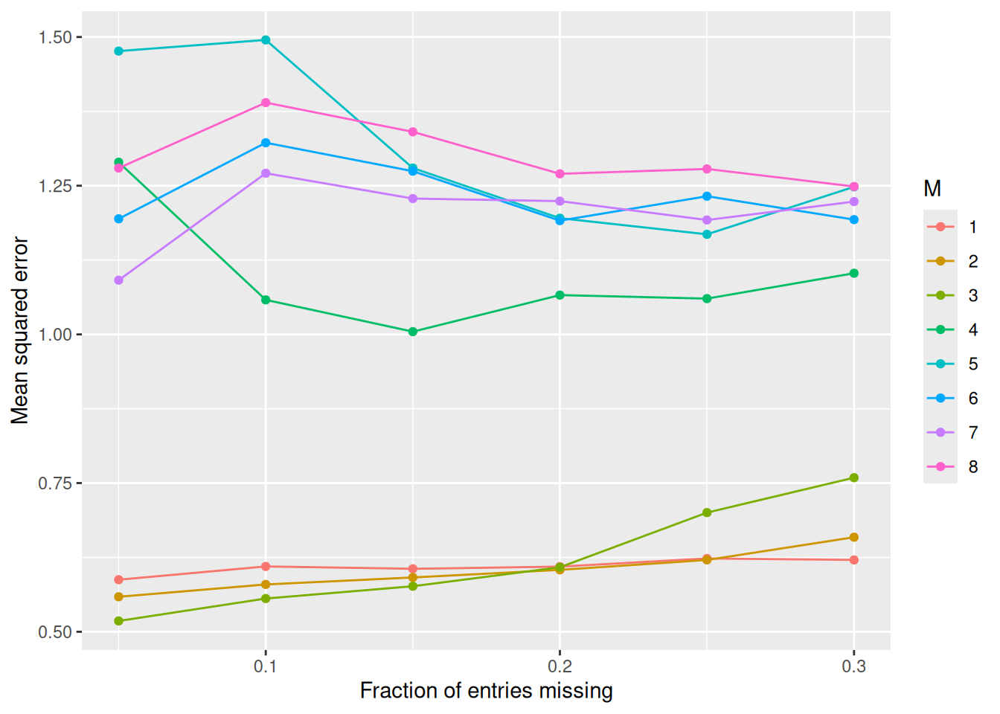

A small number of components ($M \le 3$) gives by far the best imputations
on standardised `Boston`. Beyond that the rank-$M$ approximation starts to
overfit the imputed values themselves, and the error roughly doubles. As
expected, the error also grows gradually with the fraction of missing
entries.

### Question 12

> In Section 12.5.2, Algorithm 12.1 was implemented using the `svd()` function.
> However, given the connection between the `svd()` function and the `prcomp()`
> function highlighted in the lab, we could have instead implemented the
> algorithm using `prcomp()`.
>
> Write a function to implement Algorithm 12.1 that makes use of `prcomp()`
> rather than `svd()`.

`prcomp()` returns scores $UD$ in `$x` and loadings $V$ in `$rotation`, so the
rank-$M$ approximation is `x[, 1:M] %*% t(rotation[, 1:M])` — with the column
means added back if we center. We can plug this into the matrix completion
function from Q11 by passing a different `fit` argument:


``` r
fit_prcomp <- function(X, M) {
  p <- prcomp(X, center = TRUE, scale. = FALSE)
  approx <- p$x[, 1:M, drop = FALSE] %*% t(p$rotation[, 1:M, drop = FALSE])
  sweep(approx, 2, p$center, FUN = "+")
}
```

The two implementations give essentially identical imputations (any
differences are at the level of numerical precision):


``` r
set.seed(1)
miss <- sample(length(X), 0.1 * length(X))
Xm <- X
Xm[miss] <- NA
r_svd <- matrix_completion(Xm, M = 4, fit = fit_svd, max_iter = 50)
r_pca <- matrix_completion(Xm, M = 4, fit = fit_prcomp, max_iter = 50)
cat(
  "MSE on held-out entries (svd):   ",
  mean((X[miss] - r_svd$Xhat[miss])^2), "\n"
)
```

```
## MSE on held-out entries (svd):    1.048215
```

``` r
cat(
  "MSE on held-out entries (prcomp):",
  mean((X[miss] - r_pca$Xhat[miss])^2), "\n"
)
```

```
## MSE on held-out entries (prcomp): 1.050214
```

### Question 13

> On the book website, `www.StatLearning.com`, there is a gene expression data
> set (`Ch12Ex13.csv`) that consists of 40 tissue samples with measurements on
> 1,000 genes. The first 20 samples are from healthy patients, while the
> second 20 are from a diseased group.
>
> a. Load in the data using `read.csv()`. You will need to select `header = F`.


``` r
data <- read.csv("data/Ch12Ex13.csv", header = FALSE)
colnames(data) <- c(paste0("H", 1:20), paste0("D", 1:20))
```

> b. Apply hierarchical clustering to the samples using correlation-based
>    distance, and plot the dendrogram. Do the genes separate the samples into
>    the two groups? Do your results depend on the type of linkage used?


``` r
dd <- as.dist(1 - cor(data))
hc.complete <- hclust(dd, method = "complete")
plot(hc.complete)
```

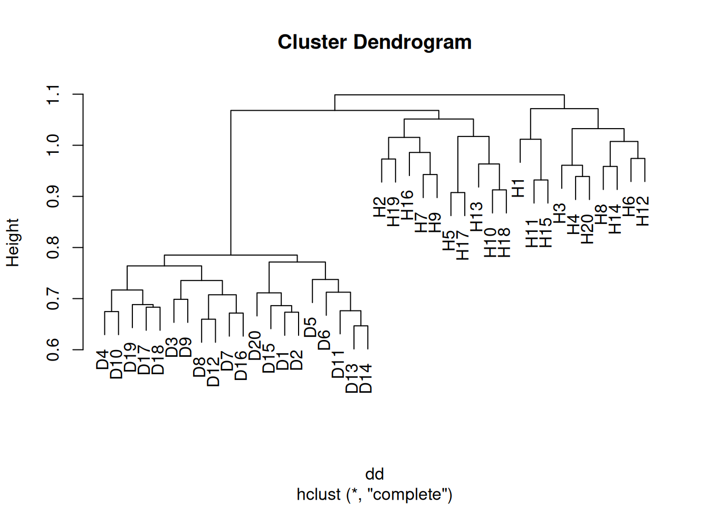

``` r
hc.average <- hclust(dd, method = "average")
plot(hc.average)
```

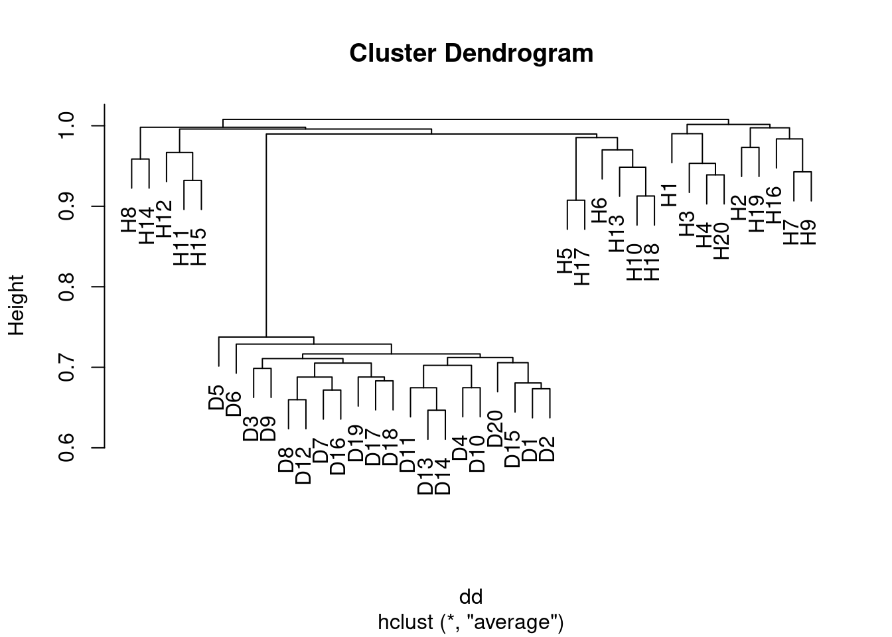

``` r
hc.single <- hclust(dd, method = "single")
plot(hc.single)
```

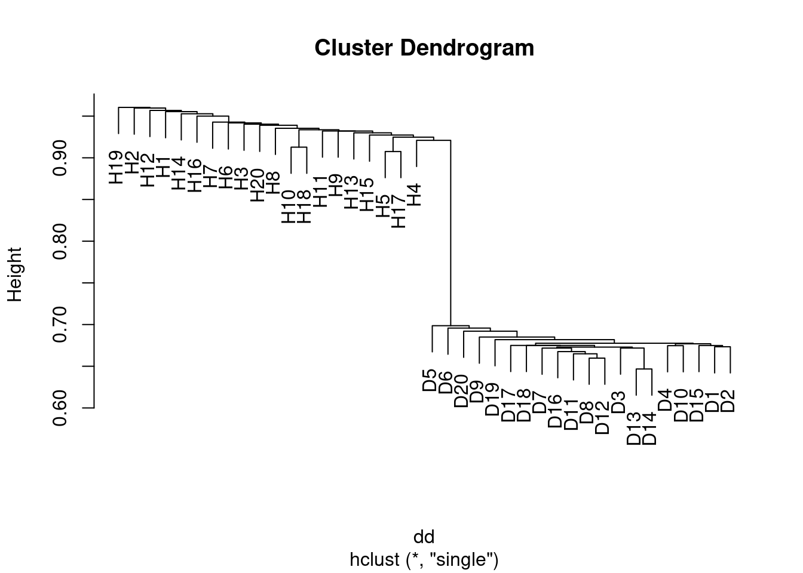

Yes the samples clearly separate into the two groups, although the results 
depend somewhat on the linkage method used. In the case of average clustering,
the disease samples all fall within a subset of the healthy samples.

> c. Your collaborator wants to know which genes differ the most across the two
>    groups. Suggest a way to answer this question, and apply it here.

This is probably best achieved with a supervised approach. A simple method
would be to determine which genes show the most significant differences between
the groups by applying a t-test to each group. We can then select those with a
FDR adjusted p-value less than some given threshold (e.g. 0.05).


``` r
class <- factor(rep(c("Healthy", "Diseased"), each = 20))
pvals <- p.adjust(apply(data, 1, function(v) t.test(v ~ class)$p.value), method = "fdr")
which(pvals < 0.05)
```

```
##   [1]  11  12  13  14  15  16  17  18  19  20 135 156 172 448 501 502 503 504
##  [19] 505 506 507 508 509 510 511 512 513 514 515 516 517 518 519 520 521 522
##  [37] 523 524 525 526 527 528 529 530 531 532 533 534 535 536 537 538 539 540
##  [55] 541 542 543 544 545 546 547 548 549 550 551 552 553 554 555 556 557 558
##  [73] 559 560 561 562 563 564 565 566 567 568 569 570 571 572 573 574 575 576
##  [91] 577 578 579 580 581 582 583 584 585 586 587 588 589 590 591 592 593 594
## [109] 595 596 597 598 599 600 615 853 967
```
