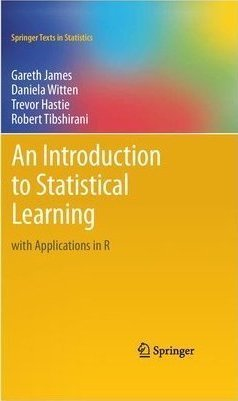

# An Introduction to Statistical Learning second edition solutions

[](https://github.com/danhalligan/ISLRv2-solutions/actions/workflows/github-actions.yml)




This repository provides my solutions for all exercises in the book 
["An Introduction to Statistical Learning"](https://www.statlearning.com/) 
by Gareth James, Daniela Witten, Trevor Hastie and Robert Tibshirani.

If you use these solutions or find them useful, please star this repository!

## About these solutions

The solutions are written in [bookdown] format using (my) 
[ISLRv2 solutions template](https://github.com/danhalligan/ISLRv2-solutions-template).

For anyone reading this book, I believe there is great value in deriving 
the solutions yourself, and the template above can be forked to provide a 
great starting point as I've created template Rmarkdown files for each chapter
and transcribed all questions as quotes within the chapter files leaving space
for you to write your solutions either as text, or by writing R code chunks.
For more details, refer to the template repository.

I've tried my best to provide solutions to each problem in this book, and I
believe my answers should be (at least for the most part) correct. The solutions
are relatively concise but hopefully comprehensive enough to address the 
purpose of each question.

If, when reading these solutions, you notice any inconsistencies, mistakes or
have any other questions, please feel free to raise an issue or provide 
suggestions and I'll happily take a look and try to incorporate.

## Compiled solutions

The HTML book is compiled from the Rmarkdown files in using a [GitHub Actions] 
workflow and then automatically deployed to [GitHub pages].

You can view these solutions hosted from GitHub at the following location:

* <https://danhalligan.github.io/ISLRv2-solutions/>

## Building the solutions

You will need to install [tensorflow and keras]. The dependencies are provided
in the `DESCRIPTION` file and you can install them by running:

```r
devtools::install()
```

Rebuild the book with compiled solutions by running:

```{r}
bookdown::render_book('index.Rmd', 'bookdown::gitbook')
```

[bookdown]: https://github.com/rstudio/bookdown
[GitHub Actions]: https://docs.github.com/en/actions
[GitHub pages]: https://pages.github.com/
[tensorflow and keras]: https://tensorflow.rstudio.com/install/
