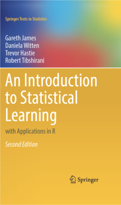

# Introduction

This bookdown document provides solutions for exercises in the book
["An Introduction to Statistical Learning with Applications in R"](https://www.statlearning.com/),
second edition, by Gareth James, Daniela Witten, Trevor Hastie and Robert Tibshirani.

